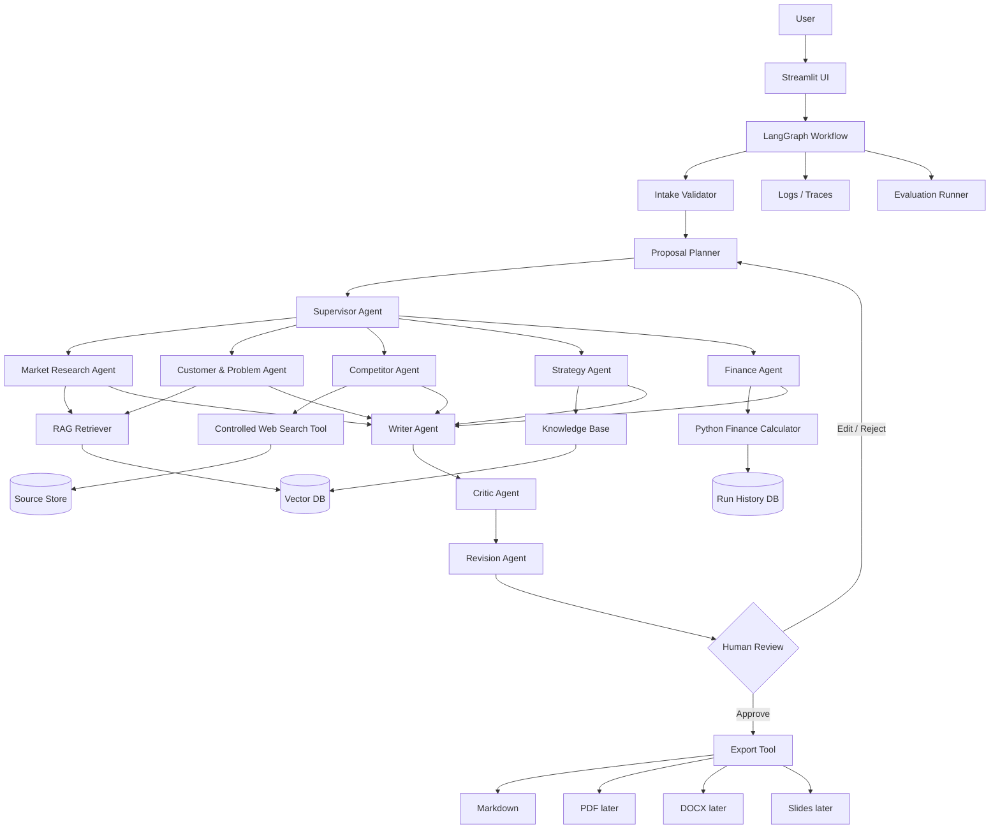
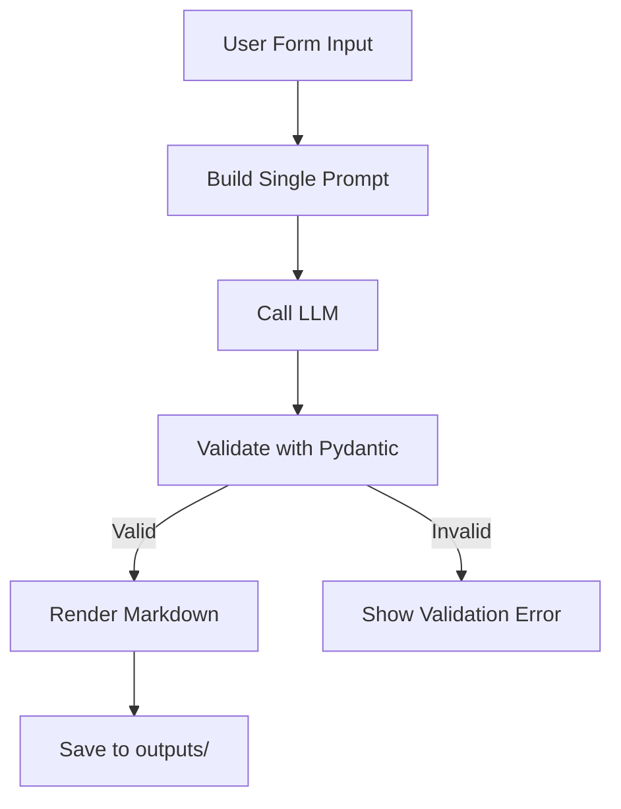
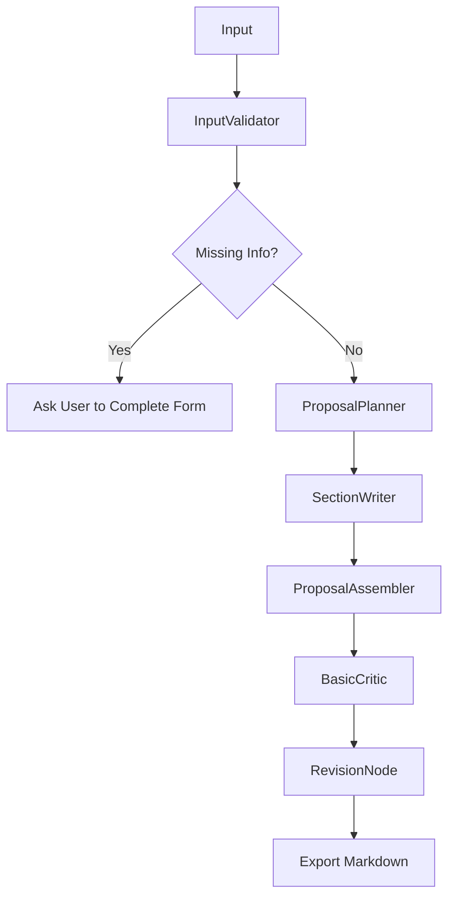
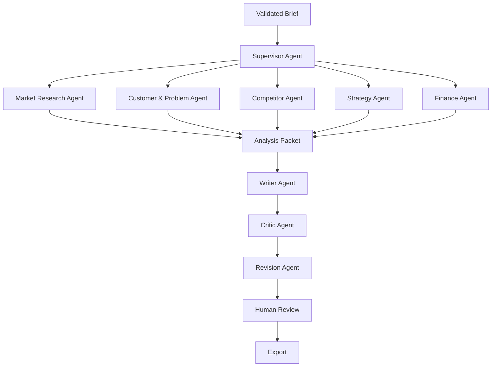
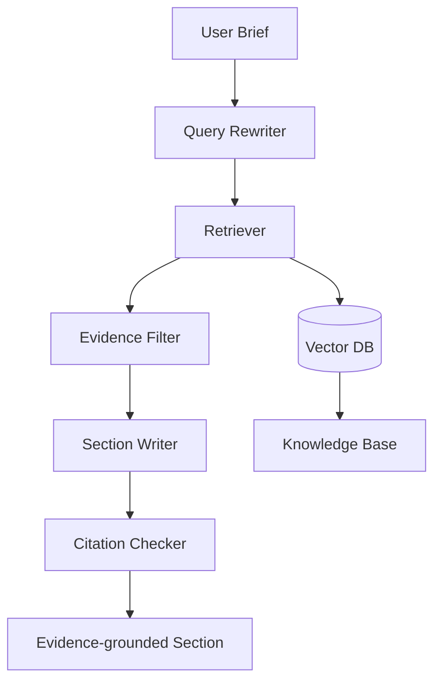

# Open Proposal Agent - Architecture Design

> 用途：作为 Cursor 分阶段开发的系统架构说明文档。  
> 项目定位：一个可审计、可评估、可扩展的 multi-agent business proposal generation system。  
> 核心原则：先做可运行 baseline，再逐步演进为可控 workflow、多 Agent、RAG、Web Research、Human-in-the-loop、Evaluation、MCP 和开源发布。

---

## 1. Product Definition

### 1.1 项目名称

**Open Proposal Agent**

### 1.2 一句话定义

Open Proposal Agent 是一个基于 Python 的多 Agent 商业提案生成系统：用户输入企业、产品或商业想法后，系统通过受控 workflow 自动完成需求校验、提案规划、市场与客户分析、竞品分析、商业模式设计、财务假设、草案写作、批判审查、修订和导出。

### 1.3 第一版目标用户

第一版不要覆盖所有商业提案场景。优先服务以下用户：

| 用户类型 | 使用场景 |
|---|---|
| 早期创业者 | 为 SaaS、电商、AI 产品生成 investor-style proposal 草案 |
| 商学院学生 | 为课程项目生成结构化 business proposal |
| 产品经理 | 为新产品机会生成内部战略 proposal |
| 创业研究者 | 对比 single-agent、workflow-only、multi-agent、RAG 等架构效果 |

### 1.4 第一版输入

用户通过 Streamlit 表单输入：

| 字段 | 必填 | 示例 |
|---|---:|---|
| company_or_product_name | 是 | AI Tutor for MBA Students |
| industry | 是 | EdTech / AI Education |
| target_customer | 是 | MBA students, business school applicants |
| problem | 是 | 学生缺少个性化商业案例辅导 |
| solution | 是 | AI-driven proposal and case coaching platform |
| business_model | 是 | Subscription + institutional licensing |
| geography | 是 | US / North America |
| proposal_goal | 是 | investor / internal strategy / class project / grant |
| stage | 否 | idea / MVP / revenue / scaling |
| known_competitors | 否 | ChatGPT, Course Hero, Perplexity |
| uploaded_materials | 否 | PDF, Markdown, DOCX, CSV |

### 1.5 第一版输出

输出一份结构化 Markdown proposal，后续扩展 PDF / DOCX / Slides。

固定章节：

1. Executive Summary
2. Problem
3. Target Customer
4. Market Opportunity
5. Solution
6. Value Proposition
7. Competitor Analysis
8. Business Model
9. Go-to-Market Strategy
10. Financial Assumptions
11. Risks and Mitigations
12. Implementation Roadmap
13. Appendix

### 1.6 Non-goals

第一版明确不做：

- 不自动发送 email。
- 不自动联系投资人。
- 不提供法律、税务、证券投资建议。
- 不声称市场规模、财务预测、竞争格局完全准确。
- 不让 Agent 无限自由聊天。
- 不从一开始实现十几个角色扮演 Agent。
- 不从一开始实现 MCP、复杂前端、复杂数据库。

---

## 2. Architectural Principles

### 2.1 核心工程原则

| 原则 | 说明 |
|---|---|
| Deterministic workflow first | 优先用可控 graph/workflow，而不是让多个 Agent 自由对话 |
| Baseline before optimization | 先建立 single-agent baseline，再比较 multi-agent 是否真的提升质量 |
| Few agents, clear boundaries | 第一版多 Agent 采用 1 Supervisor + 3-5 Worker + 1 Critic |
| Structured I/O | 所有节点和 Agent 输入输出都用 Pydantic schema 约束 |
| Generate → Critique → Revise | 文档类任务优先使用生成、批判、修订闭环 |
| Evidence-grounded generation | RAG 和 Web Research 的关键事实必须带来源 |
| Human approval for risky steps | 研究范围、财务假设、最终输出、高成本工具调用需要人工确认 |
| Evaluation as product feature | evaluation benchmark 是项目核心，而不是后期补丁 |
| Observable by default | 每次运行都保存 run history、agent outputs、tool calls、errors、costs |
| Secure tool use | 工具调用必须有 allowlist、权限边界、审计日志 |

### 2.2 初学者友好的演进路线

```text
Single-agent baseline
↓
LangGraph deterministic workflow
↓
Supervisor + Worker multi-agent
↓
Generate → Critique → Revise
↓
RAG knowledge base
↓
Controlled web research + citations
↓
Human-in-the-loop
↓
Evaluation benchmark
↓
MCP adapter
↓
Docker + CI/CD + open-source release
```

---

## 3. Target System Architecture

### 3.1 分层架构

```text
Frontend Layer
└── Streamlit first; Next.js optional later

API Layer
└── FastAPI later; MVP can call workflow directly from Streamlit

Workflow Layer
└── LangGraph stateful workflow

Agent Layer
├── Supervisor Agent
├── Market Research Agent
├── Customer & Problem Agent
├── Competitor Agent
├── Strategy Agent
├── Finance Agent
├── Writer Agent
└── Critic Agent

Tool Layer
├── Web Search Tool
├── PDF Reader Tool
├── RAG Retriever Tool
├── Python Finance Calculator
├── Export Tool
└── MCP Tool Adapter

Knowledge Layer
├── Proposal Templates
├── Business Frameworks
├── Example Proposals
└── Uploaded Documents

State Layer
├── SQLite in MVP
├── Postgres in production-like version
├── Vector DB: Chroma first; pgvector later
└── Run History

Evaluation Layer
├── promptfoo
├── Ragas
├── pytest
└── Custom Proposal Rubric

Observability Layer
├── Basic logs first
├── LangSmith optional
└── OpenTelemetry later

Deployment Layer
├── Docker
├── GitHub Actions
└── Cloud Run / Render / Railway / Fly.io
```

### 3.2 Mermaid 架构图



---

## 4. Technology Stack

### 4.1 MVP 技术栈

| 层级 | 推荐工具 | 使用阶段 | 选择理由 |
|---|---|---:|---|
| Language | Python | Phase 1+ | Agent、LLM、数据分析生态成熟 |
| UI | Streamlit | Phase 1+ | 零前端经验也能快速做界面 |
| Agent orchestration | LangGraph | Phase 2+ | 支持 graph、状态管理、中断、恢复、人审 |
| LLM provider | OpenAI / Gemini / Claude / Ollama | Phase 1+ | 兼顾效果、成本、本地化实验 |
| Structured output | Pydantic | Phase 1+ | 强制输出结构，降低 prompt 漂移 |
| Prompt management | Markdown prompt files | Phase 1+ | Cursor 易读、易改、易版本控制 |
| Persistence | SQLite | Phase 2-6 | 简单、低门槛，适合 MVP |
| Production DB | Postgres | Phase 7+ | 可扩展、可部署、支持审计和多用户 |
| Vector DB | Chroma | Phase 4+ | 简单本地向量库 |
| Vector DB later | pgvector | Phase 8+ | 与 Postgres 集成，部署更统一 |
| RAG | LlamaIndex or LangChain retriever | Phase 4+ | 文档读取、索引、检索成熟 |
| Web search | Tavily / SerpAPI / Bing Search API | Phase 5+ | 受控搜索，不让 Agent 自由浏览 |
| Evaluation | promptfoo + Ragas + pytest | Phase 7+ | prompt regression、RAG eval、单元测试 |
| Observability | basic logs → LangSmith → OpenTelemetry | Phase 2+ | 逐步建立可观测性 |
| Deployment | Docker + GitHub Actions | Phase 9 | 开源项目标准配置 |
| Docs | Markdown + MkDocs/Docusaurus optional | Phase 0+ | GitHub 友好，Cursor 友好 |

### 4.2 依赖管理建议

MVP 使用 `pyproject.toml` 管理项目。

建议包结构：

```toml
[project]
name = "open-proposal-agent"
version = "0.1.0"
description = "Auditable multi-agent business proposal generation system"
requires-python = ">=3.11"

dependencies = [
  "streamlit",
  "pydantic",
  "python-dotenv",
  "openai",
  "langgraph",
  "langchain",
  "llama-index",
  "chromadb",
  "sqlalchemy",
  "pytest",
  "rich",
]
```

不要在代码里硬编码 API key。统一使用 `.env` 和 `.env.example`。

---

## 5. Repository Structure

### 5.1 Phase 1 MVP 结构

```text
open-proposal-agent/
├── app.py
├── prompts/
│   └── single_agent_proposal.md
├── schemas/
│   └── proposal_schema.py
├── outputs/
├── docs/
│   ├── PRD.md
│   ├── USER_STORIES.md
│   ├── PROPOSAL_OUTPUT_SCHEMA.md
│   └── EVALUATION_RUBRIC.md
├── .env.example
├── .gitignore
├── pyproject.toml
└── README.md
```

### 5.2 最终开源项目结构

```text
open-proposal-agent/
├── README.md
├── LICENSE
├── pyproject.toml
├── docker-compose.yml
├── .env.example
├── .gitignore
├── .github/
│   └── workflows/
│       ├── test.yml
│       └── eval.yml
├── docs/
│   ├── architecture_design.md
│   ├── agent_design.md
│   ├── eval_methodology.md
│   ├── security.md
│   └── roadmap.md
├── src/
│   └── open_proposal_agent/
│       ├── __init__.py
│       ├── app/
│       │   ├── streamlit_app.py
│       │   └── api.py
│       ├── agents/
│       │   ├── supervisor.py
│       │   ├── market_research.py
│       │   ├── customer_problem.py
│       │   ├── competitor.py
│       │   ├── strategy.py
│       │   ├── finance.py
│       │   ├── writer.py
│       │   └── critic.py
│       ├── workflows/
│       │   ├── baseline.py
│       │   ├── proposal_graph.py
│       │   └── human_review.py
│       ├── tools/
│       │   ├── web_search.py
│       │   ├── pdf_reader.py
│       │   ├── finance_calculator.py
│       │   ├── exporter.py
│       │   └── mcp_adapter.py
│       ├── rag/
│       │   ├── loaders.py
│       │   ├── index.py
│       │   ├── retriever.py
│       │   └── citation_checker.py
│       ├── schemas/
│       │   ├── proposal.py
│       │   ├── agent_outputs.py
│       │   ├── workflow_state.py
│       │   └── evaluation.py
│       ├── storage/
│       │   ├── db.py
│       │   ├── models.py
│       │   └── repositories.py
│       ├── evals/
│       │   ├── runner.py
│       │   ├── rubric.py
│       │   └── datasets.py
│       └── observability/
│           ├── logging.py
│           └── tracing.py
├── prompts/
│   ├── single_agent_proposal.md
│   ├── planner.md
│   ├── market_research_agent.md
│   ├── customer_agent.md
│   ├── competitor_agent.md
│   ├── strategy_agent.md
│   ├── finance_agent.md
│   ├── writer_agent.md
│   ├── critic_agent.md
│   └── revision_agent.md
├── tests/
│   ├── test_schemas.py
│   ├── test_workflow.py
│   ├── test_agents.py
│   ├── test_tools.py
│   └── test_exporter.py
├── evals/
│   ├── cases/
│   │   ├── saas_crm_case.yaml
│   │   ├── amazon_seller_tool_case.yaml
│   │   ├── ai_education_app_case.yaml
│   │   ├── healthcare_booking_case.yaml
│   │   └── food_delivery_case.yaml
│   └── rubric.yaml
├── examples/
│   ├── sample_input.json
│   └── sample_output.md
├── knowledge_base/
│   ├── proposal_templates/
│   ├── business_frameworks/
│   ├── example_proposals/
│   └── industry_research/
└── outputs/
```

---

## 6. Workflow Design

### 6.1 Phase 1: Single-Agent Baseline

目标：证明一个结构化 prompt 可以稳定生成 proposal。



特点：

- 不做 RAG。
- 不做 Web Research。
- 不做 multi-agent。
- 不做复杂数据库。
- 只验证输入、结构化输出和 Markdown 导出。

### 6.2 Phase 2: Deterministic Workflow

目标：把一次性 prompt 拆成可追踪、可恢复、可调试的节点。



节点定义：

| Node | 输入 | 输出 | 是否调用 LLM |
|---|---|---|---:|
| InputValidator | UserBrief | MissingInfoReport | 否 |
| ProposalPlanner | UserBrief | ProposalOutline | 是 |
| SectionWriter | ProposalOutline | SectionDrafts | 是 |
| ProposalAssembler | SectionDrafts | FullProposalDraft | 否 |
| BasicCritic | FullProposalDraft | CritiqueReport | 是 |
| RevisionNode | Draft + Critique | RevisedProposal | 是 |
| MarkdownExporter | RevisedProposal | `.md` file | 否 |

### 6.3 Phase 3+: Multi-Agent Workflow

目标：把核心分析工作交给专业 Agent，但由 Supervisor 统一调度。



多 Agent 约束：

- Worker Agent 只产出分析模块，不直接写完整 proposal。
- Writer Agent 只整合已有事实，不新增未经验证事实。
- Critic Agent 先输出 critique，不直接改原文。
- Revision Agent 只根据 critique 和原始证据修订。
- Supervisor 决定节点顺序和数据合并，不让 Agent 无限对话。

### 6.4 Phase 4+: RAG Workflow



RAG 关键规则：

- 每个检索结果必须保留 source_id、file_name、chunk_id、page_number、quote、metadata。
- 写入 proposal 的关键事实必须可回溯到 source。
- Citation Checker 对 market size、competitors、trend、financial benchmark 等 claim 做强校验。

### 6.5 Phase 5+: Controlled Web Research

不要让 Agent 自由浏览全网。只开放受控函数：

```python
def search_web(
    query: str,
    allowed_domains: list[str] | None = None,
    recency: str | None = None,
    max_results: int = 5,
) -> list[WebSearchResult]:
    ...
```

返回结构：

```json
{
  "title": "...",
  "url": "...",
  "publisher": "...",
  "published_date": "...",
  "summary": "...",
  "relevance_score": 0.82,
  "source_quality": "official | financial_report | research_org | news | blog | unknown"
}
```

来源优先级：

```text
Official company / government / financial report
> research institution / academic / reputable database
> reputable news
> specialized industry blog
> general blog / SEO content
```

---

## 7. Agent Design

### 7.1 Agent 责任边界

| Agent | 职责 | 输入 | 输出 | 不允许做什么 |
|---|---|---|---|---|
| Supervisor Agent | 拆任务、调度、合并结果、决定是否进入下一步 | ValidatedBrief, WorkflowState | TaskPlan, RoutingDecision, MergedAnalysis | 不直接编造研究结论 |
| Market Research Agent | 分析市场规模、趋势、宏观机会 | Brief, Evidence | MarketAnalysis | 不写完整 proposal；不编造 market size |
| Customer & Problem Agent | 分析用户痛点、购买动机、使用场景 | Brief, Evidence | CustomerProblemAnalysis | 不做财务模型 |
| Competitor Agent | 找竞品、对比定位、替代方案 | Brief, Web/RAG Evidence | CompetitorAnalysis | 不给投资建议 |
| Strategy Agent | 设计价值主张、商业模式、GTM、护城河 | Brief, Analysis Packets | StrategyAnalysis | 不编造市场数据 |
| Finance Agent | 生成收入、成本、利润假设和 unit economics | Brief, StrategyAnalysis | FinanceAssumptions | 不声称预测准确 |
| Writer Agent | 把分析写成结构化 proposal | All Analysis Packets | ProposalDraft | 不新增未经验证事实 |
| Critic Agent | 找逻辑漏洞、幻觉风险、证据缺口、财务矛盾 | ProposalDraft, Evidence Map | CritiqueReport | 不直接修改原文 |
| Revision Agent | 根据 critique 修订 proposal | Draft, Critique, Evidence | RevisedProposal | 不新增未验证事实 |

### 7.2 推荐第一版 Agent 数量

MVP 多 Agent 不要超过：

```text
Supervisor Agent
├── Research Agent
├── Strategy Agent
├── Finance Agent
├── Writer Agent
└── Critic Agent
```

后续再拆分 Research 为 Market、Customer、Competitor。

### 7.3 Agent Prompt 设计规范

每个 Agent prompt 文件包含：

```markdown
# Role
你是谁。

# Objective
你要完成什么任务。

# Inputs
你会收到哪些结构化输入。

# Allowed Actions
你可以做什么。

# Forbidden Actions
你不可以做什么。

# Output Schema
你必须按照哪个 Pydantic schema 输出。

# Quality Criteria
什么叫好结果。

# Failure Behavior
如果信息不足，你要如何标注 unknown / needs_human_review。
```

---

## 8. Data Models and Schemas

### 8.1 核心 Pydantic Schema 概览

建议先定义以下 schema：

```text
UserBrief
MissingInfoReport
ProposalOutline
SectionDraft
ProposalDraft
CritiqueReport
RevisionInstruction
RevisedProposal
SourceRecord
EvidenceChunk
FinanceAssumptions
EvaluationResult
WorkflowState
ApprovalRecord
RunRecord
```

### 8.2 UserBrief

```python
class UserBrief(BaseModel):
    company_or_product_name: str
    industry: str
    target_customer: str
    problem: str
    solution: str
    business_model: str
    geography: str
    proposal_goal: Literal["investor", "internal_strategy", "class_project", "grant"]
    stage: str | None = None
    known_competitors: list[str] = []
    additional_context: str | None = None
```

### 8.3 ProposalDraft

```python
class ProposalSection(BaseModel):
    title: str
    content: str
    key_claims: list[str] = []
    source_ids: list[str] = []
    confidence: Literal["high", "medium", "low"] = "medium"

class ProposalDraft(BaseModel):
    title: str
    executive_summary: ProposalSection
    problem: ProposalSection
    target_customer: ProposalSection
    market_opportunity: ProposalSection
    solution: ProposalSection
    value_proposition: ProposalSection
    competitor_analysis: ProposalSection
    business_model: ProposalSection
    go_to_market_strategy: ProposalSection
    financial_assumptions: ProposalSection
    risks_and_mitigations: ProposalSection
    implementation_roadmap: ProposalSection
    appendix: ProposalSection
```

### 8.4 CritiqueReport

```python
class CritiqueIssue(BaseModel):
    section: str
    severity: Literal["low", "medium", "high", "critical"]
    issue_type: Literal[
        "missing_evidence",
        "logic_gap",
        "financial_inconsistency",
        "unclear_customer",
        "weak_gtm",
        "unsupported_market_claim",
        "hallucination_risk",
        "writing_quality",
    ]
    description: str
    suggested_fix: str

class CritiqueReport(BaseModel):
    overall_score: float
    issues: list[CritiqueIssue]
    must_fix_before_export: list[str]
```

### 8.5 SourceRecord

```python
class SourceRecord(BaseModel):
    source_id: str
    title: str
    url: str | None = None
    file_name: str | None = None
    publisher: str | None = None
    published_date: str | None = None
    source_quality: Literal[
        "official",
        "financial_report",
        "research_org",
        "academic",
        "news",
        "blog",
        "user_uploaded",
        "unknown",
    ]
    retrieved_at: datetime
    summary: str
```

---

## 9. State and Storage Design

### 9.1 MVP SQLite Tables

| Table | Purpose |
|---|---|
| runs | 每次 proposal 生成任务的 run_id、status、timestamps、model、cost |
| user_briefs | 用户输入 brief |
| node_outputs | 每个 workflow node 的输入输出快照 |
| agent_outputs | 每个 Agent 的结构化输出 |
| sources | Web/RAG 来源记录 |
| approvals | Human-in-the-loop 审批记录 |
| proposal_outputs | 最终 Markdown/PDF/DOCX 路径 |
| eval_results | evaluation 结果 |

### 9.2 WorkflowState

WorkflowState 是 LangGraph 中传递的核心状态对象。

```python
class WorkflowState(BaseModel):
    run_id: str
    user_brief: UserBrief
    missing_info: MissingInfoReport | None = None
    proposal_outline: ProposalOutline | None = None
    market_analysis: MarketAnalysis | None = None
    customer_analysis: CustomerProblemAnalysis | None = None
    competitor_analysis: CompetitorAnalysis | None = None
    strategy_analysis: StrategyAnalysis | None = None
    finance_assumptions: FinanceAssumptions | None = None
    proposal_draft: ProposalDraft | None = None
    critique_report: CritiqueReport | None = None
    revised_proposal: RevisedProposal | None = None
    sources: list[SourceRecord] = []
    approvals: list[ApprovalRecord] = []
    errors: list[str] = []
    current_step: str
```

### 9.3 Run History 要记录什么

每次运行至少保存：

- run_id
- user_id 或 anonymous session id
- created_at / updated_at
- input brief
- workflow version
- prompt version
- model name
- each node input
- each node output
- tool calls
- source records
- token usage
- approximate cost
- error stack trace
- human approvals
- final export path

---

## 10. Human-in-the-loop Design

### 10.1 审批点

| 审批点 | 目的 | 用户可操作 |
|---|---|---|
| Proposal Brief | 确认输入理解正确 | Approve / Edit |
| Research Plan | 确认研究方向 | Approve / Edit / Reject |
| Core Sources | 确认市场、竞品来源可信 | Approve / Remove Source / Add Note |
| Finance Assumptions | 确认收入、成本、利润假设合理 | Approve / Edit |
| Final Proposal | 避免对外发送错误内容 | Approve / Request Revision / Export |

### 10.2 Streamlit UI 状态示例

```text
Step 1: Input Brief ✅
Step 2: Research Plan ⏸ Waiting for approval
Step 3: Market Research
Step 4: Finance Assumptions ⏸ Waiting for approval
Step 5: Draft Proposal
Step 6: Critique
Step 7: Final Export
```

### 10.3 审计日志

每次审批保存：

```json
{
  "approval_id": "...",
  "run_id": "...",
  "step": "finance_assumptions",
  "decision": "approved | rejected | edited",
  "user_comment": "...",
  "before_value": "...",
  "after_value": "...",
  "approved_at": "..."
}
```

---

## 11. Evaluation Architecture

### 11.1 三层评估体系

#### Component-level Evaluation

| Agent | 指标 |
|---|---|
| Research Agent | 来源质量、相关性、时效性、覆盖度 |
| Competitor Agent | 竞品准确性、对比维度完整性 |
| Finance Agent | 假设清晰度、计算一致性、unit economics 合理性 |
| Writer Agent | 结构、表达、完整性 |
| Critic Agent | 能否发现真实问题、是否误报 |

#### End-to-end Proposal Evaluation

| 维度 | 评分 |
|---|---:|
| Problem clarity | 1-5 |
| Customer specificity | 1-5 |
| Market reasoning | 1-5 |
| Competitive insight | 1-5 |
| Business model quality | 1-5 |
| Financial assumption quality | 1-5 |
| Risk analysis | 1-5 |
| Evidence quality | 1-5 |
| Writing quality | 1-5 |
| Actionability | 1-5 |

#### Regression Evaluation

每次改 prompt、模型、Agent、workflow 后，跑同一批 cases：

```text
evals/cases/
├── saas_crm_case.yaml
├── amazon_seller_tool_case.yaml
├── ai_education_app_case.yaml
├── healthcare_booking_case.yaml
└── food_delivery_case.yaml
```

### 11.2 对比实验

README 中最终应展示：

```text
Benchmark Results
- Baseline single-agent score: 6.1 / 10
- Workflow-only score: 6.8 / 10
- Multi-agent workflow score: 7.4 / 10
- Multi-agent + RAG score: 8.1 / 10
- Multi-agent + RAG + Critic revision score: 8.6 / 10
```

这些数字必须来自实际 eval 结果，不要提前编造。文档中可用 TBD 占位。

### 11.3 Ablation Study

后期做模块移除实验：

- Without Critic Agent
- Without RAG
- Without Finance Agent
- Without Human Review
- Without Web Search
- Without Citation Checker

---

## 12. Security Model

### 12.1 主要风险与防护

| 风险 | 防护 |
|---|---|
| 任意文件读取 | 只允许读取项目目录和用户显式上传目录 |
| Prompt injection | 检索内容和系统指令隔离；引用材料只能作为 evidence，不可覆盖系统 prompt |
| SSRF | Web tool 禁止访问 localhost、内网 IP、metadata endpoints |
| Token 泄露 | API key 放入环境变量或 Secret Manager |
| 工具滥用 | Tool allowlist；每个 Agent 只拿到必要工具 |
| 高风险操作 | Human approval before execution |
| 数据污染 | 保存 source metadata；标记来源类型和时间 |
| 幻觉事实 | Citation Checker + Critic Agent + human review |

### 12.2 MCP 安全原则

MCP 不要在早期实现。Phase 8 以后再加入：

| MCP Server | 用途 | 权限边界 |
|---|---|---|
| File MCP Server | 读取本地 proposal 模板、用户上传资料 | 只读项目目录 |
| Web Research MCP Server | 提供受控搜索 | 走 allowlist 和 recency filter |
| Database MCP Server | 查询案例库、历史 proposal、eval 结果 | 只暴露必要查询 |

---

## 13. Export Design

### 13.1 MVP Export

MVP 只需要 Markdown：

```text
outputs/
└── 2026-01-01_ai_tutor_proposal.md
```

### 13.2 Later Export

后续扩展：

| 格式 | 工具建议 |
|---|---|
| Markdown | Python file write |
| PDF | Markdown → PDF converter 或 report generation pipeline |
| DOCX | python-docx |
| Slides | python-pptx 或 separate slide generator |

### 13.3 Export 命名规则

```text
outputs/{date}_{safe_project_name}_{run_id}.{ext}
```

示例：

```text
outputs/2026-01-01_ai_tutor_for_mba_7f3a2c.md
```

---

## 14. API Design for Later FastAPI Layer

MVP 可以不用 FastAPI。Phase 9 或多用户部署时再加。

| Method | Endpoint | Purpose |
|---|---|---|
| POST | `/runs` | 创建 proposal generation run |
| GET | `/runs/{run_id}` | 查看 run 状态 |
| POST | `/runs/{run_id}/approve` | 提交 human approval |
| GET | `/runs/{run_id}/proposal` | 获取最终 proposal |
| GET | `/runs/{run_id}/trace` | 获取节点和 Agent 调用记录 |
| POST | `/knowledge/upload` | 上传资料 |
| POST | `/evals/run` | 运行 evaluation |
| GET | `/evals/{eval_run_id}` | 查看 eval 结果 |

---

## 15. Phase-by-phase Architecture Evolution

### Phase 0 - Docs Only

只建立文档，不写业务代码。

```text
docs/PRD.md
docs/USER_STORIES.md
docs/PROPOSAL_OUTPUT_SCHEMA.md
docs/EVALUATION_RUBRIC.md
```

### Phase 1 - Single-Agent Baseline

```text
Streamlit form → LLM → Pydantic validate → Markdown export
```

### Phase 2 - Workflow

```text
Streamlit → LangGraph nodes → SQLite run history → Markdown export
```

### Phase 3 - Multi-Agent

```text
Supervisor → Research / Strategy / Finance / Writer / Critic → Revision
```

### Phase 4 - RAG

```text
Knowledge Base → Vector DB → Retriever → Evidence-grounded writing
```

### Phase 5 - Web Research

```text
Controlled Search Tool → Source Store → Citation Checker
```

### Phase 6 - Human-in-the-loop

```text
LangGraph interrupt → Streamlit approval UI → Audit logs → Resume workflow
```

### Phase 7 - Evaluation

```text
Cases + Rubric → promptfoo/Ragas/pytest → CI report → README benchmark
```

### Phase 8 - MCP

```text
MCP Adapter → File/Search/Database MCP Servers → Tool allowlist → Security docs
```

### Phase 9 - Open Source Release

```text
Docker + GitHub Actions + README + Docs + Examples + Release v0.1.0
```

---

## 16. Cursor Development Rules

Cursor 每次开发时遵守以下规则：

1. 一次只实现一个 Sprint 中的一个小任务。
2. 每个任务完成后必须运行对应测试或手动验收。
3. 不要提前实现未来 Phase 的复杂功能。
4. 如果 schema 未定义，先写 schema 再写业务逻辑。
5. 如果 prompt 输出不稳定，先加 Pydantic 校验，不要靠口头要求修复。
6. Agent 之间只通过结构化对象通信，不通过自由文本互相聊天。
7. 所有工具调用都要记录日志。
8. 所有关键事实都要保留 source_id。
9. 所有高风险操作都要经过 human approval。
10. 每次提交 Git 时，commit message 写清楚 Sprint 和任务编号。

---

## 17. Minimal Definition of Done

### MVP Done

- 用户可以在 Streamlit 输入 business idea。
- 系统生成固定结构的 Markdown proposal。
- 输出通过 Pydantic schema 校验。
- proposal 保存到 `outputs/`。
- README 能让另一个人 10 分钟内跑起来。

### Workflow Done

- 每个节点输入输出可查看。
- 中间失败后可以重新运行。
- run record 保存到 SQLite。
- Critic 生成问题清单。
- Revision 根据 critique 生成修订版。

### Multi-Agent Done

- Supervisor 决定任务流。
- 每个 Agent 有清晰输入输出。
- 每个 Agent 可单测。
- Writer 不新增未经验证事实。
- Critic 可发现证据缺口和逻辑漏洞。

### Research-grade Done

- 有 baseline。
- 有 benchmark cases。
- 有自动评分 rubric。
- 有 ablation study。
- 有 citation checker。
- 有 README benchmark table。
- 有 Docker 和 CI。
