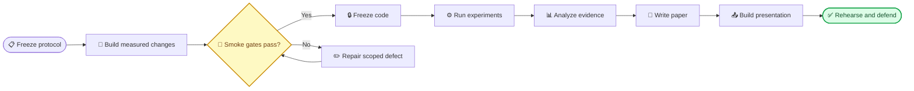

# 48 小时 Codex 协作与课程汇报交付索引

_适用于 Heidelberg University DSBA / Intelligent Systems Master Practical 项目收尾；执行语言规则：项目代码、论文与 PPT 全部为英文，用户审计与 Codex 提示词开头使用中文。_

---

## 📋 你现在拥有的文件

| 顺序 | 文件 | 什么时候使用 | 最终作用 |
|---:|---|---|---|
| 00 | `00_multiple_ai_agent_optimization_2day_plan.md` | 先读 | 技术方案、实验设计和 48 小时总计划 |
| 10 | `10_README_48h_codex_and_presentation_index.md` | 每次开始工作前 | 总导航和阶段进入条件 |
| 11 | `11_codex_48h_collaboration_playbook.md` | 管理多个 Codex 任务时 | 文件所有权、时间线、检查点、止损规则 |
| 12 | `12_codex_staged_prompt_library.md` | 每一阶段复制提示词时 | 从代码审计到论文、PPT、最终红队审计的完整提示词 |
| 13 | `13_presentation_30min_blueprint.md` | 实验协议冻结后开始填；数据完成后定稿 | 23 页、约 23 分钟的英文主讲结构、讲稿要点、图表与数据依赖 |
| 14 | `14_evidence_and_data_collection_matrix.md` | 从第一次正式运行前开始 | 必须采集的数据、采集阶段、来源和论文/PPT用途 |
| 15 | `15_required_data_register.csv` | 每个阶段结束时更新 | 可过滤、可打勾的数据采集台账 |

> 📌 **课程定位：** Heidelberg 官方 DaCS 说明将 Master’s Advanced Practical 列为 8 CP；官方培养目标强调独立规划、实现、评估和呈现复杂计算系统，并在技术与经济约束下论证方案。[^1][^2] 本文件将这些目标用作质量对齐依据，但不是课程教师发布的正式评分 rubric。若教师另有 rubric，以教师文件为准。

## 🎯 48 小时的唯一成功路径

顺序不能颠倒：

1. 先冻结问题、指标、6 个 cases、evidence snapshots 和 C1–C6 条件
2. 再修 evidence provenance、confidence 与 role-level Critic
3. 单 case 冒烟通过后冻结代码
4. 才开始 36 个最小正式 runs
5. 只从 manifest 和评分表生成 Results
6. 先完成英文论文首轮，再逐节使用 academic-humanizer
7. PPT 结果页只引用最终 CSV/figures，不手工输入数字

## 👥 推荐的 Codex 任务布局

两天内最多同时维护四个任务，且每个文件只能有一个 owner：

| Codex 任务 | 角色 | 允许写入 | 禁止写入 |
|---|---|---|---|
| Control Room | 只读总控、检查阶段门、整合 handoff | 交付目录中的状态文档 | 产品代码 |
| Core Product | provenance、confidence、Critic、routing、tests | `agents/`、`schemas/`、`workflow/`、`prompts/`、相关 `tests/` | `slm/`、论文和正式数据 |
| Evaluation | cases、manifest、metrics、blind packs、figures | 新建 `evaluation/`、`docs/EVALUATION_RUBRIC.md`、结果目录 | Core Product 文件，除非明确移交 |
| SLM | Granite adapter、preflight、single-process runs | `slm/` 与 `slm/tests/` | Core Product 与评分文件 |
| Paper and Slides | 英文论文、PPT、speaker notes | `@final presentation/` | 产品代码和原始实验数据 |

不建议同时运行五个写任务。Paper and Slides 在 Day 1 只能写结构与 Methods；正式 Results 必须等待数据。

## 📍 你每天只需要做的事

### Day 1

- 审批 rubric、cases、evidence 和成功阈值
- 在三个实现任务的 checkpoint 审计 `git diff`、tests 和残余风险
- 决定 Granite 是否通过 memory/schema/time gate
- 在 smoke tests 通过后明确宣布 `CODE FREEZE`
- 晚上只让一个本地 SLM 进程运行

### Day 2

- 检查 36 个预定 run 是否都有 success/failure record
- 完成人工盲评和实际 edit-time 记录
- 审核自动指标是否能追溯到 `run_id`
- 审核英文 Results 的每个数字是否来自 CSV
- 审核 PPT 每个结论是否有图表、测试、日志或限制支持
- 至少完整计时练习三次，并准备 6 分钟 Q&A

## ✅ 四个不可跳过的人工决策门

| 决策门 | 你要回答的问题 | 通过后才能做什么 |
|---|---|---|
| Gate A：Protocol | 研究问题、条件、rubric 和阈值是否冻结？ | 修改产品代码 |
| Gate B：Code | targeted tests、full tests、single-case smoke 是否通过？ | 正式运行 |
| Gate C：Evidence | 失败是否进入分母、评分是否匿名、数字是否可回溯？ | 写 Results |
| Gate D：Presentation | 22–24 分钟能否讲完、结论是否不过度、backup 是否齐全？ | 提交和汇报 |

## ⚠️ 最高风险提醒

- 当前分支存在未提交的 `slm/` 修改；只有 SLM owner 可以继续修改这些文件
- 不要让两个 Codex 任务同时编辑 `workflow/multi_agent_graph.py`
- 不要让写论文的 Codex 自己选择排除失败 runs
- 不要把 Critic 自评分当成 Critic 成效证据
- 不要把 36 次运行写成 `n=36`；独立 case 是 `n=6`
- 不要为了减少 `Confidence: low` 而增加 unsupported medium/high claims
- 不要现场依赖 live demo；准备 45–60 秒录屏或三张连续截图
- 不要把 30 分钟全部讲满；默认按 24 分钟主讲、6 分钟问答准备

## 🔧 现在立刻怎么开始

1. 打开 `12_codex_staged_prompt_library.md`
2. 把 Prompt 0 发给 Control Room
3. 把 Prompt 1 发给 Evaluation 任务，冻结 protocol
4. Gate A 由你批准后，并行启动 Prompt 2 和 3；Prompt 2 通过后执行 Prompt 4，再执行 Prompt 5
5. 每个 Codex 返回结果时，要求它使用同一 handoff 格式
6. 把 handoff 发回 Control Room，由它判断下一阶段是否可以开始

OpenAI 官方提示建议以 expected outcome、success criteria、evidence rules、test expectations 和 stopping conditions 组织长任务，并明确何时使用并行子任务。[^3] 本提示词库已经把这些字段固化，你不需要再写长篇过程指令。

## 🔗 参考来源

[^1]: Heidelberg University Institute of Computer Science. “Master’s Degree Data and Computer Science.” https://www.informatik.uni-heidelberg.de/studium/master/dacs?lang=en

[^2]: Heidelberg University. “Module Handbook: Master Course of Studies Data and Computer Science.” https://www.informatik.uni-heidelberg.de/c/image/f/default/pdfs/mhb2024/MHB_Informatik_MSc_DaCS_aktuell.pdf

[^3]: OpenAI. “Model guidance: Prompting best practices.” https://developers.openai.com/api/docs/guides/latest-model?model=gpt-5.5
