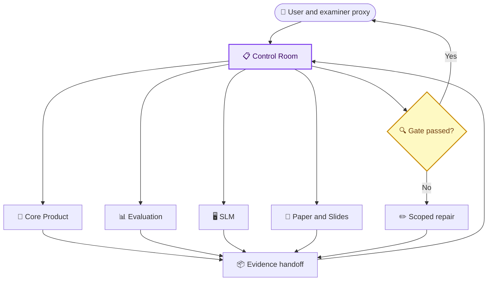
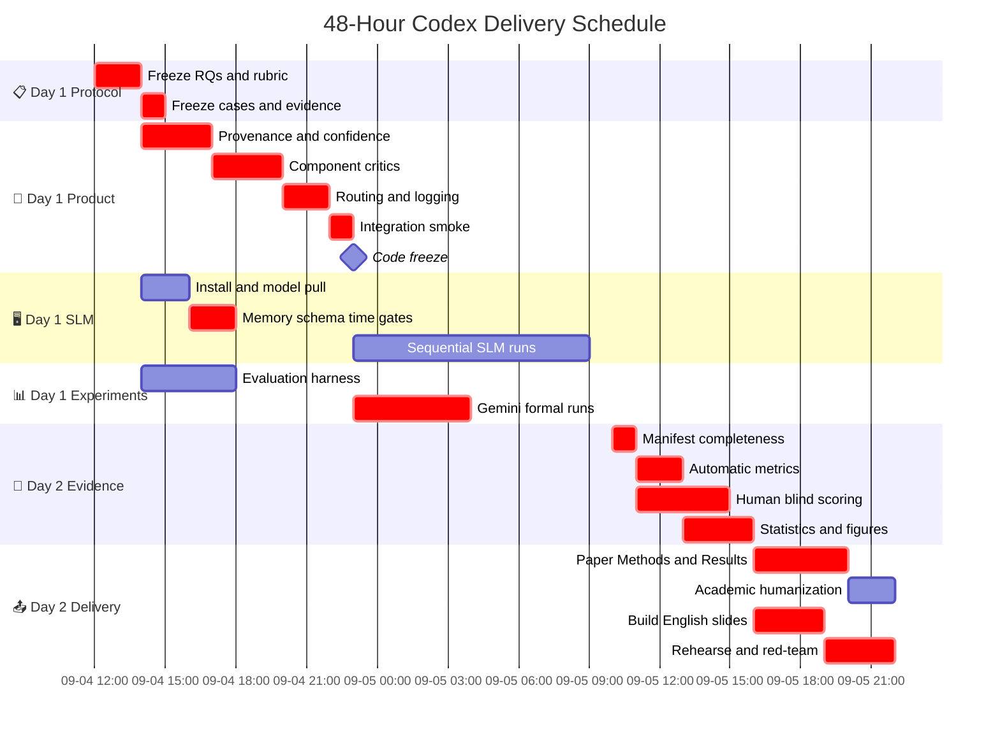

# 如何在 48 小时内与 Codex 协作完成 Multiple AI Agent 项目

_操作手册｜适用于单人主导、Codex 大量执行、需要同时交付英文代码、英文论文和英文 30 分钟汇报的 Master Practical。_

---

## 🎯 协作原则

你的角色不是逐行告诉 Codex 怎么编码，而是控制五件事：

1. **Outcome**：这一阶段必须产生什么可审计 artifact
2. **Scope**：允许修改哪些文件，禁止触碰哪些文件
3. **Evidence**：什么测试、日志或数据才算完成
4. **Decision gate**：什么条件满足后才能进入下一阶段
5. **Scientific boundary**：哪些结论可以写，哪些只能写成 limitation

Codex 的角色是完成范围内的审计、实现、测试、实验自动化、数据整理、英文写作和可视化。官方 OpenAI prompting guidance 也建议长任务采用 outcome-first 结构，明确 success criteria、testing、delegation 和 stopping conditions，而不是把所有实现步骤预先写死。[^1]

## 👥 推荐工作模式

### 首选模式：一个总控任务加三个隔离执行任务



Control Room 不改代码。它维护当前事实、剩余时间、阶段状态和阻塞项。这样某个执行任务出现长对话或方向偏移时，不会丢掉全局约束。

### 什么时候使用单一任务

如果你不熟悉 worktree 或不想处理合并，使用一个 Core Product 任务，让它自行委派只读 subagents，并由主 agent 完成所有代码写入。Evaluation 与 Paper 仍可并行，因为它们写新目录，不应覆盖产品文件。

### 什么时候使用 worktree

只有满足以下条件才开独立 worktree：

- 工作包文件边界清楚
- 可独立测试
- 最终可用一个小 commit 合并
- 不依赖另一个尚未完成的 schema

当前仓库有未提交的 `slm/` 工作。创建 SLM worktree 时必须以 current working tree 为起点，或继续在当前 checkout 中由唯一 owner 完成；不要从默认分支启动并丢失现有修改。

## 📋 文件所有权和并发规则

| 工作包 | 唯一 owner | 可并行对象 | 合并前依赖 |
|---|---|---|---|
| Protocol and rubric | Evaluation | Paper Methods skeleton | 无，最先完成 |
| Provenance and confidence | Core Product | Evaluation harness、SLM install | Protocol frozen |
| Component Critic | Core Product | SLM preflight | Provenance schema finalized |
| Dynamic routing and logging | Core Product | Paper Methods | Critic schema and gates stable |
| Granite integration | SLM | Core Product | Context contract frozen |
| Experiment runner | Evaluation | Core Product tests | Condition config and logging fields frozen |
| Formal runs | Evaluation / user | Paper Introduction and Methods | Code freeze |
| Results and figures | Evaluation | Paper architecture sections | Run manifest complete |
| Paper Results | Paper and Slides | Presentation visual skeleton | Metrics CSV frozen |
| Final PPTX | Paper and Slides | Q&A preparation | Final figures and claims frozen |

禁止的并发组合：

- 两个任务同时改 `schemas/agent_outputs.py`
- 两个任务同时改 `workflow/multi_agent_graph.py`
- 两个 Ollama/Granite 32K 进程同时运行
- 正式实验运行时另一个任务修改 prompts、schemas 或 routing
- 人工评分进行时重新生成匿名 output
- Results 写作与指标定义调整同时发生

## 📍 48 小时详细调度



时间点按实际开始时间平移即可；关键是依赖和 milestone，不是日期本身。

## 🔄 每个 Codex 任务的标准生命周期

### 1. 启动

发送 `12_codex_staged_prompt_library.md` 中对应提示词。不要额外口头添加互相矛盾的要求。

### 2. 第一次更新

Codex 应先报告：

```text
UNDERSTANDING
- Outcome:
- Files in scope:
- Files explicitly out of scope:
- Existing user changes detected:
- Validation plan:
- Expected blocker, if any:
```

如果它的 files in scope 与所有权表冲突，立即停止，而不是等它改完。

### 3. 执行中检查点

只在这些时刻要求更新：

- 审计完成、准备开始修改
- 数据契约或 public interface 即将改变
- targeted tests 首次通过
- 发现原计划无法完成，需要触发降级
- 工作包完成，准备 handoff

不要每 10 分钟问一次进度；会中断长任务。使用明确的 artifact-based checkpoint。

### 4. 完成交接

每个任务必须返回：

```text
HANDOFF
1. Outcome achieved:
2. Files changed:
3. Commands/tests run and exact results:
4. Artifacts created:
5. Data fields now captured:
6. Known limitations:
7. Uncommitted or pre-existing changes preserved:
8. Recommended next prompt:
9. GO / NO-GO recommendation:
```

### 5. Gate 审批

你只需要检查：

- 是否达成 acceptance criteria
- tests 是否真的运行，而不是“应该通过”
- 是否修改越界文件
- 是否产生所需 CSV/log/artifact
- 结论是否超过证据

通过后将 handoff 复制给 Control Room。Control Room 更新阶段表，再发下一提示词。

## ✅ 阶段 Gate 定义

### Gate A：Protocol freeze

必须存在：

- 英文 RQ 和 hypotheses
- C1–C6 condition table
- 6 cases 和 frozen evidence strategy
- academic/business/safety metrics
- blind rubric 和 1/3/5 anchors
- success thresholds 与 failure exclusion policy
- experiment version

不通过时，禁止修改 Critic 和跑正式实验。

### Gate B：Measured implementation

必须存在：

- claim-to-source provenance
- deterministic confidence aggregation
- role-specific Critic schemas
- max one revision per role
- route trace 和 budget guards
- legacy feature flag
- targeted tests 和 full test result

不通过时，只能继续 mock/smoke，禁止 formal runs。

### Gate C：SLM feasibility

必须存在：

- exact model/quantization/context
- free RAM before load、peak RAM/VRAM、CPU/GPU split
- one packet schema result
- one critic schema result
- one Writer batch result
- prompt/generation tokens per second
- estimated full-run time

如果单节点超过 20 分钟、完整 Multi 预计超过 90 分钟或连续两次 schema 失败，记录失败并降级，不继续扩大 timeout。

### Gate D：Code freeze

必须存在：

- C1–C6 单 case smoke status
- full tests result
- Git commit or content hashes
- prompt/schema/evidence hashes
- run manifest 可增量写入
- failure records 不会被覆盖

宣布 code freeze 后，只有阻断全部 runs 的 P0 bug 可以改。修复后新建 experiment version，并重跑所有受影响条件。

### Gate E：Evidence complete

必须存在：

- 每个预定 run 都有 success/failure
- 每个成功 run 都有 output hash
- 自动指标、人工匿名 ID 和 condition mapping 分离
- 评分表没有 condition 泄漏
- 失败进入 completion/utility 分母
- 数字可以从 CSV 自动重新计算

不通过时，禁止写 Results 的结论句。

### Gate F：Submission ready

必须存在：

- 英文论文中的数字与最终 CSV 一致
- 论文明确 exploratory pilot 和 `n=6 cases`
- 英文 PPT 主讲 22–24 分钟
- 所有结果图有 sample size、unit、direction 和 uncertainty
- 结论页同时包含 contribution、trade-off 和 limitation
- backup slides、PDF backup 和 6 分钟 Q&A 答案

## 📊 你如何审计 Codex 的工作

### 代码任务

要求查看：

- `git diff --stat`
- `git diff -- <owned files>`
- targeted tests 的 exact command 和 pass count
- full tests 的 exact command 和 pass count
- 新增 schema 的向后兼容说明
- 一个 failure-path test

不要以“代码看起来合理”作为验收。

### 实验任务

要求查看：

- `run_manifest.csv` 行数是否等于计划数
- condition 与 case 是否完整交叉
- status/failure_type 是否无空值
- output/evidence/prompt/schema hashes 是否存在
- 随机化顺序是否被保存
- repeated runs 是否仍归入同一 case

### 论文任务

要求每个 Results 段落同时提供：

```text
Claim
Exact supporting table/figure
Analysis unit
Effect direction and magnitude
Uncertainty or limitation
Prohibited stronger interpretation
```

### PPT 任务

要求每页提供：

```text
One-sentence message
One primary visual
Source data path
Speaking time
Transition sentence
Backup or main-deck status
```

## ⚠️ 失败时怎么和 Codex 协作

### Codex 开始扩张范围

发送：

```text
中文任务摘要：停止范围扩张，回到当前阶段的验收目标。

Stop implementation. Report the files already changed, why each change is required for the current acceptance criteria, and which changes are optional. Revert nothing. Continue only with the smallest set that satisfies the current gate. Do not touch files owned by another workstream.
```

### Codex 卡在同一错误

发送：

```text
中文任务摘要：不要重复同一修复路线，请把阻塞转化为可验证的根因与降级方案。

Stop retrying the same approach. Produce: (1) the exact failing command and error, (2) the smallest reproducible case, (3) three plausible root causes ranked by evidence, (4) one targeted diagnostic per cause, and (5) the lowest-risk fallback that preserves the experiment's interpretability. Do not increase timeouts as the primary fix.
```

### 时间不足

按顺序削减：

1. sentinel repeats
2. SLM 上的 C5/C6
3. SLM Multi 全链，改为 Single + component-level
4. 完整 Strategy/Finance gate，保留 Research vertical slice
5. live demo，改用录屏/截图
6. presentation 装饰性动画

不能削减 protocol、failure logging、C1/C2、confidence safety、Results traceability 和 limitation。

## 📈 面向 1.5–2.0 的质量标准

这不是官方评分表，而是与 Heidelberg 官方硕士培养目标对齐的自检标准：官方说明强调独立科学工作、复杂系统设计与评估、技术和经济约束、可靠性、文档与展示、对替代方案的评价。[^2][^3]

| 维度 | 低质量风险 | 目标表现 |
|---|---|---|
| Scientific framing | 只说“我做了一个 App” | 有 RQ、comparators、fair controls 和 claim boundaries |
| Engineering depth | 只有 prompts 和 UI | 有 typed contracts、routing、budgets、logging、tests、failure recovery |
| Evaluation | 只展示一个好例子 | 有 2×2、ablation、failed runs、blind rubric、effect sizes |
| Critical reflection | 只讲成功 | 解释 static/dynamic 差异、SLM failure、confidence calibration 和 validity threats |
| Business relevance | 只报模型质量 | 同时报 usable draft、edit time、latency、cost、Pareto |
| Reproducibility | 手工截图和口头描述 | 有 Git/model/prompt/schema/evidence hashes 与 manifest |
| Communication | 密集文字和流水账 | 一页一结论、结果占 40–50%、明确 limitations、准备 Q&A |

## 🔗 参考来源

[^1]: OpenAI. “Model guidance: Prompting best practices.” https://developers.openai.com/api/docs/guides/latest-model?model=gpt-5.5

[^2]: Heidelberg University Institute of Computer Science. “Master’s Degree Data and Computer Science.” https://www.informatik.uni-heidelberg.de/studium/master/dacs?lang=en

[^3]: Heidelberg University. “Module Handbook: Master Course of Studies Data and Computer Science.” https://www.informatik.uni-heidelberg.de/c/image/f/default/pdfs/mhb2024/MHB_Informatik_MSc_DaCS_aktuell.pdf
