# Evidence-Gated Multi-Agent Planning under API and Local Compute Constraints

_Thirty-minute English presentation blueprint for the Heidelberg University DSBA Master Practical “Intelligent Systems” (8 ECTS). Prepared target: 22:45–23:15 speaking time, 1 minute recovery buffer, and at least 6 minutes for questions._

---

## 🎯 Presentation contract

**Proposed title**

> Evidence-Gated Multi-Agent Planning under API and Local Compute Constraints

**Subtitle**

> Master Practical “Intelligent Systems” · Heidelberg University DSBA · 8 ECTS

**One-sentence thesis**

> A multi-agent planning system is useful only when specialist decomposition and bounded quality gates improve evidence quality and human usability enough to justify their coordination, latency, and compute overhead.

**Core story**

> A planning system can generate a complete-looking document without producing a trustworthy decision artifact. This project tests whether specialist decomposition, local critique, and bounded conditional revision improve evidence quality and practical usability, and whether those gains survive model and hardware constraints.

The official Heidelberg DaCS description emphasizes scientific and practical competence, while the current module handbook expects students to plan, implement, document, evaluate, and present complex computing systems under technical and economic constraints.[^1][^2] This blueprint aligns the presentation with those published qualification objectives; it is not an official grading rubric.

**Non-negotiable claim boundary**

- Say **“observed in this six-case exploratory pilot”**, not “Multi-Agent systems are superior.”
- Say **“bounded conditional revision”**, not “fully autonomous dynamic control.”
- Say **“local inference has no per-call API fee”**, not “local inference is free.”
- Treat a failed Granite arm as a deployment-feasibility result, not as evidence of inferior content quality.
- Keep completed-output quality, completion rate, and failure-adjusted utility separate.

## ⏱️ Timing architecture

| Act | Slides | Time | Purpose |
|---|---:|---:|---|
| Problem and research questions | 1–4 | 2:55 | Establish why trust and fair comparison matter |
| System diagnosis and intervention | 5–8 | 3:55 | Explain the implemented contribution |
| Evaluation design | 9–10 | 2:20 | Establish scientific credibility before results |
| Results and engineering evidence | 11–20 | 11:35 | Spend approximately half the talk on measured findings |
| Claim boundary and conclusion | 21–23 | 2:10 | State what is supported, what is not, and why it matters |
| **Prepared talk** | **23 slides** | **22:55** | Leaves approximately 7 minutes inside a 30-minute slot |

Speaking target: approximately 115–125 words per minute, or 2,700–2,900 prepared words. Do not fill the remaining time by adding detail; preserve it for recovery and examination questions.

## 🧭 Narrative flow

```mermaid
flowchart LR
    accTitle: Presentation Evidence Story
    accDescr: The talk moves from a trust problem through the implemented architecture and controlled experiment to bounded conclusions and deployment decisions.

    problem[Problem<br/>complete-looking but untrustworthy plans] --> diagnosis[Diagnosis<br/>static error propagation]
    diagnosis --> intervention[Intervention<br/>typed evidence and local critics]
    intervention --> comparison[Controlled comparison<br/>C1 through C6]
    comparison --> evidence[Measured evidence<br/>quality reliability cost]
    evidence --> decision[Bounded conclusion<br/>when complexity is justified]

    classDef core fill:#dbeafe,stroke:#2563eb,stroke-width:2px,color:#172554;
    classDef result fill:#dcfce7,stroke:#16a34a,stroke-width:2px,color:#14532d;
    class problem,diagnosis,intervention,comparison core;
    class evidence,decision result;
```



## 🎤 Main-deck blueprint

Every final slide must contain an evidence footer such as `Source: 03_run_manifest.csv; figure script hash …` or `Implementation: workflow/...; test ...`. Replace all bracketed placeholders only from locked artifacts.

### Slide 1 — Evidence-Gated Multi-Agent Planning under API and Local Compute Constraints

- **Time:** 0:20
- **Message:** This is an engineering evaluation of when added agent complexity becomes defensible.
- **Visual:** Clean title, small system motif, course subtitle.
- **Speaker line:** “I investigated not merely whether multiple agents can produce a plan, but when their additional complexity produces a more trustworthy and usable artifact.”
- **Evidence dependency:** None.

### Slide 2 — A complete plan can still be unsafe to trust

- **Time:** 0:45
- **Message:** Surface completeness hid low confidence, weak provenance, and downstream propagation of specialist defects.
- **Visual:** One anonymized baseline excerpt with three callouts: unsupported factual claim, section-wide `Confidence: low`, and missing claim-to-source trace.
- **Required values:** Legacy output ID; count of low-confidence sections; one verified failure mechanism.
- **Speaker transition:** “The first problem was therefore not document length; it was whether a decision-maker could audit the content.”

### Slide 3 — The task is to convert one structured brief into an auditable 13-section plan

- **Time:** 0:45
- **Message:** The product task combines evidence retrieval, business reasoning, financial calculation, synthesis, and safety constraints.
- **Visual:** Input brief → specialist packets → 13-section plan, with source lineage below.
- **Required values:** Required sections; actual specialist roles; one representative case domain.
- **Do not:** Read all section names aloud.

### Slide 4 — Four questions determine whether the added complexity is justified

- **Time:** 0:55
- **Message:** Architecture, model, critic placement, and bounded routing are evaluated separately.
- **Visual:** Four compact RQ cards.
- **Slide text:**
  1. Does Multi-Agent improve plan quality over a matched Single Agent?
  2. What changes when Gemini is replaced by a local Granite SLM?
  3. Do component-level critics reduce defect propagation?
  4. Does conditional revision preserve quality while avoiding unnecessary calls?
- **Required values:** Final frozen RQ wording and estimands.

### Slide 5 — In the legacy graph, specialist defects propagated to the final critic

- **Time:** 0:55
- **Message:** A final-only critic was too late to recover missing evidence or specialist reasoning reliably.
- **Visual:** Implemented legacy static graph; mark Research, Strategy, and Finance outputs as unchecked handoffs.
- **Required evidence:** Code path, node names, and one actual baseline route trace.
- **Terminology:** “Legacy static multi-agent workflow.”

### Slide 6 — The intervention reviews errors where they originate

- **Time:** 1:05
- **Message:** Typed role reviews create issue-level correction before downstream synthesis.
- **Visual:** Legacy and reviewed-static architecture side by side; show Research/Strategy/Finance Critic gates and the retained final critic.
- **Required evidence:** `AgentReview` fields, feature flags, max revisions, persisted pre/post records.
- **Speaker line:** “Critics do not add facts. They identify bounded issues, protect provenance, and request one targeted correction.”

### Slide 7 — Dynamic means bounded conditional revision, not unrestricted autonomy

- **Time:** 0:55
- **Message:** C6 changes the executed path at runtime while deterministic guards guarantee termination.
- **Visual:** `pass → next`, `revise → once → next`, `block → terminal/HITL` with request, token, and time budgets.
- **Required evidence:** Real pass, revise, and terminal route traces; observed maximum revision count.
- **Do not:** Call the system a self-directed autonomous supervisor.

### Slide 8 — Evidence is a typed object, not prose decoration

- **Time:** 1:00
- **Message:** Claim types, source support, authority, critic state, and reason-coded confidence make the output auditable.
- **Visual:** One claim card with `claim_type`, `source_ids`, `support`, `evidence_status`, `confidence`, and `reason_codes`.
- **Required values:** Allowlist validation rate; unknown-source count; one before/after confidence example.
- **Speaker transition:** “With the system contract fixed, the next question is whether the comparison itself is fair.”

### Slide 9 — A blocked 2×2 design separates architecture from model effects

- **Time:** 1:10
- **Message:** C1–C4 isolate Single versus Multi and Gemini versus Granite on identical case/evidence blocks; C5–C6 are architecture ablations.
- **Visual:** 2×2 grid plus a C2 → C5 → C6 ablation strip.
- **Required values:** Six cases; planned/completed runs; hashes shared across matched conditions; randomization rule.
- **Footnote:** “Experimental unit: case (`n = 6`), not run.”
- **Context:** Multi-agent evaluation literature emphasizes separating task performance from coordination and reporting cost and failure dimensions, which supports this multidimensional design.[^3][^4]

### Slide 10 — Quality, reliability, and cost were measured separately

- **Time:** 1:10
- **Message:** No opaque aggregate score hides a safety or reliability failure.
- **Visual:** Three columns.
  - Quality: blind 1–5 rubric and academic 0–100 transformation.
  - Reliability: completion, usable draft, schema valid@1, unsupported high-impact claims.
  - Efficiency: latency, tokens, actual API cost, edit minutes, peak memory.
- **Required values:** Rubric dimensions/weights; primary outcome; safety guardrail; rating design; hidden-repeat fraction.
- **Method note:** If an LLM judge is used, label it auxiliary. G-Eval supports structured LLM-assisted evaluation but does not replace the project’s blinded human primary outcome.[^5]

### Slide 11 — Execution reality: [COMPLETED] of [PLANNED] runs reached a terminal state

- **Time:** 0:50
- **Message:** The full denominator, including failed and gate-failed runs, defines what can be concluded.
- **Visual:** Completion waterfall by C1–C6 with success, failed, gate-failed, and reduced categories.
- **Required values:** Planned and terminal row counts; failure counts by condition; protocol deviations.
- **Do not:** Hide infeasible Granite runs or quote quality only for successful runs without this slide.

### Slide 12 — Agent decomposition [IMPROVED / DID NOT IMPROVE] plan quality on [X OF 6] matched cases

- **Time:** 1:20
- **Message:** The main Multi-versus-Single result is a paired case-level effect, not a cherry-picked example.
- **Visual:** Paired dot or slope plot for C1 versus C2; add median paired difference and case-cluster interval.
- **Required values:** Per-case blind score, completion, usable draft, paired median/mean difference, positive-case count, uncertainty.
- **Speaker pattern:** observation → magnitude → heterogeneity → bounded interpretation.
- **Fallback:** If C1/C2 are incomplete, title the slide “The primary architecture comparison remained underpowered because [observed cause].”

### Slide 13 — Local Granite traded [QUALITY] for [LATENCY / PRIVACY / API INDEPENDENCE]

- **Time:** 1:15
- **Message:** The local model decision depends on deployability and utility, not content quality alone.
- **Visual:** C1/C3 and C2/C4 paired comparison plus a compact feasibility card for context, RAM, throughput, and valid@1.
- **Required values:** Exact model/digest/quantization/context; completed cases; quality; completion; latency; peak RAM/pagefile; cost status.
- **Fallback title:** “The local SLM did not complete the end-to-end task within the hardware budget.”
- **Fallback evidence:** Memory/schema/time gate values and the deepest successful component.

### Slide 14 — The interaction test asks whether decomposition compensates for a smaller model

- **Time:** 1:05
- **Message:** Architecture benefit may depend on the underlying model; do not average away the interaction.
- **Visual:** Two-line interaction plot: Single and Multi across Gemini and Granite.
- **Required values:** Matched complete C1–C4 cells and case-level interaction estimate.
- **Rule:** Move this slide to backup if any cell is too incomplete for an interpretable interaction.

### Slide 15 — Quality gains occupied a measurable latency–cost frontier

- **Time:** 1:15
- **Message:** Added agents are justified only if their gain is worth their coordination and correction overhead.
- **Visual:** Pareto plot: quality on y, latency on x, bubble size as cost or requests; mark failures separately.
- **Required values:** Quality, completion-adjusted utility, end-to-end P50/P95, tokens, requests, actual API cost or `not collected`.
- **Do not:** Assign zero cost to missing Gemini billing data or local energy.

### Slide 16 — Component critics stopped [X%] of verified defects before final synthesis

- **Time:** 1:15
- **Message:** Critic value is measured by verified defect handling, not by the critic’s own score.
- **Visual:** Dumbbell or funnel: seeded/observed issues → detected → fixed → retained downstream; show false positives and regressions.
- **Required values:** Precision, recall, true-issue resolution, regression, upstream propagation, C2 versus C5 paired quality and overhead.
- **Fallback:** Use the title “A component-level Research critic demonstrated bounded defect interception” if only a vertical slice was completed.

### Slide 17 — Conditional routing revised only when evidence justified it

- **Time:** 1:10
- **Message:** C6 must show a route difference, a saved revision call when passing, and bounded behavior when failing.
- **Visual:** Route frequency Sankey-like flow or grouped bars for pass/revise/block, plus C5/C6 requests and quality.
- **Required values:** Gate counts, revision-trigger rate, skipped revisions, missed-needed revisions, requests/tokens saved, quality difference, guard success.
- **Fallback title:** “A bounded dynamic vertical slice was feasible; full adaptive orchestration remains future work.”

### Slide 18 — Confidence became better calibrated, not merely higher

- **Time:** 1:10
- **Message:** Success means fewer underconfident supported claims without more overconfident unsupported claims.
- **Visual:** Before/after matrix or bars for appropriate low, appropriate medium/high, underconfidence, and overconfidence; include reason-code distribution.
- **Required values:** Audited-claim denominator; legacy/new confidence on the same frozen claims; direct-support audit; transitions and errors.
- **Do not:** Report the number of `low` labels alone as improvement.

### Slide 19 — Remaining failures concentrated in [TOP FAILURE MODES]

- **Time:** 1:15
- **Message:** Failure localization is an engineering result and determines the next design decision.
- **Visual:** Agent × failure-mode heatmap with one representative route trace.
- **Required values:** Failure taxonomy, denominator, node, recoverability, propagation, retries, termination guard, and final impact.
- **Speaker pattern:** “The guard contained [failure], but [limitation] remained.”

### Slide 20 — Product value depends on reduced human correction, not longer output

- **Time:** 1:00
- **Message:** A plan becomes commercially useful when it completes, passes safety checks, and reduces edit effort at an acceptable wait and cost.
- **Visual:** Decision matrix or compact frontier using usable-draft rate, edit minutes, time to first valid draft, and cost per usable draft.
- **Required values:** Operational definition of usable draft; actual edit time; normalized edit distance if available; completion-adjusted utility.
- **Do not:** Claim revenue, ROI, or customer willingness-to-pay without measured data.

### Slide 21 — The evidence supports a bounded claim, not a universal one

- **Time:** 1:15
- **Message:** Scientific maturity is visible in the limits of the claim.
- **Visual:** Two columns: “Supported” and “Not established.”
- **Supported examples:** observed paired changes; actual route behavior; measured resource feasibility; verified failure containment.
- **Not established examples:** broad domain generalization; multi-user deployment; model-family universality; long-term operational economics.
- **Required values:** `n = 6`; rater count; missing arms; protocol deviations; hardware and API constraints.

### Slide 22 — Three takeaways define when this architecture is worth using

- **Time:** 0:55
- **Message:** Close with answers rather than a feature list.
- **Visual:** Three numbered assertions populated only after result lock.
  1. **Architecture:** `[bounded answer to Single vs Multi]`.
  2. **Control:** `[bounded answer to local critics and conditional revision]`.
  3. **Deployment:** `[bounded answer to Gemini vs Granite and human effort]`.
- **Never skip:** This slide must remain even when earlier result slides are reduced.

### Slide 23 — Questions

- **Time:** 0:10
- **Visual:** One architecture thumbnail and links/QR only if repository sharing is authorized.
- **Speaker line:** “The implementation, run manifests, output hashes, and figure sources are available for inspection. I welcome questions.”

## 🧰 Backup deck

Keep the main deck evidence-led and move diagnostic detail into the following backup order:

| Backup | Title | Required evidence |
|---:|---|---|
| B1 | Exact Evaluation Rubric and Anchors | weights, 1/3/5 anchors, primary outcome |
| B2 | Six Cases and Controlled Variables | case rationale, evidence hashes, condition diffs |
| B3 | Frozen Input and Evidence Manifest | brief/source snapshot hashes |
| B4 | Role Contracts and Forbidden Actions | schema fields, tool permissions, source restrictions |
| B5 | Context and Memory Budget | per-node context, pruning, retained sources |
| B6 | One Claim from Source to Final Plan | full `source_id → claim_id → output` lineage |
| B7 | Full Per-Case Results | all paired values and missing reasons |
| B8 | Statistical Procedure | estimands, bootstrap seed, exploratory tests |
| B9 | Route and Termination Evidence | pass/revise/block/timeout traces |
| B10 | Granite Configuration and Telemetry | digest, context, RAM, pagefile, throughput |
| B11 | Failure Log and Recovery | representative P0/P1 failure |
| B12 | Web Research and Prompt-Injection Controls | allowlist, validation, tool and export gates |
| B13 | Reproducibility Stack | code/model/prompt/schema/evidence hashes and commands |
| B14 | Representative Before/After Output | same case, blinded excerpt, verified corrections |
| B15 | Recorded Demo Fallback | 45–60 second recording or three screenshots |

## 🧯 Result-contingent fallback narratives

### If Granite does not pass the hardware gate

Keep the failure in the headline deck. Show the exact deepest successful probe and the gate that failed. State:

> “On this 15.8 GiB, CPU-first laptop, the selected local model did not meet the predeclared end-to-end feasibility budget. This limits the content comparison, but it is a reproducible deployment result rather than a missing observation.”

Do not silently substitute a smaller model. A separate H 1B probe may appear only as a newly named component-level feasibility condition.

### If C1–C4 are incomplete

- Retain completion and failure denominators.
- Present C1/C2 if that matched comparison is intact.
- Move the model-by-architecture interaction to backup.
- Change result titles from comparative claims to observed execution facts.

### If only the Research critic and dynamic gate are complete

Use “component-level vertical slice” consistently. Do not draw a full target graph as implemented without labeling future nodes. Measure seeded-defect interception, one-revision termination, provenance retention, and saved revision calls.

### If human evaluation has one rater

Report hidden repeat agreement or intra-rater reliability. Do not report inter-rater reliability. State that ratings support an exploratory within-case comparison and require external replication.

### If cost data are unavailable

Show requests, tokens, and latency. Label provider billing `not collected`; label local energy `not measured`. Do not convert absent values into zero.

## 🎨 Visual and language system

### Condition colors

| Meaning | Color | Use |
|---|---|---|
| Single Agent | neutral gray | architecture baseline |
| Multi-Agent | blue | multi-agent conditions |
| Gemini | amber accent | provider/model comparison |
| Granite | purple accent | local model comparison |
| Passed/supported | green | validated evidence, success |
| Failed/unsupported | red | failure and safety violation |

Use redundant labels and markers so color is never the only encoding. Avoid radar charts. Prefer paired dots, slope charts, interaction plots, dumbbells, heatmaps, waterfalls, and Pareto scatterplots.

### Slide writing rules

- Use assertion-style titles, not topic labels.
- Define Single Agent, Multi-Agent, SLM, RAG, and HITL on first use.
- Use a maximum of one main chart and one small evidence card per result slide.
- Put `n`, unit, direction, and uncertainty next to each headline value.
- Use at least 28 pt body text and 20 pt chart labels unless the selected template demands larger sizes.
- Keep citations and artifact footers readable but visually secondary.
- Use the same condition order on every chart: C1, C2, C3, C4, C5, C6.
- Never copy values manually from a terminal or Streamlit screen; generate slides from locked results or a verified evidence map.

## 📦 Slide evidence map schema

Create `slide_evidence_map.csv` with:

```csv
slide_id,claim_id,claim_text,source_artifact,source_field_or_figure,analysis_unit,denominator,status,reviewer
```

Allowed `status` values:

```text
verified
placeholder_before_result_lock
removed_unsupported
declared_limitation
```

Before export, there must be no `placeholder_before_result_lock` status on a quantitative main slide.

## 🗣️ Rehearsal protocol

Perform three full rehearsals:

1. **Evidence rehearsal:** stop at every number and name its source artifact.
2. **Timing rehearsal:** speak without stopping; target 22:45–23:15.
3. **Exam rehearsal:** another Codex task asks the likely questions below and interrupts for clarification.

Log:

```text
rehearsal_id
date_time
duration
slide_at_10_minutes
slide_at_20_minutes
over_time_sections
unclear_terms
unsupported_claims_found
changes_made
```

If the course allocates all 30 minutes to prepared speech and places Q&A afterward, expand to no more than 28:30 plus a 1:30 buffer. Promote B4, B5, B12, and B13 rather than adding more result charts.

## ❓ Likely examiner questions

1. Why are six cases sufficient, and what is the experimental unit?
2. In what exact sense is the new workflow dynamic?
3. How do you know the critic is correct rather than merely confident?
4. How did you keep evidence and prompts fair across conditions?
5. Why was Granite selected, and what was its actual usable context?
6. How did you distinguish justified low confidence from underconfidence?
7. Why not use a fully autonomous LLM supervisor?
8. Which results generalize beyond these cases?
9. What is the business value after including edit time, failure, and latency?
10. What would you implement with one additional sprint?

Each answer should follow this pattern:

> Direct answer → exact observed evidence → limitation → next engineering action.

## ✅ Final deck checklist

- All main slides are English.
- Prepared talk is below 24 minutes.
- Results occupy approximately 45–50% of speaking time.
- Every central value has a source artifact and denominator.
- Case is the analysis unit; run count is not presented as sample size.
- Failures and reductions are visible.
- Static, reviewed-static, and bounded-dynamic terminology is consistent.
- Granite identity, context, and hardware are exact.
- Confidence improvement means calibration, not simply higher labels.
- At least one contribution, trade-off, failure, and limitation are explicit.
- PPTX and PDF are rendered and visually inspected.
- Backup slides and recorded-demo fallback open offline.
- The last substantive slide answers the RQs.

## 🔗 References

[^1]: Heidelberg University Institute of Computer Science. “Master’s Degree Data and Computer Science.” https://www.informatik.uni-heidelberg.de/studium/master/dacs?lang=en

[^2]: Heidelberg University. “Module Handbook: Master Course of Studies Data and Computer Science.” https://www.informatik.uni-heidelberg.de/c/image/f/default/pdfs/mhb2024/MHB_Informatik_MSc_DaCS_aktuell.pdf

[^3]: Zhu, X. et al. “MultiAgentBench: Evaluating the Collaboration and Competition of LLM Agents.” ACL 2025. https://aclanthology.org/2025.acl-long.421/

[^4]: Rasal, S. et al. “GEMMAS: A Benchmark Suite for Evaluating Multi-Agent Systems on Multi-Faceted Tasks.” EMNLP Industry 2025. https://aclanthology.org/2025.emnlp-industry.106/

[^5]: Liu, Y. et al. “G-Eval: NLG Evaluation using GPT-4 with Better Human Alignment.” EMNLP 2023. https://aclanthology.org/2023.emnlp-main.153/
