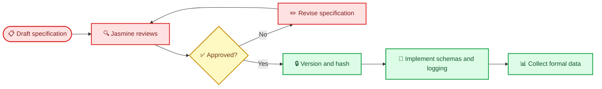

# AI-Agent Evaluation Metrics Specification — Draft for User Audit

_本文件是指标、实验字段、评分表、统计脚本、论文结果与PPT结果的唯一候选规范。当前状态为待 Jasmine 人工审核；未批准前不具有实施授权。_

---

## 🚫 Document control and hard approval gate

| Control | Current value |
|---|---|
| `document_id` | `METRICS-SPEC` |
| `spec_version` | `0.1-draft` |
| `approval_status` | `DRAFT_FOR_USER_REVIEW` |
| `downstream_implementation_permitted` | `NO` |
| Approver | Jasmine Jiang |
| Approved version | `PENDING` |
| Approved SHA-256 | `PENDING` |
| Supersedes | None; derived from planning documents 00, 14, and 15 |

> ⚠️ **Hard gate:** 在本文件被 Jasmine 明确批准、赋予正式版本号并记录 SHA-256 之前，Codex 不得据此修改 metric-related schemas、database fields、instrumentation、experiment runner、rating forms、analysis scripts、paper claims、result figures 或 PPT result slides。

批准前允许的动作仅包括：只读审计现有代码/数据是否能够支持候选指标、列出 instrumentation gaps、根据 Jasmine 的批注修订本文件，以及创建不能产生正式结果的明确标注 mock-up。



## 🎯 Normative scope and evaluation principles

本规范控制：

- experiment conditions、comparisons 和 estimands
- human、automatic 和 hybrid metrics
- formulas、denominators、directions、aggregation 和 missingness
- acceptance thresholds 和 failure handling
- claim sampling 和 blind-rating procedure
- downstream database、Pydantic schema、logging、analysis、table、figure、paper 和 PPT 字段

每个计算结果必须保留：

```text
metric_id
formula_version
numerator
denominator
value
analysis_unit
aggregation_method
missingness_status
experiment_version
metrics_spec_version
metrics_spec_sha256
```

允许的 `missingness_status`：

```text
observed
not_applicable
structurally_missing_due_failure
not_collected_protocol_deviation
```

必须批准的基本原则：

1. Final-output quality 与 agent/collaboration process 分开
2. Quality、reliability、latency、cost 分开，不合成不透明总分
3. Critic self-score 和 LLM judge 不能作为 ground truth
4. Timeout、schema failure、context overflow 和 quota failure 均保留在分母
5. Metrics、weights、anchors、cases、evidence 和 exclusions 必须在 candidate outputs 前冻结
6. Quality improvement 只有在 high-impact unsupported claim rate 未恶化时才成立
7. Zero 不得替代 missing 或 `not_applicable`

## 🧪 Proposed experimental contract

### Experimental unit

独立实验单位拟定为 `case_id`，因此正式表述为 **`n = 6 cases`**。Runs、retries、seeds、claims、node events 和 agent calls 都不是独立样本。

Technical repeats 嵌套在 `case × condition` 内，只用于 stability，不增加科学样本量，也不能替换失败的 canonical run。

### Conditions requiring approval

| ID | Architecture | Model | Review/control |
|---|---|---|---|
| C1 | Single Agent | Gemini 2.5 Flash | Common terminal validation |
| C2 | Multi-Agent | Gemini 2.5 Flash | Final-only critic; static route |
| C3 | Single Agent | Granite 4.0 H Micro Q4_K_M | Common terminal validation |
| C4 | Multi-Agent | Granite 4.0 H Micro Q4_K_M | Final-only critic; static route |
| C5 | Multi-Agent | Gemini 2.5 Flash | Role critics; fixed review and at most one targeted revision |
| C6 | Multi-Agent | Gemini 2.5 Flash | Role critics; revision only after gate failure and at most once |

同一 case 内必须固定 `brief_hash`、`evidence_hash`、source allowlist、context/output limits、schema、applicable prompt content、temperature/seed policy 和 structured-output repair allowance。

> ⚠️ **Audit point M-D01:** C1/C2 与 C3/C4 的 terminal review treatment 是否完全等价必须由 Jasmine 确认。如果不同，只能称为 system-level comparison，不能称为纯 architecture effect。

### Proposed comparison estimands

令 `Q(c,j)` 为 case `c` 在 condition `j` 下的盲评 academic score：

```text
Architecture effect under Gemini
= mean_case[Q(C2) - Q(C1)]

Architecture effect under Granite
= mean_case[Q(C4) - Q(C3)]

Gemini advantage under Single Agent
= mean_case[Q(C1) - Q(C3)]

Gemini advantage under Multi-Agent
= mean_case[Q(C2) - Q(C4)]

Model-by-architecture interaction
= mean_case[(Q(C2) - Q(C1)) - (Q(C4) - Q(C3))]

Role-critic effect
= mean_case[Q(C5) - Q(C2)]

Bounded-dynamic quality effect
= mean_case[Q(C6) - Q(C5)]
```

提议：paired mean difference 为 primary estimand；paired median、IQR、raw case differences、positive-case count 和 complete-pair count 为强制 companion。Jasmine 需确认 mean/median 的主次顺序。

## 📏 Proposed metric hierarchy

### Tier 0 — Experimental-validity gates

这些指标不衡量 agent quality；它们决定结果能否用于比较。

| Metric ID | Formula | Proposed gate | Consequence if failed |
|---|---|---:|---|
| `T0_INPUT_MATCH` | matched pairs with identical required hashes / required matched pairs | 100% | No clean attribution |
| `T0_PROTOCOL` | canonical runs using approved versions and budgets / canonical runs | 100% | Protocol deviation |
| `T0_MANIFEST` | planned rows with terminal status / planned rows | 100% | Incomplete denominator |
| `T0_BLIND_LEAK` | blind artifacts exposing model/condition metadata / blind artifacts | 0% | Human ratings invalid |
| `T0_CONDITION_DIFF` | undeclared configuration differences / audited comparisons | 0 | Comparison confounded |

Tier 0 失败时，结果仍可作为 engineering observation 报告，但不得进行干净的 causal attribution。

### Tier 1 — Three primary decision outcomes

| Metric ID | Exact definition | Direction |
|---|---|---|
| `Q_ACADEMIC_100` | `100 × Σ[w(d) × (score(d) − 1) / 4]` for completed canonical outputs | Higher |
| `B_USABLE_RATE` | usable canonical outputs / all planned canonical outputs | Higher |
| `S_UNSUPPORTED_HIGH_IMPACT` | audited high-impact factual claims without adequate support / audited high-impact factual claims | Lower |

失败 run 的 `usable = 0`，但不得伪造 `academic_score = 0`。若某输出没有 high-impact factual claim，该 claim-level rate 为 `not_applicable`，同时必须报告 numerator 和 denominator。

### Proposed six-dimensional academic rubric

| Dimension ID | Dimension | Weight | 1 / 3 / 5 anchor summary |
|---|---|---:|---|
| `AQ1` | Factual and citation correctness | 25% | unsupported/mismatched / major gaps / direct credible support |
| `AQ2` | Reasoning and cross-section consistency | 20% | contradictions / incomplete chain / coherent claims-assumptions-numbers |
| `AQ3` | Instruction adherence and structural completeness | 15% | missing core output / complete but generic / full contract compliance |
| `AQ4` | Business logic and domain plausibility | 15% | infeasible / usable with major judgement / concrete and actionable |
| `AQ5` | Uncertainty and calibration | 15% | overconfident or mechanically low / partial separation / clear fact-assumption-unknown boundary |
| `AQ6` | Clarity and traceability | 10% | unreadable/untraceable / mostly clear / concise and evidence-traceable |

正式 rubric 仍需为每维写出完整 English 1/3/5 anchors 和两个 scored examples。Weights、anchors 和 examples 都是审批对象。

### Usable-draft decision

拟定 `usable = true` 必须同时满足：

```text
run completed successfully
AND required-output contract passed
AND no critical unsupported factual claim exists
AND no rewrite of core decision logic is required
```

Jasmine 需批准 `critical`、`core decision logic` 和 `major rewrite` 的操作性定义。

### Tier 2 — Reliability, business, and resource companions

| Metric ID | Formula | Direction |
|---|---|---|
| `R_COMPLETION` | successful canonical outputs / planned canonical outputs | Higher |
| `R_FAILURE_ADJ_QUALITY` | sum of completed academic scores / planned canonical outputs | Higher |
| `B_EDIT_MIN` | submission-ready timestamp − edit start | Lower |
| `B_EDIT_DISTANCE` | character Levenshtein distance(original, final) / max(original characters, 1) | Lower |
| `B_TIME_VALID` | first schema-and-business-valid timestamp − run start | Lower |
| `B_COST_USABLE` | measured actual monetary cost / usable outputs | Lower |
| `B_THROUGHPUT` | usable outputs / measured wall-clock hours | Higher |
| `R_LATENCY_P50_P95` | empirical run and node latency percentiles | Lower |
| `R_PEAK_MEMORY` | maximum measured RAM/VRAM/pagefile during run | Lower within feasibility |
| `R_UNCONDITIONAL_UTILITY` | completion rate × mean academic score among completed | Higher |

当 usable count 为 0，`B_COST_USABLE = not_applicable`。Local API fee 可为 `not_applicable`；未测 electricity/hardware cost 必须写 `not_measured`，不得填 0。

### Tier 3 — Confidence calibration

```text
Supported factual-claim rate
= audited factual claims with adequate direct support / audited factual claims

Overconfidence rate
= audited medium/high factual claims that are unsupported, contradicted,
   or incorrectly cited / audited medium/high factual claims

Underconfidence rate
= audited low factual claims with adequate direct evidence, no material conflict,
   and no unresolved high/critical issue / audited low factual claims

Appropriate-low rate
= audited low claims with a valid low-confidence reason / audited low claims

Eligible remediation rate
= eligible low claims correctly upgraded after valid remediation / eligible low claims

Relative underconfidence reduction
= (legacy rate - new rate) / legacy rate
```

Legacy rate 为 0 时，relative reduction 为 `not_applicable`。Every confidence change requires a reason code；Critic 不得仅通过改写语句提升 unsupported claim 的 confidence。

## 🧩 Proposed agent and collaboration metrics

### Agent-level metrics

| Role | Required metric definitions | Evidence boundary |
|---|---|---|
| Validator | `valid@1`; defect-localization precision/recall; false-rejection rate | Seeded input defects + deterministic validation |
| Supervisor | required-role recall; unnecessary-role rate; valid dependency topology | Frozen gold routes |
| Research | citation coverage; claim-source support precision; authority/recency; hallucinated-source rate | Allowlist + human support audit |
| Strategy | traceable recommendations; actionable GTM; unsupported novelty; contradiction density | Lineage + blind rubric |
| Finance | recomputed arithmetic accuracy; assumption labeling; unit/currency/period consistency; false precision | Deterministic checks + human audit |
| RAG/Web | allowlist compliance; deduplication; fallback success; injection handling; snapshot completeness | Automatic logs |
| Writer | required sections / 13; evidence retention; unsupported novelty; contradiction density; redundancy | Automatic candidates + human verify |
| Role Critic | TP/FP/FN; precision/recall/F1; severity calibration; actionable-fix rate | Independently adjudicated seeded defects |
| Revision | true-issue resolution; regression incidence; pre/post quality; evidence preservation | Pre/post diff + human verify |
| Export | Markdown contract; citation-table consistency; manifest traceability | Deterministic validators |

Required formulas:

```text
Critic precision = TP / (TP + FP)
Critic recall = TP / (TP + FN)
Critic F1 = 2 × precision × recall / (precision + recall)

Issue resolution rate
= verified true issues fixed / verified true issues targeted for revision

Revision regression incidence
= revisions introducing at least one verified new defect / revisions

Failure propagation rate
= verified upstream defects reaching final output / verified upstream defects

Skipped-needed-revision rate
= adjudicated revision-needed gates incorrectly passed / adjudicated revision-needed gates
```

Zero denominators use `not_applicable`。

### Collaboration metrics

```text
Handoff completeness
= required contract fields present and valid / required fields expected

Provenance retention
= adopted factual claims preserving correct upstream source_id
   / adopted factual claims derived from sourced upstream facts

Contribution utilization
= non-redundant upstream insights adopted in final output
   / adjudicated usable upstream insights

Coordination overhead
= supervisor + handoff + critic tokens / total workflow tokens

Contradiction density
= verified cross-agent contradictory claim pairs / final-output tokens × 1,000

Redundancy ratio
= adjudicated duplicate collaboration content / collaboration content

Recovery rate
= recoverable failures successfully repaired / recoverable failures

Unnecessary-path ratio
= adjudicated unnecessary agent/revision calls / all calls

Loop/budget-violation rate
= runs exceeding approved revision/budget limit / executed runs
```

Single-Agent conditions 的 collaboration-only metrics 为 `not_applicable`。拟定以 case-level macro-average 为 primary、pooled micro-average 为 secondary，避免 verbose case 支配结果；该选择需 Jasmine 批准。

## 👤 Human, automatic, and hybrid boundary

### Human-primary

- Six academic rubric scores
- Critical/major/minor issue adjudication
- Usable-draft decision and core-logic rewrite requirement
- High-impact classification and claim-support adjudication
- Timed editing
- Critic TP/FP/FN and revision regression adjudication
- Gate revision-need adjudication
- C2/C5 and C5/C6 pairwise preference

### Automatic-only

- IDs、hashes、versions、terminal status 和 schema validity
- Required-section/field completeness
- Timing、tokens、requests、retries 和 actual provider billing
- RAM、VRAM、pagefile 和 throughput
- Route、gate、revision count 和 termination
- Deterministic arithmetic
- Source-allowlist membership

### Hybrid

Claim extraction、contradiction candidate detection、provenance matching、edit distance 和 defect matching 可自动生成 candidates，但 semantic correctness 必须按冻结规则人工核验。

LLM/Codex judge 只允许作为 versioned sensitivity analysis，不得定义 truth、usability、citation correctness、critic correctness 或 acceptance。

拟定 human-rating protocol：

1. Anonymous output IDs and sealed condition mapping
2. Randomized output order and A/B orientation
3. Approximately 20% hidden repeated ratings
4. Intra-rater agreement reported
5. Inter-rater reliability only if an independent second rater completes a predeclared overlap
6. Rubric、anchors、examples 和 hash frozen before rating
7. All high-impact claims audited
8. Up to five additional factual claims per completed C1–C4 output selected by a frozen stratified hash rule
9. All percentages explicitly use the audited-claim denominator

## 📊 Proposed analysis and decision thresholds

### Statistical reporting

每个 comparison 必须报告：

1. Raw case-level values
2. Complete-pair count
3. Paired differences
4. Mean and median difference with IQR
5. Positive-case count, such as `5/6 improved`
6. Case-cluster bootstrap interval
7. Effect size where defensible
8. Exact permutation/Wilcoxon only as exploratory
9. Holm adjustment across preregistered multiple comparisons

不得使用 post-hoc observed power。`P50/P95` 在小样本下必须与 raw values 同时展示。Non-significant 不代表 equivalence。

### Proposed engineering thresholds requiring explicit approval

| Decision | Proposed rule |
|---|---|
| Retain role critics | Quality improves in ≥4/6 cases; median verified-defect density decreases ≥25%; regression incidence ≤5%; high-impact unsupported rate does not increase; overhead fully recorded |
| Accept bounded dynamic C6 | Mean quality loss vs C5 ≤3/100; tokens or latency decrease ≥15%; skipped-needed-revision = 0; budget violations = 0; every loop terminates within one revision |
| Accept confidence revision | High-impact unsupported rate does not increase; relative underconfidence decreases ≥25% when defined; every label change has a valid reason; no unsupported upgrade without evidence |
| Granite end-to-end GO | Required schemas pass within one repair; fixed generation-speed threshold; no node >20 minutes; projected Multi ≤90 minutes; memory stays inside approved margin |
| Make an interaction claim | Interpretable complete C1–C4 case quadruplets exist; otherwise descriptive only |
| Use “outperforms” | A minimum practically important difference is approved before results; otherwise report observed effects/trade-offs only |

`3/100` 和 `15%` 是 proposed engineering thresholds，不是已经成立的 statistical non-inferiority margin。Granite 的 generation-speed threshold 必须从现有模糊的 `1–2 tokens/s` 中由 Jasmine 选定一个值。

## 🔒 Downstream code and data contract

正式批准头必须为：

```text
approval_status: APPROVED
metrics_spec_version: X.Y
metrics_spec_sha256: ...
approved_by: Jasmine Jiang
approved_at_utc: ...
supersedes: ...
```

批准后：

1. Database schema、Pydantic models、loggers、fixtures、forms 和 scripts 必须从批准后的 `metric_id` 与公式派生
2. 每个 formal run 必须记录 `metrics_spec_version` 和 `metrics_spec_sha256`
3. Version/hash mismatch 时 runner 和 analysis 必须 fail closed
4. 每个公式至少测试 normal、zero denominator、failed run、missing、repeat 和 protocol deviation
5. 每张 table/figure 必须有 source、filter、analysis unit、script/hash 和 generation time sidecar
6. Paper/PPT numbers 必须从 approved data/code regeneration；禁止人工抄录
7. Formula、denominator、direction、weight、anchor、sampling、condition、case、threshold、canonical-run 或 missingness 的改变都需 change request 和新版本
8. Formal execution 后的实质改变必须创建新 `experiment_version` 并重跑 affected cells，否则只能标记 exploratory/protocol deviation
9. Paper 和 PPT 不得为了 narrative convenience 重定义指标

任何 downstream artifact 必须包含：

```text
METRICS_SPEC_VERSION
METRICS_SPEC_SHA256
PPT_SPEC_VERSION
PAPER_FRAMEWORK_VERSION
```

若三份 approved specifications 发生冲突，Codex 必须停止并请求 Jasmine 决策，不能自行选择优先级。

## ✅ Jasmine audit and approval checklist

请逐项勾选、修改或写明拒绝理由：

- [ ] M-D01: I approve the C1–C6 definitions and equivalent terminal review treatment.
- [ ] M-D02: I approve `case_id` as the experimental unit and `n = 6 cases`.
- [ ] M-D03: I approve paired mean as primary and median/IQR as mandatory companions.
- [ ] M-D04: I approve the three separate primary outcomes.
- [ ] M-D05: I approve all six academic dimensions, weights, anchors, and scored examples.
- [ ] M-D06: I approve the four-part usable-draft rule.
- [ ] M-D07: I approve the definition of adequate support for high-impact factual claims.
- [ ] M-D08: I approve failure treatment and explicit missingness states.
- [ ] M-D09: I approve the confidence calibration definitions.
- [ ] M-D10: I approve every agent-level metric and its evidence boundary.
- [ ] M-D11: I approve every collaboration metric and case-level macro-aggregation.
- [ ] M-D12: I approve the human/automatic/hybrid separation.
- [ ] M-D13: I approve the blind-rating and claim-audit workload.
- [ ] M-D14: I approve the statistical reporting plan.
- [ ] M-D15: I approve each engineering decision threshold.
- [ ] M-D16: I approve the minimum practically important difference or explicitly prohibit “outperforms.”
- [ ] M-D17: I approve the fixed Granite throughput gate: `_____ tokens/s`.
- [ ] M-D18: I approve the downstream code/data freeze contract.

```text
Decision: APPROVED / APPROVED WITH CHANGES / REVISE AND RESUBMIT

Required revisions:

Rejected metrics or thresholds:

Additional metrics required:

Approved by:

Approval date:

Approved version:

SHA-256:
```
