# PPT Architecture Specification — Draft for User Audit

_本文件控制30分钟英文课程汇报的故事线、逐页结构、时间、图表、证据和降级叙事。所有正式 slide titles、slide content 与 speaker notes 均必须为英文；中文仅用于 Jasmine 审计。_

---

## 🚫 Document control and hard approval gate

| Control | Current value |
|---|---|
| `document_id` | `PPT-SPEC` |
| `spec_version` | `0.1-draft` |
| `approval_status` | `DRAFT_FOR_USER_REVIEW` |
| `downstream_implementation_permitted` | `NO` |
| Approver | Jasmine Jiang |
| Presentation context | Heidelberg University DSBA Master Practical “Intelligent Systems”, 8 ECTS |
| Approved version / SHA-256 | `PENDING` / `PENDING` |
| Predecessor | `13_presentation_30min_blueprint.md`; this review document is not yet a replacement |

在 Jasmine 批准前，禁止：

- 创建 final PPTX/PDF
- 根据本草案编写正式 figure-generation code
- 因拟议 slide claim 修改实验 schema 或正式采集数据
- 将占位符改写成推测性结果
- 编写绑定本架构的最终 English speaker notes
- 将拟议 slide title 描述为已观察结论

允许只读核查现有代码、日志和数据能否支持拟议 slides，并记录 gaps。可制作不依赖结果的 visual-style mock-up，但必须标为 `NON-NORMATIVE DRAFT`。

## 🎯 Decisions requiring Jasmine approval

| ID | Proposed decision | Alternatives / audit question |
|---|---|---|
| `P-D01` | `22:55` prepared talk + recovery/Q&A inside 30 minutes | If Q&A is outside, approve up to `28:30` + `1:30` buffer |
| `P-D02` | Proposed English title and central thesis below | Approve or rewrite separately |
| `P-D03` | Four presentation questions mapped to seven paper RQs | Alternative: show all seven RQs in the main deck |
| `P-D04` | Slides 11–20 use 11:35, approximately half the talk | Approve result-led allocation |
| `P-D05` | Failed/incomplete arms remain visible in main deck | Approve mandatory failure narrative |
| `P-D06` | Product value limited to observed usability/edit/cost/latency evidence | Approve commercial claim boundary |
| `P-D07` | Recorded screenshot/video in backup, no provider-dependent live demo | Approve demo strategy |

### Proposed title

> **Evidence-Gated Multi-Agent Planning under API and Local Compute Constraints**

### Proposed subtitle

> **Master Practical “Intelligent Systems” · Heidelberg University DSBA · 8 ECTS**

### Proposed central thesis

> **A multi-agent planning system is useful only when specialist decomposition and bounded quality gates improve evidence quality and human usability enough to justify their coordination, latency, and compute overhead.**

这条 thesis 是 evaluation criterion，不是预先宣称的 positive result。

### Proposed presentation questions

| ID | English wording | Paper mapping |
|---|---|---|
| PQ1 | Does agent decomposition improve plan quality over a matched Single Agent? | RQ1; interaction evidence contributes to RQ3 |
| PQ2 | How does a local Granite SLM change quality, reliability, and deployability relative to Gemini? | RQ2 and RQ3 |
| PQ3 | Do component-level critics reduce defect propagation? | RQ4 |
| PQ4 | Can bounded conditional revision preserve quality while reducing unnecessary work? | RQ5 |

RQ6 是跨结果的 quality–latency–cost–human-effort decision layer；RQ7 是 trustworthiness/confidence layer。

## ⏱️ Narrative and timing architecture

| Act | Slides | Correct time | Narrative purpose |
|---|---:|---:|---|
| I. Trust problem and questions | 1–4 | 2:45 | Show why a complete plan may remain untrustworthy |
| II. Diagnosis and intervention | 5–8 | 3:55 | Explain typed evidence, local critics, and bounded routing |
| III. Evaluation design | 9–10 | 2:20 | Establish fairness before presenting outcomes |
| IV. Results and engineering evidence | 11–20 | 11:35 | Answer architecture, model, critic, dynamic, confidence, and product questions |
| V. Claim boundary and conclusion | 21–23 | 2:20 | Bound generalization and close with three answers |
| **Total** | **23 slides** | **22:55** | Leaves **7:05** for recovery and questions inside 30 minutes |

> 📌 **Correction to the predecessor plan:** Its total `22:55` was correct, but Act I must be `2:45` rather than `2:55`, and Act V must be `2:20` rather than `2:10`.

```mermaid
flowchart LR
    accTitle: Presentation Claim Flow
    accDescr: The proposed talk begins with an observed trust problem, explains the implemented controls, establishes a fair comparison, presents measured evidence, and ends with bounded conclusions.

    trust[⚠️ Trust problem] --> diagnose[🔍 Static propagation]
    diagnose --> intervene[🔧 Evidence and review gates]
    intervene --> compare[🧪 Controlled C1-C6 comparison]
    compare --> measure[📊 Quality reliability cost]
    measure --> conclude([✅ Bounded deployment claim])

    classDef problem_style fill:#fee2e2,stroke:#dc2626,stroke-width:2px,color:#7f1d1d;
    classDef process_style fill:#dbeafe,stroke:#2563eb,stroke-width:2px,color:#1e3a5f;
    classDef success_style fill:#dcfce7,stroke:#16a34a,stroke-width:2px,color:#14532d;
    class trust problem_style;
    class diagnose,intervene,compare,measure process_style;
    class conclude success_style;
```



## 🎤 Slide-by-slide approval table

All bracketed assertions remain placeholders until result lock and a second Jasmine claim review.

### Slides 1–4 — Trust problem and questions

| ID | Proposed English assertion title | Time | Required evidence | Approval/fallback |
|---|---|---:|---|---|
| S1 | Evidence-Gated Multi-Agent Planning under API and Local Compute Constraints | 0:20 | None quantitative | Approve title/subtitle/thesis |
| S2 | A complete plan can still be unsafe to trust | 0:45 | Anonymous baseline ID; low count; verified provenance failure | If screenshot is unsuitable, use a redrawn anonymous claim card |
| S3 | The task is to convert one structured brief into an auditable 13-section plan | 0:45 | Final output contract; actual roles; representative domain | If section contract changes, title and visual must change together |
| S4 | Four questions determine whether the added complexity is justified | 0:55 | Approved PQ1–PQ4 and RQ mapping | If seven RQs are required, move full mapping to backup |

### Slides 5–8 — Diagnosis and intervention

| ID | Proposed English assertion title | Time | Required evidence | Approval/fallback |
|---|---|---:|---|---|
| S5 | In the legacy graph, specialist defects propagated to the final critic | 0:55 | Actual code path, node names, baseline route and verified propagation | Without propagation evidence: “The legacy graph allowed unchecked specialist handoffs” |
| S6 | The intervention reviews errors where they originate | 1:05 | Implemented review fields, feature flags, revision cap, persistence | Incomplete roles must be labelled proposed; one role = vertical slice |
| S7 | Dynamic means bounded conditional revision, not unrestricted autonomy | 0:55 | Actual pass/revise/block trace and termination evidence | One gate only: “A bounded dynamic vertical slice was feasible” |
| S8 | Evidence is a typed object, not prose decoration | 1:00 | Claim schema, allowlist result, unknown-source count, reason codes | If calibration is unfinished, show approved schema only |

### Slides 9–10 — Evaluation design

| ID | Proposed English assertion title | Time | Required evidence | Approval/fallback |
|---|---|---:|---|---|
| S9 | A blocked 2×2 design separates architecture from model effects | 1:10 | Approved C1–C6; six cases; hashes; randomization; planned/terminal rows | Granite NO-GO remains visible as a planned but infeasible arm |
| S10 | Quality, reliability, and cost were measured separately | 1:10 | Approved Metrics Spec, rubric, outcomes, guardrail, rater design | Unmeasured dimensions must be declared, never backfilled |

S10 is a hard dependency on the approved `METRICS-SPEC`; it cannot be finalized independently.

### Slides 11–15 — Comparative outcomes

| ID | Proposed English assertion title | Time | Required evidence | Approval/fallback |
|---|---|---:|---|---|
| S11 | Execution reality: [COMPLETED] of [PLANNED] runs reached a terminal state | 0:50 | Full manifest, terminal status, failures, reductions, deviations | Mandatory main slide; no deletion |
| S12 | Agent decomposition [IMPROVED / DID NOT IMPROVE] plan quality on [X OF 6] matched cases | 1:20 | C1/C2 paired scores, usable rate, effect, interval, positive cases | Incomplete: state underpowered execution fact |
| S13 | Local Granite traded [QUALITY] for [LATENCY / API INDEPENDENCE] | 1:15 | Exact model/config/context; quality; completion; latency; memory; cost status | Failure title: “The local SLM did not complete the end-to-end task within the hardware budget” |
| S14 | The interaction test asks whether decomposition compensates for a smaller model | 1:05 | Interpretable complete C1–C4 case cells | Automatically move to backup when cells are incomplete |
| S15 | Quality gains occupied a measurable latency–cost frontier | 1:15 | Quality, failure-adjusted utility, P50/P95, requests, tokens, actual cost/missing status | Missing billing: use requests/tokens/latency and `cost not collected` |

### Slides 16–20 — Ablations and product evidence

| ID | Proposed English assertion title | Time | Required evidence | Approval/fallback |
|---|---|---:|---|---|
| S16 | Component critics stopped [X%] of verified defects before final synthesis | 1:15 | TP/FP/FN, resolution, regression, propagation, C2/C5 paired result | One role: “A component-level Research critic demonstrated bounded defect interception” |
| S17 | Conditional routing revised only when evidence justified it | 1:10 | Route frequency, skipped/missed revisions, C5/C6 quality and resources | Partial: explicitly state vertical-slice feasibility only |
| S18 | Confidence became better calibrated, not merely higher | 1:10 | Same frozen claims, legacy/new audit, over/underconfidence, reasons | Without support audit, remove calibration claim; low count alone is insufficient |
| S19 | Remaining failures concentrated in [TOP FAILURE MODES] | 1:15 | Frozen taxonomy, denominator, node, recovery, propagation, impact | Small count: event table instead of percentage heatmap |
| S20 | Product value depends on reduced human correction, not longer output | 1:00 | Usable definition, edit time/distance, valid-draft time, cost per usable | No edit evidence: state that operational value was not quantified |

### Slides 21–23 — Boundary and conclusion

| ID | Proposed English assertion title | Time | Required evidence | Approval/fallback |
|---|---|---:|---|---|
| S21 | The evidence supports a bounded claim, not a universal one | 1:15 | Case/rater count, missing arms, deviations, hardware/API limits | Mandatory “Supported / Not established” slide |
| S22 | Three takeaways define when this architecture is worth using | 0:55 | One locked answer for architecture, control, and deployment | Every sentence requires second Jasmine claim approval |
| S23 | Questions | 0:10 | Authorized sharing/contact details | Omit QR/repository if sharing is not approved |

## 🧯 Result-contingent and claim-boundary rules

| Trigger | Required presentation action | Forbidden interpretation |
|---|---|---|
| Granite fails hardware gate | Show deepest successful probe and exact failed gate; move S14 if needed | Granite is generally inferior in content quality |
| C1/C2 incomplete | Change S12 to execution/underpowered statement | General superiority from successful subset |
| Any C1–C4 cell uninterpretable | Move S14 to backup | Formal interaction claim |
| Only Research critic complete | Use `component-level vertical slice` consistently | Full critic architecture implemented |
| One human rater | Report hidden-repeat/intra-rater evidence | Inter-rater reliability |
| API billing missing | Use `not collected` and show requests/tokens/latency | Cost equals zero |
| Local energy unmeasured | Use `not measured` | Local inference is free |
| Confidence support audit missing | Move/retitle S18 | Low-label decrease proves calibration |
| Edit effort missing | Retitle S20 as missing operational evidence | ROI or commercial superiority |
| Live service unstable | Use recording/screenshots | Live debugging in main talk |

Commercial claims are limited to measured usable-draft rate, edit minutes, normalized edit distance, time to valid draft, cost per usable draft, completion-adjusted utility, latency, and resources. No revenue, ROI, willingness-to-pay, or market-adoption claim is allowed without corresponding evidence.

## 📦 Backup deck and visual grammar

### Proposed backup slides

1. `Exact Evaluation Rubric and Anchors`
2. `Six Cases and Controlled Variables`
3. `Frozen Input and Evidence Manifest`
4. `Role Contracts and Forbidden Actions`
5. `Context and Memory Budget`
6. `One Claim from Source to Final Plan`
7. `Full Per-Case Results`
8. `Statistical Procedure`
9. `Route and Termination Evidence`
10. `Granite Configuration and Telemetry`
11. `Failure Log and Recovery`
12. `Web Research and Prompt-Injection Controls`
13. `Reproducibility Stack`
14. `Representative Before/After Output`
15. `Recorded Demo Fallback`

### Proposed visual system

- 16:9; white/near-white background; dark navy/charcoal text
- Assertion titles rather than topic labels
- One primary visual and at most one compact evidence card per result slide
- Body text at least 28 pt; chart labels at least 20 pt
- Every quantitative headline includes `n`, denominator, unit, direction, and uncertainty
- Every result slide includes an artifact footer
- No radar, 3D chart, decorative gauge, or untraceable generated result graphic
- At least 40% visual white space

Variable encoding:

- Architecture-focused figure: Single gray, Multi blue; model by facet/text
- Model-focused figure: Gemini amber, Granite purple; architecture by marker/line style
- Passed/supported green; failed/unsupported red
- Color always paired with labels, markers, or line styles
- Condition order always C1, C2, C3, C4, C5, C6

Preferred chart forms:

- Single versus Multi: paired dots or slope plot
- Model × architecture: interaction plot
- Critic: dumbbell or issue funnel
- Execution: completion waterfall
- Agent/failure detail: heatmap
- Quality/latency/cost: Pareto scatter
- Confidence: calibration matrix or reason-coded transitions

## 🔗 Slide evidence and downstream contract

Create a versioned `slide_evidence_map.csv` only after approval:

```csv
slide_id,claim_id,rq_id,claim_text,metric_id,source_artifact,source_field_or_figure,analysis_unit,denominator,figure_path,figure_hash,status,reviewer
```

Allowed status values:

```text
draft_placeholder
verified
declared_limitation
removed_unsupported
```

Export rules:

1. No quantitative main slide may retain `draft_placeholder`
2. Every value must trace to a run/case/claim artifact
3. No number may be manually copied from terminal, Streamlit, or notes
4. Figures must be generated from locked data with script and figure hashes
5. `case_id` is the analysis unit; run count is an execution denominator only
6. All final slide titles that state outcomes require Jasmine's second claim review

PPT build metadata must include:

```text
PPT_SPEC_VERSION
PPT_SPEC_SHA256
METRICS_SPEC_VERSION
METRICS_SPEC_SHA256
PAPER_FRAMEWORK_VERSION
PAPER_FRAMEWORK_SHA256
DATA_FREEZE_SHA256
FIGURE_MANIFEST_SHA256
```

### Approval gates

- `PPT-A — Architecture`: this document approved and hashed
- `PPT-B — Cross-spec`: Metrics/Paper/PPT versions agree
- `PPT-C — Result lock`: manifests, ratings, analysis, failures, hardware, and confidence audit frozen
- `PPT-D — Claim approval`: S12, S13, S16, S17, S18, S20, and S22 titles/conclusions approved after results
- `PPT-E — Render/rehearsal`: PPTX/PDF visually inspected and three rehearsals logged

Substantive changes requiring new approval include slide addition/deletion/reorder, RQ mapping, metric/denominator/analysis unit, chart axes, condition comparison, claim strength, fallback narrative, and implemented-versus-future-work boundary. Spacing, line breaks, grammar polish, and non-semantic alignment may be logged without reapproval.

## ✅ Jasmine audit and approval checklist

- [ ] P-D01: I approve the presentation-slot mode: `Mode A / Mode B`.
- [ ] P-D02: I approve the English title, subtitle, and central thesis.
- [ ] P-D03: I approve four presentation questions and their paper-RQ mapping.
- [ ] P-D04: I approve the five-act narrative and corrected time totals.
- [ ] P-D05: I approve the 23-slide main-deck structure.
- [ ] P-D06: I approve that results occupy approximately half the prepared talk.
- [ ] P-D07: I approve keeping failures and incomplete conditions visible.
- [ ] P-D08: I approve Slide 10's dependency on the final Metrics Spec.
- [ ] P-D09: I approve each fallback title and forbidden interpretation.
- [ ] P-D10: I approve the business-value claim boundary.
- [ ] P-D11: I approve the visual grammar and chart-selection rules.
- [ ] P-D12: I approve the backup-deck scope.
- [ ] P-D13: I approve a recorded demo rather than a live provider call.
- [ ] P-D14: I approve the slide evidence map and no-manual-number rule.
- [ ] P-D15: I approve the downstream code/data freeze and second claim-review gate.

```text
Decision: APPROVED / APPROVED WITH CHANGES / REVISE AND RESUBMIT

Required revisions:

Slides moved to backup:

Slides removed:

Additional evidence required:

Approved by:

Approval date:

Approved version:

SHA-256:
```
