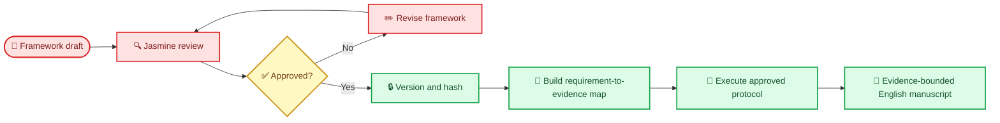

# Engineering Paper Framework — Draft for User Audit

_本文件控制 25–30 页英文工程论文的研究问题、论证边界、章节结构、篇幅、图表、证据映射和写作顺序。论文正文必须为英文；中文仅用于 Jasmine 审计与修订。当前草案不授权修改代码、采集正式实验数据或撰写虚构结果。_

---

## 🚫 Document control and hard approval gate

| Control | Current value |
|---|---|
| `document_id` | `PAPER-FRAMEWORK` |
| `framework_version` | `0.1-draft` |
| `approval_status` | `DRAFT_FOR_USER_REVIEW` |
| `downstream_implementation_permitted` | `NO` |
| Approver | Jasmine Jiang |
| Paper context | Heidelberg University DSBA Master Practical “Intelligent Systems”, 8 ECTS |
| Writing language | English; Chinese audit annotations only |
| Target length | 25–30 pages, subject to the counting rule below |
| Approved version / SHA-256 | `PENDING` / `PENDING` |

> ⚠️ **Hard gate:** 在 Jasmine 明确批准本文件、赋予正式版本号并记录 SHA-256 前，Codex 不得将本框架视为最终论文结构，也不得因为本框架而修改 metrics schema、instrumentation、experiment runner、database fields、prompts、agent routing、analysis scripts 或结果图表。

批准前禁止：

- 将拟议研究问题、假设、章节标题或篇幅分配描述为已冻结
- 为满足某一拟议论文结论而调整实验或排除失败运行
- 创建含有推测性数字、虚构统计显著性或未观察结果的 Results 正文
- 将 `run`、`case` 或 `condition` 错写为独立受试者或一般化样本
- 在未经指标规范批准时自创阈值、复合分数、权重或成功判定
- 将当前系统尚未实现的功能写成已实现工程事实

批准前允许：只读审计代码和现有证据、识别 evidence gaps、修订本文件，以及用明确的 `PLACEHOLDER — NOT AN OBSERVED RESULT` 标记建立非规范写作骨架。



## 🎯 Decisions requiring Jasmine approval

| ID | Proposed decision | Audit question / alternative |
|---|---|---|
| `F-D01` | Count 25–30 pages from Abstract through Conclusion, including main-text figures and tables; exclude title page, TOC, references, and appendices | Confirm course rule; if references count, reduce the main-text budget |
| `F-D02` | Target 27.5 pages to preserve a 2.5-page margin | Approve or set another target |
| `F-D03` | Use an exploratory engineering evaluation, not a confirmatory causal study | Approve epistemic positioning |
| `F-D04` | Use seven paper research questions, consolidated into four presentation questions | Approve, merge, delete, or rewrite the RQs |
| `F-D05` | Make the approved `METRICS-SPEC` the sole authority for metric formulas, weights, thresholds, and statistical decisions | Approve cross-document authority |
| `F-D06` | Report all attempted conditions and failures; do not silently discard failed arms | Approve failure-reporting rule |
| `F-D07` | Treat architecture, prompts, data, models, and analysis as versioned experimental factors | Approve reproducibility scope |
| `F-D08` | Use neutral claims: multi-agent systems must earn their added complexity empirically | Approve the paper’s central stance |
| `F-D09` | Use the result-contingent Results and Discussion structure below | Approve fallback narrative if some arms fail |
| `F-D10` | Apply `academic-humanizer` only after evidence and scientific-content approval, subsection by subsection | Approve language-polish workflow |

## 🧭 Proposed paper identity and claim boundary

### Proposed English title

> **Evidence-Gated Multi-Agent Planning under API and Local Compute Constraints: An Engineering Evaluation of Single- and Multi-Agent Architectures**

### Proposed central thesis

> This study does not assume that more agents are inherently better. It evaluates whether evidence-gated task decomposition, role-specific critics, and bounded conditional revision improve the quality–reliability–resource trade-off compared with controlled single-agent and legacy multi-agent baselines under cloud API and local-compute constraints.

### Study type

`Exploratory, controlled, within-case engineering evaluation.`

It is not proposed as a population-level behavioral study, a proof of multi-agent superiority, or a benchmark of all LLMs and SLMs. The principal analysis unit is the approved case–condition run, with paired comparisons made within frozen cases where feasible. Replicate runs are repeated system executions, not independent human subjects.

### Intended contribution classes

1. **Engineering artifact:** a reproducible planning-agent system with explicit contracts, evidence provenance, role-level review, and bounded routing.
2. **Evaluation artifact:** a versioned protocol and metric suite spanning final-output quality, agent behavior, collaboration, reliability, and resource use.
3. **Empirical evidence:** controlled observations comparing approved single-agent, multi-agent, critic, routing, and model conditions.
4. **Failure evidence:** documented coordination, schema, context, model, API, evidence, and confidence failure modes.
5. **Design guidance:** bounded conclusions about when additional agents or revisions are justified under the observed constraints.

## ❓ Proposed research questions

| ID | Research question | Primary decision supported |
|---|---|---|
| `RQ1` | How does the approved multi-agent architecture compare with a controlled single-agent baseline on final-plan quality, reliability, and resource use? | Whether multi-agent orchestration is justified |
| `RQ2` | How does a locally runnable SLM compare with the Gemini Flash LLM under matched task, evidence, prompt, and evaluation conditions? | Whether a local model is viable and for which roles |
| `RQ3` | Does model–architecture interaction change which configuration offers the best quality–resource trade-off? | Whether one deployment recommendation fits all models |
| `RQ4` | What is the incremental effect of inserting a bounded critic after eligible specialist agents? | Whether role-level criticism improves outputs enough to justify overhead |
| `RQ5` | What is the incremental effect of bounded dynamic control relative to static routing? | Whether conditional orchestration is feasible and useful |
| `RQ6` | What are the observed commercial and operational trade-offs in usability, edit burden, latency, compute, calls, and failure recovery? | Product and deployment positioning |
| `RQ7` | Does evidence-gated confidence become more complete and better aligned with observable support than the legacy confidence mechanism? | Whether the low-confidence problem is partially resolved |

These RQs become normative only after approval. Formal estimands, formulas, thresholds, aggregation, missingness handling, and confidence rules must be imported from the approved `METRICS-SPEC`; they must not be recreated in the paper.

## 📏 Page-count convention and budget

### Proposed counting rule

The 25–30-page limit is interpreted as Abstract through Conclusion, including figures and tables placed in the main text, and excluding title page, table of contents, references, and appendices. This assumption must be checked against the course instructions. If references are included in the limit, Jasmine must approve a revised budget before drafting.

### Recommended 27.5-page allocation

| Section | Pages | Main purpose |
|---|---:|---|
| Abstract | 0.50 | Complete study in compact form |
| 1. Introduction | 2.00 | Decision problem, gap, RQs, contributions |
| 2. Background and Related Work | 2.25 | Focused positioning and design rationale |
| 3. Task Definition and System Requirements | 1.75 | Frozen task, user, contracts, constraints |
| 4. System Architecture and Engineering Design | 4.50 | Artifact and intervention details |
| 5. Evaluation Methodology | 4.75 | Conditions, metrics, fairness, analysis |
| 6. Results | 4.75 | Observations organized by RQ |
| 7. Failure Analysis | 1.50 | Failure modes and recovery evidence |
| 8. Discussion | 2.25 | Interpretation, trade-offs, implications |
| 9. Human Oversight, Safety, Reliability, and Reproducibility | 1.50 | Governance and trustworthy operation |
| 10. Limitations and Threats to Validity | 1.00 | Bounded claims and threats |
| 11. Conclusion | 0.75 | Direct answers and next step |
| **Total** | **27.50** | Leaves a 2.5-page compliance margin |

Page budgets include the main-text figures and tables assigned below. A section may move by at most ±0.5 page without user review; a larger transfer requires a documented framework revision.

## 🧱 Detailed English manuscript framework

### Abstract — 0.50 page

Required content, written last:

- decision problem and operational constraint
- proposed engineering intervention
- controlled evaluation design and comparison families
- only the most decision-relevant observed results, with denominators
- principal limitation
- bounded conclusion

No citations, speculative motivation, unobserved numbers, or undefined acronyms. No figure.

### 1. Introduction — 2.00 pages

#### 1.1 Decision Problem and Motivation

Define the planning task, intended user decision, why output quality alone is insufficient, and why API/local-compute constraints matter.

#### 1.2 Scientific and Engineering Gap

Separate the literature-supported general gap from the repository-specific engineering gap. The section must not claim novelty through adjectives such as “first,” “unique,” or “state of the art” unless independently verified.

#### 1.3 Research Objective and Questions

State the approved objective and `RQ1`–`RQ7`. Explain that comparisons are exploratory and controlled within the available cases.

#### 1.4 Contributions

List only contributions supported by an implemented artifact, approved protocol, or observed result. Distinguish artifacts from findings.

#### 1.5 Scope and Paper Structure

State what is outside scope: universal model ranking, production security certification, broad market validation, and causal claims beyond the protocol.

### 2. Background and Related Work — 2.25 pages

#### 2.1 Agentic Architectures and Task Decomposition

Position single-agent, role-decomposed, reviewer, and routing patterns. Avoid a catalogue of frameworks.

#### 2.2 Evaluation of Single- and Multi-Agent Systems

Cover final-task performance, coordination quality, failure exposure, cost, latency, and fairness of comparison.

#### 2.3 Critic, Reflection, and Revision Mechanisms

Distinguish critique generation, acceptance, revision, stopping, and evaluator leakage. Explain why a critic is not an oracle.

#### 2.4 Small Language Models and Local Inference Constraints

Use only verified model documentation and measured local behavior. Context-window specifications must not be presented as guaranteed effective context.

#### 2.5 RAG, Web Research, Evidence Provenance, and Confidence

Distinguish retrieval success, source quality, citation correctness, claim support, and calibrated confidence.

#### 2.6 Positioning of This Project

Close with a precise comparison: what this artifact combines, what the experiment isolates, and what remains outside scope.

Every external claim requires a human-verifiable source. Literature discovery may be AI-assisted, but inclusion requires title/author/year/venue/DOI-or-URL verification and claim-level checking.

### 3. Task Definition and System Requirements — 1.75 pages

#### 3.1 Input and Output Contract

Define accepted inputs, generated plan structure, required evidence, abstention behavior, confidence fields, and machine-readable schema.

#### 3.2 Target User and Decision Context

State who uses the plan, what decision it informs, and which edits or checks remain human responsibilities.

#### 3.3 Functional and Non-Functional Requirements

Map stable requirements such as evidence traceability, bounded execution, schema validity, reproducibility, latency, and local feasibility to `PF-REQ-*` identifiers.

#### 3.4 Success and Failure Definitions

Import success gates and failure definitions from the approved metrics and protocol documents. Do not infer success solely from a generated file.

#### 3.5 Operational Constraints

Document cloud quotas, available hardware, memory, model-serving limits, time budget, and any observed provider instability.

**Required display:** `Table 1 — Task and Output Contract`.

### 4. System Architecture and Engineering Design — 4.50 pages

#### 4.1 Technology Stack and Framework Rationale

Explain the chosen orchestration style using requirements and measured constraints, not framework popularity.

#### 4.2 Legacy Baselines

Document the existing single-agent and multi-agent flows, including the former end-only critic and static routing. Baselines must remain runnable or be reconstructed from a frozen revision.

#### 4.3 Agent Roles, Contracts, and Communication

For each role specify input contract, output schema, allowed tools, evidence obligations, failure signal, and downstream consumer.

#### 4.4 Prompt and Structured-Output Design

Describe prompt boundaries, shared versus role-specific context, schema validation, retries, and prompt versioning. Full prompts belong in an appendix or repository artifact.

#### 4.5 Role-Level Critic Design

Define critic placement, rubric, issue taxonomy, accept/revise/reject decision, revision budget, stop rule, and logged provenance. Do not imply that critic agreement establishes truth.

#### 4.6 Bounded Dynamic Control

Define eligible routing states, observable trigger variables, deterministic guardrails, maximum cycles, timeout/fallback behavior, and the difference between genuine conditional routing and static branching with a different label.

#### 4.7 Model, Memory, and Context Management

Specify Gemini and local SLM roles, serving configuration, quantization, context allocation, truncation policy, summaries, and measured resource ceilings.

#### 4.8 Controlled Web Research, Provenance, and Confidence

Describe domain/tool allowlists, query budgets, source records, claim–evidence links, contradiction handling, evidence sufficiency, and evidence-gated confidence.

#### 4.9 Human-in-the-Loop and Observability

Place human approval at high-impact boundaries and describe logs, traces, status fields, and recovery controls.

**Required displays:**

- `Figure 1 — Legacy and Review-Gated Architecture`
- `Table 2 — Agent Roles, Contracts, and Failure Signals`

Only behavior verified against the frozen code revision may be written in past or present tense as implemented. Proposed behavior must remain explicitly future work.

### 5. Evaluation Methodology — 4.75 pages

#### 5.1 Research Questions, Estimands, and Decisions

Map every RQ to its approved comparison, analysis unit, estimand, decision rule, and limitations.

#### 5.2 Cases and Frozen Evidence Pack

Describe case selection, inclusion/exclusion criteria, input difficulty, expected evidence, data freeze, and case identifiers. State the exact number of cases and distinguish it from run count.

#### 5.3 Conditions and Ablations

List only approved and actually attempted conditions. Recommended candidate family: controlled single agent, legacy multi-agent, role-level critics, bounded dynamic routing, cloud LLM, and local SLM. Final condition IDs are governed by the metrics/protocol approval.

#### 5.4 Fair Comparison and Execution Protocol

Control task inputs, evidence access, system prompts where comparable, output contract, budgets, timeout policy, seeds where supported, condition order, warm-up effects, hardware state, caching, and retry policy.

#### 5.5 Approved Outcome Metrics

Reference the frozen `METRICS-SPEC` rather than redefining it. Summarize final-plan quality, usable-draft status, reliability, resource, confidence, per-agent, and collaboration metrics.

#### 5.6 Blind Human Evaluation and Instrument

Specify rater identity, blinding, randomized artifact order, scoring form, anchors, tie handling, missingness, adjudication, and whether inter-rater statistics are estimable.

#### 5.7 Automatic, Agent-Level, and Collaboration Evaluation

Separate deterministic checks from model-based judging and human judgment. Declare any evaluator-model overlap and leakage controls.

#### 5.8 Statistical, Sensitivity, and Failure Analysis

Use paired case-level summaries, effect sizes, uncertainty intervals, denominators, and descriptive emphasis appropriate to the approved sample. Thresholds and tests are imported from `METRICS-SPEC`.

#### 5.9 Protocol Deviations

Report skipped arms, changed models, schema failures, quota interruptions, retry deviations, and post-freeze fixes with timestamps and impact.

**Required displays:**

- `Table 3 — Conditions and Controlled Factors`
- `Table 4 — RQ-to-Metric-to-Decision Map`

### 6. Results — 4.75 pages

Results report observations; they do not explain why the observations occurred. Every numeric statement must include its analysis unit and denominator, and link to a frozen table or figure source.

#### 6.1 Execution Accounting and Data Completeness

Report planned, attempted, completed, valid, degraded, failed, excluded, and missing runs by condition and case. No failed condition may disappear from the denominator.

#### 6.2 RQ1: Single-Agent versus Multi-Agent

Report final quality, usable-draft rate, reliability, edit burden, latency, calls, tokens, and resource trade-offs using paired case-level evidence.

#### 6.3 RQ2 and RQ3: LLM versus SLM and Model–Architecture Interaction

Report local feasibility first, then quality and efficiency. If the SLM arm is incomplete, present the feasibility envelope and failure boundary rather than a fabricated ranking.

#### 6.4 RQ4 and RQ5: Role Critics and Bounded Dynamic Control

Report critic triggers, accepted critiques, revisions, regression rate, stop-rule activation, routing changes, loops prevented, quality deltas, and overhead.

#### 6.5 RQ7: Evidence and Confidence Behavior

Report evidence coverage, citation/claim support, abstention, missing confidence, invalid confidence, and alignment/calibration metrics only where estimable.

#### 6.6 RQ6: Commercial and Operational Trade-offs

Report measurable usability, human edit burden, recovery rate, latency, calls, local compute, and observed variable cost. Do not convert a small course experiment into market demand or ROI claims.

#### 6.7 Sensitivity and Robustness Checks

Show whether decisions change under approved alternate weights, missing-data treatments, exclusion of protocol deviations, or deterministic-only scoring.

**Required displays:**

- `Figure 2 — Final Quality and Usable-Draft Outcomes by Condition`
- `Figure 3 — Quality–Latency–Resource Trade-off`
- `Figure 4 — Critic and Revision Funnel`
- `Figure 5 — Confidence and Evidence Diagnostics`
- `Figure 6 — Failure and Recovery Profile`
- `Table 5 — Primary Paired Results with Denominators and Uncertainty`
- `Table 6 — Reliability, Resource, and Operational Outcomes`

If any display is unsupported, replace it with an explicit evidence-gap statement; do not fill it with synthetic numbers.

### 7. Failure Analysis — 1.50 pages

#### 7.1 Failure Taxonomy

Use mutually distinguishable categories: task-quality, evidence, confidence, schema, context, model, API, tool, routing, coordination, termination, and human-process failures.

#### 7.2 Collaboration and Coordination Failures

Report duplication, contradiction, handoff loss, unresolved critic issues, agent non-contribution, and coordinator override.

#### 7.3 Recovery, Regression, and Termination

Report fallback activation, retry outcome, revision regression, timeouts, loop prevention, degraded-mode output, and unrecovered failure.

**Required display:** `Table 7 — Failure Modes, Detection, Recovery, and Residual Risk`.

### 8. Discussion — 2.25 pages

#### 8.1 Direct Answers to the Research Questions

Answer each RQ in one bounded paragraph and state evidence strength.

#### 8.2 Engineering Interpretation

Explain plausible mechanisms while marking inference clearly and considering competing explanations.

#### 8.3 Architecture and Product Trade-offs

Discuss when specialization, criticism, or routing pays for its coordination and resource overhead, and when a simpler system is preferable.

#### 8.4 Static versus Bounded Dynamic Control

Separate demonstrated dynamic behavior from intended autonomy. If dynamic routing is only partially implemented, state the exact boundary.

#### 8.5 Deployment, Human Oversight, and Future Work

Propose the smallest evidence-supported next engineering step; do not disguise unimplemented work as a conclusion.

### 9. Human Oversight, Safety, Reliability, and Reproducibility — 1.50 pages

#### 9.1 Human Approval and Intervention Points

Describe approval gates for metrics, architecture, evidence, result interpretation, and external actions.

#### 9.2 Evidence and Web-Research Safety

Cover source provenance, prompt injection resistance within scope, content isolation, citation validation, and unsupported-claim handling.

#### 9.3 Reliable and Degraded Operation

Document budgets, timeouts, retries, circuit breakers, safe fallbacks, partial output, and visible failure status.

#### 9.4 Reproducibility Package

List code revision, environment, model identifiers/digests, model settings, prompt/schema versions, evidence-pack hash, case manifest, experiment manifest, raw logs, derived tables, and analysis-script hash.

### 10. Limitations and Threats to Validity — 1.00 page

Address separately:

- **construct validity:** whether rubrics and automatic checks capture plan usefulness
- **internal validity:** evaluator leakage, order effects, prompt mismatch, uncontrolled retries, caching, and implementation maturity
- **statistical conclusion validity:** small case count, limited replicates, uncertainty, multiplicity, and unstable estimates
- **external validity:** one planning domain, selected models, local hardware, provider limits, and course-project timescale
- **engineering validity:** incomplete arms, evolving code, logging gaps, and reproducibility boundaries

Limitations must constrain the adjacent claim, not appear only as a final disclaimer.

### 11. Conclusion — 0.75 page

Answer the decision problem directly, summarize only observed trade-offs, state what was genuinely demonstrated, identify the principal unresolved limitation, and name one next validation step. Do not introduce new evidence or literature.

## 🗺️ Coverage of the 14 required engineering questions

| Required question | Primary paper location | Mandatory evidence |
|---|---|---|
| 1. What exactly is the research task? | 1; 3.1–3.2 | Task contract, target user, output example |
| 2. How should the agentic architecture be designed? | 4.2; 4.5–4.6 | Frozen diagrams, routing trace, design rationale |
| 3. How should roles and communication protocols be designed? | 4.3 | Role contracts, schemas, handoff logs |
| 4. Which framework should be used? | 4.1 | Requirements-based decision and alternatives |
| 5. How should prompts be designed and studied? | 4.4; 5.4 | Prompt versions, controlled factors, schema outcomes |
| 6. How should the SLM be selected? | 2.4; 4.7; 6.3 | Verified specs, local feasibility, measured comparison |
| 7. How should memory and context be managed? | 4.7 | Context policy, truncation logs, token/resource evidence |
| 8. How should RAG, web research, and evidence credibility be designed? | 4.8; 9.2 | Claim–evidence records, source checks, confidence behavior |
| 9. How should single-agent performance be evaluated? | 5; 6.2–6.3 | Approved metrics, baseline runs, paired outcomes |
| 10.1 How should final-task multi-agent performance be evaluated? | 5; 6.2–6.3 | Final quality, usability, reliability, resource outcomes |
| 10.2 How should collaboration be evaluated? | 5.7; 6.4; 7.2 | Contribution, contradiction, handoff, critic metrics |
| 10.3 How should coordination failure be analyzed? | 7 | Failure taxonomy, traces, recovery evidence |
| 10.4 How can the comparison be fair? | 5.2–5.4 | Frozen cases, budgets, execution protocol, deviations |
| 11. How should an ablation study be performed? | 5.3; 6.4 | One-factor contrasts, approved conditions, denominators |
| 12. Is the evaluation method reliable? | 5.6; 5.8; 10 | Blinding, anchors, reliability evidence, validity threats |
| 13. Where should human-in-the-loop control occur? | 4.9; 9.1 | Approval/intervention points and audit records |
| 14. How do safety, reproducibility, and engineering reliability enter the paper? | 9; 10 | Safety controls, manifests, hashes, degraded modes |

## 📊 Figure and table governance

### Main-text display register

| ID | Display | Source authority | Release gate |
|---|---|---|---|
| `F1` | Legacy and review-gated architecture | Frozen code and architecture trace | Code freeze + manual verification |
| `F2` | Final quality and usable-draft outcomes | Approved primary metrics table | Data lock + analysis audit |
| `F3` | Quality–latency–resource trade-off | Quality and resource tables | Unit/denominator audit |
| `F4` | Critic and revision funnel | Critic event logs | Event-schema completeness |
| `F5` | Confidence and evidence diagnostics | Claim–evidence and confidence records | Confidence-rule audit |
| `F6` | Failure and recovery profile | Run status and failure taxonomy | Failure denominator audit |
| `T1–T7` | Contracts, roles, conditions, metric map, results, resources, failures | Frozen manifests and derived tables | Matching evidence IDs and hashes |

Rules:

- No decorative chart and no radar chart.
- Every quantitative display states unit of analysis, `n`, denominator, missingness, and uncertainty where estimable.
- Failed and degraded runs remain visible.
- Axes, units, condition IDs, and aggregation must match the approved metrics specification.
- Figures are generated from frozen derived data by versioned scripts; manual number editing is prohibited.
- Colour is not the sole carrier of meaning; labels and symbols must remain interpretable in grayscale.
- A display unsupported by complete evidence is omitted or marked as an evidence gap.

## 🔗 Evidence and claim traceability

### Evidence identifiers

| Prefix | Meaning | Example |
|---|---|---|
| `E` | External or project source | `E008` verified model documentation |
| `C` | Manuscript claim | `C041` critic overhead claim |
| `M` | Method/protocol artifact | `M012` evaluation instrument |
| `N` | Numeric record or derived datum | `N031` latency summary |
| `O` | Observed run outcome | `O017` failed SLM run |
| `R` | Audited result | `R012` paired quality contrast |
| `F` / `T` | Figure or table | `F4`, `T5` |

Draft claims should carry temporary inline audit markers until the evidence audit is complete:

```text
[claim:C041] [evidence:R012,E008] [status:verified]
```

Before final export, markers may be hidden from the reader only after a machine- and human-auditable claim ledger maps every material claim to evidence.

### Global claim limits

The paper must not claim, without evidence at the appropriate scope:

- universal superiority of multi-agent systems
- equivalence from a non-significant result
- that repeated runs are independent samples of users or tasks
- that a local SLM is generally inferior or superior based on one device and small case set
- that local inference has zero cost
- that bounded routing is an autonomous general supervisor
- that a critic establishes truth merely through agreement
- calibrated confidence from too few or non-independent observations
- ROI, market demand, or production readiness from course-project runs
- inter-rater reliability if only one independent rater completed the instrument
- truthfulness of web content merely because a source was retrieved
- production-grade security from design controls alone
- that one pure-model deployment is optimal when the evidence supports a hybrid allocation

Preferred language includes “within the evaluated cases,” “the observed runs,” “descriptively,” “is consistent with,” “could not be estimated,” “the arm was infeasible under the tested configuration,” and “requires further validation.”

## 🔒 Cross-document authority and downstream binding

### Authority hierarchy

| Topic | Sole normative source | Paper responsibility |
|---|---|---|
| Metric formulas, weights, thresholds, missingness, statistics | Approved `METRICS-SPEC` | Reference and report faithfully |
| Storyline, slide allocation, chart selection, spoken claims | Approved `PPT-SPEC` | Provide traceable manuscript evidence |
| RQs, chapter structure, page budget, claim boundaries | Approved `PAPER-FRAMEWORK` | Govern manuscript drafting |
| Experimental execution details | Later approved experiment protocol | Describe without retroactive rewriting |
| Implemented behavior | Frozen code, prompts, schemas, and traces | State only verified behavior |

Every formal run manifest and every released paper/PPT artifact must carry:

```yaml
paper_framework_id: PAPER-FRAMEWORK
paper_framework_version: PENDING_APPROVAL
paper_framework_sha256: PENDING_APPROVAL
metrics_spec_id: METRICS-SPEC
metrics_spec_version: PENDING_APPROVAL
metrics_spec_sha256: PENDING_APPROVAL
ppt_spec_id: PPT-SPEC
ppt_spec_version: PENDING_APPROVAL
ppt_spec_sha256: PENDING_APPROVAL
experiment_protocol_version: PENDING
code_revision: PENDING
prompt_bundle_version: PENDING
schema_bundle_version: PENDING
evidence_pack_version: PENDING
evidence_pack_sha256: PENDING
model_identifiers_and_digests: PENDING
analysis_version: PENDING
raw_data_sha256: PENDING
```

If any approved specification hash changes, dependent code, data, analysis, manuscript, and slides become `STALE_PENDING_IMPACT_REVIEW` until the impact is classified and resolved.

### Requirement-to-code rule

After approval, each paper-derived engineering requirement receives a stable ID such as `PF-REQ-001`. A traceability record must map:

`paper requirement → approved metric/protocol → implementation location → test → logged field → analysis output → paper claim → slide claim`.

No implementation task may cite an unapproved paragraph as authority.

## 🧪 Evidence-led drafting workflow

| Gate | Required output | Approval condition |
|---|---|---|
| `PF0` | Approved framework, version, hash | Jasmine approves structure and RQs |
| `PF1` | Requirement/RQ/evidence traceability matrix | No orphan RQ or unowned claim |
| `PF2` | Frozen methods package | Code, prompts, schemas, protocol, models versioned |
| `PF3` | Locked evidence package | Run accounting complete; hashes recorded |
| `PF4` | Claim–evidence outline | Every proposed material claim has support/status |
| `PF5` | First English manuscript draft | Written in evidence-first section order |
| `PF6` | Scientific and numeric audit | Claims, numbers, denominators, figures agree |
| `PF7` | Subsection-level language revision | Meaning/data/citations unchanged; readability improved |
| `PF8` | Final human approval | Paper, PPT, repository, and manifests consistent |

### Required drafting order

1. Methods and reproducibility sections
2. Results and failure analysis from frozen tables
3. Architecture and task definition from frozen implementation evidence
4. Discussion and limitations from observed results
5. Introduction and focused related work
6. Conclusion
7. Abstract

`academic-humanizer` may be applied only at `PF7`, one approved subsection at a time. It may improve clarity and voice, but must not alter numbers, equations, metric names, condition IDs, uncertainty, citations, claim strength, or conclusions.

## 🔁 Change control after approval

| Change class | Example | Required action |
|---|---|---|
| Editorial | Grammar or non-semantic wording | Log; no experiment rerun |
| Interpretive | Stronger/weaker claim or changed implication | User approval + claim audit |
| Analytic | Aggregation, test, exclusion, figure logic | New analysis version + impact review |
| Measurement | Metric formula, weight, threshold, missingness | Revise `METRICS-SPEC`; invalidate dependent results |
| Experimental | Cases, conditions, budgets, models, retries | Revise protocol; separate or rerun affected data |
| Architectural | Agents, critic placement, routing, tools, schema | New code/prompt versions; retest and recollect affected arms |

All substantive changes must record requester, reason, timestamp, old/new version, affected requirements, affected runs, and disposition. A deadline is not justification for silently changing a denominator or claim.

## 📎 Proposed appendices and reproducibility package

Appendices are outside the proposed page count unless the course rules say otherwise:

- `Appendix A — Full Agent and Prompt Contracts`
- `Appendix B — Human Evaluation Rubric and Instructions`
- `Appendix C — Case Manifest and Frozen Inputs`
- `Appendix D — Experiment and Model Configuration`
- `Appendix E — Additional Results and Sensitivity Analyses`
- `Appendix F — Failure Catalogue and Selected Traces`
- `Appendix G — Claim–Evidence Ledger`
- `Appendix H — Reproducibility and Change Log`

Repository artifacts should include machine-readable manifests, raw immutable logs, derived-data scripts, figure scripts, environment lock information, and a minimal reproduction guide. Secrets and private keys must never enter the reproducibility package.

## ✅ Jasmine audit checklist

Please edit the draft directly or annotate each item as `APPROVE`, `REVISE`, or `REJECT`.

- [ ] I approve the page-count convention in `F-D01`, or I have supplied the official alternative.
- [ ] I approve the 27.5-page target and section allocations.
- [ ] I approve the proposed English title.
- [ ] I approve the neutral central thesis and exploratory-study positioning.
- [ ] I approve, merge, rewrite, or delete each of `RQ1`–`RQ7`.
- [ ] I approve the contribution classes and their claim boundaries.
- [ ] I approve the detailed section/subsection hierarchy.
- [ ] I approve the Results structure even when an arm fails or remains incomplete.
- [ ] I approve the dedicated Failure Analysis section.
- [ ] I approve the 14-question coverage matrix.
- [ ] I approve the proposed `F1–F6` and `T1–T7` display register.
- [ ] I approve the global prohibited-claim list and bounded wording.
- [ ] I approve `METRICS-SPEC` as the sole source of metric and statistical definitions.
- [ ] I approve the cross-document version/hash binding and stale-artifact rule.
- [ ] I approve the `PF0–PF8` drafting and evidence gates.
- [ ] I approve applying `academic-humanizer` only after scientific-content audit.
- [ ] I approve the proposed appendices and reproducibility contents.
- [ ] I confirm that no product code, formal experiment, final paper, or final PPT may be governed by this framework until I approve and freeze it.

### Approval record — to be completed by Jasmine

| Field | Value |
|---|---|
| Decision | `PENDING` |
| Approved framework version | `PENDING` |
| Required revisions | `PENDING` |
| Approval date | `PENDING` |
| Approver | Jasmine Jiang |
| Frozen SHA-256 | `PENDING` |

After Jasmine’s revisions, Codex must produce a clean redline/decision summary, update the version, compute the SHA-256, and ask for one final explicit approval. Only that frozen version may govern engineering requirements, data collection, manuscript writing, and PPT evidence selection.
