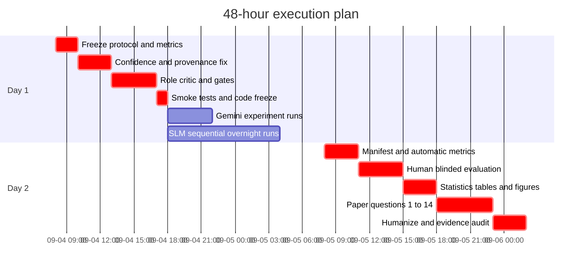

# Multiple AI Agent 产品优化与两天工程论文执行计划

> 版本：v1.0｜制定日期：2026-09-04｜执行窗口：48 小时｜项目：`multiple_ai_agent`  
> 目标：在不重复 Qwen2.5 失败路线的前提下，完成可审计的产品优化、Single vs Multi 与 LLM vs SLM 对照实验，并形成工程论文可直接使用的证据链。  
> 重要范围：本计划不讨论 AI 使用披露；项目已获授权，论文只需聚焦系统、实验、证据和结论。

## 🎯 0. 执行摘要：先做这八个决定

| 决定 | 结论 | 为什么 |
|---|---|---|
| Phase 5 状态 | 受控 Web Research 已经实现并通过专项测试，但“Web 证据进入系统”不等于“证据已正确传到最终 claim” | 当前仍存在 Web-only 被整体降为 low、Research 缺少结构化 `source_ids` 等问题 |
| 指标优先 | 先冻结 agent-level、协作层、最终任务层和商业层指标，再改 Critic 架构 | 否则无法证明改动有效，也容易把“标签变好看”误当成质量提升 |
| 本地 SLM | 首选 **IBM Granite 4.0 H Micro Q4_K_M，实际设 32K context**；内存不足时降级 Granite 4.0 H 1B | Hybrid Mamba2/Attention 架构对长上下文的 KV 内存更友好，适合本机 16 GB RAM / 2 GB VRAM 约束[^granite-micro][^granite-docs] |
| Critic 架构 | Research、Strategy、Finance 后各加 role-specific critic；Writer 后保留 final critic | 让错误在进入下游前被发现；Supervisor 与 RAG 用确定性 validator 比再加一个 LLM Critic 更可靠 |
| 动态控制 | 可以做，但应实现为 **bounded adaptive quality-gated workflow**，不是自由自治 Supervisor | 动态性来自 conditional edge 和状态规则，不来自换模型；每个角色最多一次返工，必须有 call/token/time 上限[^langgraph-router][^langgraph-graph] |
| 公平比较 | 学术主实验使用相同 brief、冻结 evidence、32K 共同上限、相同 schema/chunking；产品次实验才允许各自最佳配置 | 避免把 Web/RAG、上下文预算或工程优化误当成架构/模型效应 |
| 两天实验量 | 最小 36 次正式运行：6 cases × 4 核心臂 = 24；per-agent critic = 6；dynamic = 6 | 现有 60-run 方案加人工评估在两天内不可控；36 runs 是 exploratory pilot 的可执行下限 |
| `Confidence: low` | 目标不是减少 low 标签本身，而是降低 **underconfidence**，同时不得增加 **overconfidence** | 必须修 claim-source 血缘和聚合规则；Critic 不能凭空制造证据或提高置信度 |

两天内的产品目标不是“完成所有未来架构”，而是交付一个可运行、可比较、可写入论文的最小闭环：

```text
指标与协议冻结
  → confidence / provenance 修复
  → per-agent review gates
  → bounded dynamic revision
  → 2×2 核心实验 + 两项消融
  → 自动指标 + 人工盲评
  → 论文 1–14 问的证据映射
```

## 🔎 1. 当前系统基线与关键诊断

### 1.1 当前事实，不应继续沿用的表述

| 主题 | 当前代码事实 | 论文应如何写 |
|---|---|---|
| 主流程 | `validator → supervisor → research → strategy → finance → rag_retrieval → writer → critic → revision → export` | 当前版本是静态、确定性的 LangGraph 编排 |
| Supervisor | 主图安装固定五角色计划，传入的 `supervisor_llm` 未用于运行时选路 | 不得写成 LLM 动态调度或自主任务分配 |
| Critic | 只接收 `ProposalDraft`，只能在 Writer 后审查完整计划书 | 当前是 final-only critic，错误可能在 Agent 间传播 |
| Web Research | 已进入 Research prompt，并有受控来源流程 | Phase 5 功能存在，但 source-to-claim 血缘尚未完整结构化 |
| Confidence | 任一 key claim 不是 `sourced_fact` 时，整节可被强制降为 low；Web-only 仍触发全局低置信 | 13/13 节 low 很大部分是规则设计结果，不等同于模型“完全不确定” |
| SLM | 现有 `slm/` 仍围绕 Qwen2.5/托管迁移历史，完整本地链路曾严重超时 | Qwen2.5 路线停止；旧数据作为失败基线，不再重复投入 |

主要代码证据位于：

- `workflow/multi_agent_graph.py`：固定节点和固定边；
- `workflow/multi_agent_nodes.py`：`build_deterministic_supervisor_plan()` 与 Web/RAG evidence mode；
- `agents/critic.py`：当前 Critic 强制解析为 `ProposalDraft`；
- `schemas/workflow.py`：section confidence 的强制降级规则；
- `schemas/agent_outputs.py`：`WriterInput` 的 `low_confidence_required`；
- `agents/writer.py`：最终 confidence floor；
- `slm/README.md`：Qwen2.5 本地 32K 失败、paging 和超时记录。

### 1.2 当前与目标架构

```mermaid
flowchart LR
    accTitle: 当前静态多 Agent 工作流
    accDescr: Research Strategy 和 Finance 的输出未经局部审查，直到 Writer 完成后才由最终 Critic 发现问题。
    V[Validator] --> S[Static Supervisor]
    S --> R[Research]
    R --> T[Strategy]
    T --> F[Finance]
    F --> G[RAG Retrieval]
    G --> W[Writer]
    W --> C[Final Critic]
    C --> X[Revision]
    X --> E[Export]
    classDef risk fill:#fee2e2,stroke:#b91c1c,color:#111827;
    class R,T,F risk;
```



当前架构最大的问题不是“没有更多 Agent”，而是质量控制位置太晚：Research 的来源问题会污染 Strategy，Strategy 的假设会进入 Finance，Finance 的数字又会被 Writer 重述。最终 Critic 即使发现问题，也需要同时修 13 个章节，成本高、定位差，并且可能引入新的缺陷。

### 1.3 `Confidence: low` 的四个根因

1. **聚合规则过度保守**：只要一条 claim 是 assumption 或 needs-validation，整节就可能变成 low。商业计划天然含未来假设，因此全 low 是规则的可预期产物。
2. **Web-only 被错误视作无外部证据**：当前全局 floor 主要看 `has_rag`，未把可信 Web evidence 等价纳入。
3. **Research 缺少结构化来源血缘**：finding 主要通过自由文本 rationale 携带来源信息，后续无法确定性验证 `claim → source_id → evidence snapshot`。
4. **Revision 只能继续降低，很难在问题真正修复后恢复为 medium**：这造成系统性 underconfidence。

因此，增加更多 Critic 只能改善逻辑和完整性；如果不先修 evidence provenance 与 confidence 语义，Critic 数量增加后仍会输出大量 low。

### 1.4 本机资源边界

本次资源检测结果：

| 资源 | 实测/识别值 | 对方案的影响 |
|---|---:|---|
| CPU | Intel i7-1165G7，4 核 / 8 线程 | 本地生成以 CPU 为主，必须单并发 |
| RAM | 15.8 GiB，总空闲约 4.41 GiB | 运行 3B 32K 前应先释放到至少约 7 GiB 可用内存 |
| GPU | NVIDIA MX450，2 GiB VRAM | 只能作为少量 offload 加速，不应按“模型可完全装入 GPU”规划 |
| Disk | 约 34 GiB 可用 | 只下载主模型和 1 个降级模型，不做候选模型仓库式试错 |

标称 128K/256K 是模型能力上限，不是这台电脑可实际使用的窗口。对本项目，32K 是 Granite H Micro 的实验上限；是否真的可用必须通过真实最大 prompt 的 preflight 决定。

## 🧭 2. 研究目标、研究问题和范围边界

### 2.1 产品与研究任务

研究任务应统一表述为：

> 构建一个能够把结构化 business brief 和受控证据转换为 13 章节、可追溯、商业可执行计划书的 Agentic 系统，并在受限硬件和 API 预算下，评估多 Agent 分工、局部 Critic 与动态质量门是否改善质量、可靠性和人类编辑效率。

### 2.2 研究问题

| 编号 | 研究问题 | 主要估计量 |
|---|---|---|
| RQ1 | 相同模型、brief、证据和输出契约下，Multi 是否优于 Single？ | `Q(Multi, model) − Q(Single, model)` |
| RQ2 | 相同架构下，Gemini 2.5 Flash 是否优于本地 Granite SLM？ | `Q(architecture, Gemini) − Q(architecture, SLM)` |
| RQ3 | Multi 架构是否缓解或放大 SLM 能力差距？ | difference-in-differences 交互效应 |
| RQ4 | Per-agent critic 是否优于 final-only critic？ | C5 − C2 |
| RQ5 | 条件返工是否比固定返工更高效？ | C6 − C5，质量非劣 + token/延迟下降 |
| RQ6 | 质量收益是否值得额外延迟、请求、内存和人工编辑成本？ | 质量—成本—延迟 Pareto |
| RQ7 | 当前 low confidence 是合理不确定，还是系统欠置信？ | overconfidence、underconfidence、remediation rate |

其中 `Q` 的第一主指标是人工盲评学术质量分；商业可用率、引用支持率、延迟、成本必须分别报告，不能先混成一个难解释的总分。

### 2.3 两天内明确不做

- 不再尝试 Qwen2.5 或另一个托管平台；
- 不做微调、蒸馏或训练 learned router；
- 不做无限循环或自由创建 Agent 的 fully autonomous supervisor；
- 不做 60+ 正式 runs 的完整大矩阵；
- 不同时修改 prompt、模型、证据和架构后声称某一个因素有效；
- 不以字符串替换方式把 `low` 改成 `medium/high`；
- 不在正式实验开始后继续随意调 rubric 或删除失败 runs；
- 不把重复 seed 当作新的独立 case；
- 不引入新的前端或替换 LangGraph 框架。

## 📏 3. 先冻结专业指标体系

### 3.1 指标设计原则

1. **最终结果与过程分开**：计划书好看不代表协作正确；协作日志丰富也不代表输出可用。
2. **质量与成本分开**：不把质量、token、延迟、费用强行合成单一分数；用 Pareto 解释。
3. **模型自评不能当真值**：Critic 的 `overall_score` 不能证明 Critic 有效。
4. **失败进入分母**：API timeout、schema failure、context overflow 都是产品可靠性结果。
5. **先冻结再运行**：正式实验前锁定指标定义、权重、case、证据和排除规则。
6. **安全护栏优先**：质量提高只有在高影响 unsupported claim rate 未恶化时才成立。

### 3.2 三个预注册主指标

| 层级 | 主指标 | 定义 |
|---|---|---|
| 学术质量 | Blinded Academic Quality Score，0–100 | 六维人工盲评加权分 |
| 商业价值 | Usable-without-major-rewrite rate | 不需重写核心逻辑、无 critical unsupported claim 的输出比例 |
| 安全护栏 | High-impact unsupported claim rate | 高影响但无直接证据或错误引用的 factual claim 比例 |

建议的学术质量六维 rubric：

| 维度 | 权重 | 1 分锚点 | 3 分锚点 | 5 分锚点 |
|---|---:|---|---|---|
| 事实与引用支持正确性 | 25% | 大量无支持/错配 | 基本可核验但有重大缺口 | 关键事实均有直接、可信支持 |
| 推理与跨章节一致性 | 20% | 矛盾或推理断裂 | 基本一致但链条不完整 | 结论、理由、假设与数字一致 |
| 任务遵循与结构完整性 | 15% | 缺失核心章节/字段 | 结构完整但部分空泛 | 13 章节完整且满足契约 |
| 商业逻辑与领域合理性 | 15% | 不可执行或明显错误 | 可用但需重大判断 | 具体、可执行、领域适配 |
| 不确定性与校准 | 15% | 过度自信或全部机械 low | 部分区分事实/假设 | 事实、假设、未知边界清楚 |
| 清晰度与可追溯性 | 10% | 难读、无法回溯 | 基本清晰 | 表达紧凑且可追到上游证据 |

换算公式：

```text
Academic Score = 100 × Σ[w_d × (dimension_score_d − 1) / 4]
```

### 3.3 Agent-level 指标

| Agent / 节点 | 必测专业指标 | 自动/人工 |
|---|---|---|
| Validator | 输入完整率、错误定位准确率、误拒率、valid@1 | 自动 + 缺陷样例 |
| Supervisor | plan valid@1、依赖拓扑正确率、必要角色召回率、不必要角色调用率 | 自动 + gold route |
| Research | source relevance/authority/recency、citation coverage、claim-source support precision、幻觉 URL、unsupported claim 识别召回率 | manifest + 人工抽查 |
| Strategy | research traceability、价值主张具体性、GTM 可执行性、建议—理由链完整率、跨 Agent 矛盾率、新造事实率 | 自动 + blind rubric |
| Finance | 算术正确率、币种/单位/周期一致率、假设显式率、假设来源可追溯率、scenario coverage、false precision rate | 确定性计算 + 人工 |
| RAG/Web | source allowlist 合规率、去重率、失败降级率、prompt injection 命中率、evidence snapshot 完整率 | 自动 |
| Writer | 13-section 完整率、上游 evidence retention、新增 unsupported factual claim rate、跨章节矛盾密度、重复率 | 自动 + 人工 |
| Role Critic | seeded defect precision/recall/F1、严重度校准、actionable fix rate、false-positive rate | gold defects + 独立评估 |
| Revision | issue resolution rate、new-defect regression rate、来源/结构保留率、pre/post quality delta | pre/post diff |
| Export | Markdown 完整率、引用表一致率、run manifest 可回溯率 | 自动 |

关键计算：

```text
Issue resolution rate = 已修复的真实 issue / Critic 发现的真实 issue
Regression rate       = Revision 新引入缺陷数 / Revision 次数
Evidence retention    = 最终稿保留正确 source_id 的上游事实数 / 可保留事实数
Unsupported novelty   = Writer 新增且无上游支持的 factual claim / Writer 新增 factual claim
```

### 3.4 协作层指标

多 Agent 评估不能只看最终答案；还要观察信息传递、有效贡献、冗余路径和失败恢复。近期 MultiAgentBench 和 GEMMAS 也强调过程 milestone、信息多样性与不必要路径等指标[^multiagentbench][^gemmas]。

| 指标 | 定义 |
|---|---|
| Handoff completeness | 下游收到的必需字段 / contract 必需字段 |
| Provenance retention | 下游使用且保留正确 `source_id` 的事实 / 可用上游事实 |
| Contribution utilization | 被最终稿有效采用的非重复上游 insight / 有效上游 insight |
| Cross-agent contradiction density | 经核实的矛盾 claim pair / 1,000 output tokens |
| Redundancy ratio | 重复或近重复协作内容 / 全部协作内容 |
| Coordination overhead | supervisor + handoff + critic tokens / 总 tokens |
| Unnecessary path ratio | 事后判定不必要的 Agent/返工调用 / 全部调用 |
| Failure propagation rate | 上游缺陷未被拦截并进入最终稿的比例 |
| Recovery rate | validator/critic 发现后成功恢复的失败 / 可恢复失败 |
| Loop/termination rate | 超过返工或预算上限的 runs / 全部 runs |

### 3.5 商业导向指标

| 指标 | 定义 | 为什么重要 |
|---|---|---|
| 可用草稿率 | 无 critical unsupported claim 且不需重写核心逻辑 | 直接对应产品价值 |
| 人工编辑时间 | 草稿到“可提交”所需分钟数 | 比字数或模型自评分更接近真实成本 |
| Normalized edit distance | 修改字符数 / 原始字符数 | 量化改稿工作量 |
| Time to first valid draft | 开始运行到首次通过结构和业务验证 | 用户等待体验 |
| Cost per usable draft | 总实际成本 / 可用草稿数 | API 与部署决策 |
| Completion/failure rate | 成功导出 / 所有预定 runs | 产品可靠性 |
| Throughput | 可用计划书 / wall-clock hour | 扩展性 |
| P50 / P95 latency | 端到端与节点级延迟 | 商业 SLA |
| Peak RAM / VRAM | 本地 SLM 实测峰值 | 本地部署可行性 |
| Context overflow/pruning rate | 发生截断/裁剪的 runs 比例 | SLM 风险 |

本地 SLM 的 API 费用可以为 0，但计算成本不是 0。至少报告 wall-clock、峰值 RAM/VRAM 和硬件；未测功耗时写明 `energy cost not measured`，不要写“local cost = 0”。

## 🧠 4. `Confidence: low` 的正确修复方案

### 4.1 目标定义

合格的改进不是“low 数量下降”，而是：

- 可获得证据的 factual claims 得到正确支持；
- 已被强证据支持的内容不再无理由 low；
- business assumptions 继续明确标记为 assumption；
- unsupported factual claims 不得因为 Critic 润色而升为 medium/high；
- overconfidence 不增加，underconfidence 明显降低。

### 4.2 必须先补齐 claim-source 数据契约

给 Research finding 和下游 key claim 至少保留：

```text
claim_id
claim_text
claim_type: factual | assumption | recommendation | projection
evidence_status: sourced_fact | needs_validation | assumption | unsupported
source_ids: list[str]
source_support: direct | partial | contextual | none
source_quality: 0..1
source_recency: 0..1 or not_applicable
critic_status: passed | unresolved
```

确定性校验规则：

1. `source_ids` 必须属于本次冻结 Web/RAG allowlist；
2. Critic 和 Revision 不得发明新 `source_id`；
3. factual claim 声称 `sourced_fact` 时至少有一个直接支持来源；
4. recommendation 和 assumption 不要求伪造外部引用，但必须标明前提；
5. Finance 的数字必须区分 external benchmark、user input、calculated result 和 assumption。

### 4.3 建议的 section confidence 计算

先在 claim level 判断，再确定性汇总到 section；模型只提供解释，不直接决定最终等级。

```text
section_score =
    0.35 × supported_factual_claim_coverage
  + 0.20 × citation_entailment_precision
  + 0.15 × source_quality
  + 0.10 × source_recency_or_applicability
  + 0.10 × cross_section_consistency
  + 0.10 × resolved_critic_issue_rate
```

建议阈值：

- `high`：score ≥ 0.85，且没有 high/critical unresolved issue，没有 high-impact unsupported factual claim；
- `medium`：0.60 ≤ score < 0.85，或主要内容属于明确标注的 assumption/recommendation；
- `low`：score < 0.60，或存在 high-impact unsupported factual claim、来源冲突、上下文被裁剪、关键问题未解决；
- 任一普通 assumption **不再自动把整节降为 low**；
- assumption 占主导的预测型章节最多为 medium，除非有经验证的用户数据与稳健 sensitivity analysis；
- Web evidence 应纳入 `has_external_evidence = has_rag or has_web`，但仍须通过来源质量与 claim support 校验。

### 4.4 Confidence 评估指标

| 指标 | 含义 |
|---|---|
| Supported factual-claim rate | factual claims 中真正得到支持的比例 |
| Appropriate-low rate | 缺证据/冲突/裁剪时正确标 low 的比例 |
| Overconfidence rate | medium/high 但无支持或错误的 factual claims 比例 |
| Underconfidence rate | 强证据支持且无冲突，却仍标 low 的比例 |
| Eligible remediation rate | 可补证据的 low claims 在修复后合理升级的比例 |
| Low-reason distribution | `no_evidence`、`weak_source`、`conflict`、`pruned`、`critic_unresolved` 等原因分布 |

### 4.5 验收标准

- high-impact unsupported claim rate 不增加；
- underconfidence 相对旧规则下降至少 25%；
- Web-only 且证据充分的 factual section 不再被全局强制 low；
- 所有 confidence 变化都能由 reason code 解释；
- 无新证据时，Critic 不得把 factual claim 从 low 直接升级为 high；
- 旧输出可通过兼容默认值继续加载，避免破坏 run history。

## 🏗️ 5. 目标架构：角色级质量门与受限动态控制

### 5.1 推荐的产品架构

```mermaid
flowchart LR
    accTitle: 带角色级质量门的目标工作流
    accDescr: 每个专业 Agent 后先审查；只有未通过门且尚未返工时才执行一次定向修订。Writer 后保留最终 Critic 与最终导出审批。
    V[Input Validator] --> S[Plan Validator]
    S --> R[Research]
    R --> RC[Research Critic]
    RC --> RG{Gate}
    RG -->|pass| T[Strategy]
    RG -->|revise once| RR[Research Revision]
    RR --> T
    T --> TC[Strategy Critic]
    TC --> TG{Gate}
    TG -->|pass| F[Finance]
    TG -->|revise once| TR[Strategy Revision]
    TR --> F
    F --> FC[Finance Critic]
    FC --> FG{Gate}
    FG -->|pass| G[RAG Evidence Validator]
    FG -->|revise once| FR[Finance Revision]
    FR --> G
    G --> W[Writer]
    W --> C[Final Critic]
    C --> CG{Final Gate}
    CG -->|pass| H[Human Approval / Export]
    CG -->|revise once| X[Targeted Final Revision]
    X --> H
    classDef gate fill:#dbeafe,stroke:#1d4ed8,color:#111827;
    class RG,TG,FG,CG gate;
```



原则是“每个会产生语义内容的 specialist agent 都被审查”，但不机械地在每个技术节点后放一个 LLM：

- Supervisor plan：用 schema、依赖拓扑和 allowlist 做确定性 plan validator；
- Research / Strategy / Finance：使用 role-specific LLM Critic + deterministic gate；
- RAG/Web：用 source allowlist、URL、重复、注入和快照完整性 validator；
- Writer：保留 proposal-level final Critic；
- Export：最终 human approval，尤其是财务假设、外部发送和高风险声明。

### 5.2 新建通用但角色感知的 Review schema

不要硬复用当前 proposal-only `CritiqueReport`。新增：

```text
ComponentCritiqueReport
  role: research | strategy | finance
  metric_scores[]
    metric
    score: 0..4
    rationale
    evidence_anchor
  issues[]
    severity: low | medium | high | critical
    criterion
    description
    suggested_fix
  must_fix[]
```

最终 route decision 不由 LLM 直接输出。代码根据以下规则决定：

```text
revision_required = overall_score < 7.0 OR exists(high_or_critical_issue)
blocking          = exists(critical_issue)
```

其中：

- 每个 worker 最多 revision 一次；
- revision 后不再重新进入 LLM Critic 循环，只做 Pydantic + deterministic validator；
- 未解决的非关键问题进入 `component_review_warnings` 后继续；
- 未解决 critical issue 时标记 `needs_human_review`，禁止显示 ready for external use；
- Research Critic 可触发至多一次额外受控搜索；Strategy/Finance Critic 不得自行调用 Web；
- 所有 route decision 写入 `route_trace`，包含触发规则、issue、预算与结果。

### 5.3 Feature flags 与版本隔离

为对照实验保留：

```text
component_review_enabled = false  # 旧版 final-only 对照
component_review_enabled = true   # per-agent critics
dynamic_revision_enabled = false  # 每个角色固定修订一次
dynamic_revision_enabled = true   # 只有 gate 失败才修订
max_component_revisions = 1
```

新 workflow version 建议使用：

```text
multi-agent-review-gates-v2
```

不能覆盖现有 `multi-agent-rag-v1`，否则历史 runs 与新 runs 无法区分。

### 5.4 动态控制到底是否可行

**可行，但换成 SLM 不是动态性的原因。** LangGraph 的 conditional edges / `Command` / `Send` 可以在 Gemini 或 SLM 上使用；动态性来自代码依据运行时 state 选路[^langgraph-router][^langgraph-graph]。

两天内应实现的动态是：

> bounded adaptive quality-gated workflow：角色和拓扑预先定义，运行时只根据结构化 Critic 结果决定是否执行一次定向 revision；不动态创造角色，不允许无限循环。

SLM 带来的机会是没有 Gemini API quota 的逐次调用限制，可承担更多局部 reviewer 请求；但本地推理更慢，额外 Critic/Revision 仍会消耗大量时间。因此：

- 路由由确定性代码决定，不再增加一个 SLM Supervisor planning call；
- Critic prompt 只含当前 packet、紧凑上游摘要和 source allowlist；
- 为 Writer/final Critic 预留请求预算；
- 无 blocking issue 时跳过 final full revision；
- compact node 超过 20 分钟或系统开始 swap 时停止该 SLM 全链配置。

论文准确表述：

> The system evolved from a static deterministic DAG into a bounded adaptive quality-gated workflow. Runtime routing conditionally executes at most one role-level revision based on structured critic outputs and deterministic safety rules.

不要写 `fully dynamic supervisor orchestration`、`self-evolving agents` 或 `autonomous task creation`。

## 🖥️ 6. 本地 SLM 选型与实际使用方法

### 6.1 推荐结论

主模型：

```text
IBM Granite 4.0 H Micro GGUF, Q4_K_M
Ollama alias: granite-h-micro-32k
实际 context: 32768
并发: 1
temperature: 0
```

Granite H Micro 是约 3B 的 hybrid Mamba2/Attention 模型，官方模型卡支持 128K、RAG、function calling、中文和 agent workflow；Q4_K_M 约 1.94 GB，Apache 2.0[^granite-micro][^granite-gguf]。本机只使用 32K，不使用标称最大窗口。

内存降级：

```text
IBM Granite 4.0 H 1B GGUF, Q4_K_M
建议用途: controller / compact critic / 可行性实验
```

该模型 Q4 约 950 MB，更可能在当前仅约 4.41 GiB 空闲时运行，但不能预设其完整计划书质量足够[^granite-1b]。

### 6.2 为什么不选 Phi-4-mini 或 Ministral 3 3B

| 候选 | 官方窗口 | Q4 权重 | 32K 本机风险 | 决策 |
|---|---:|---:|---|---|
| Granite 4.0 H Micro | 128K | 约 1.94 GB | 只有少数 attention 层，KV 压力较低 | 主选 |
| Granite 4.0 H 1B | 128K | 约 0.95 GB | 质量较弱但最稳 | 降级 |
| Phi-4-mini-instruct | 128K | 约 2.5 GB | dense Transformer 的 32K KV 粗估约 4 GiB | 不作为本机长上下文主模型 |
| Ministral 3 3B | 256K | 约 3.0 GB | 32K KV 粗估约 3.25 GiB，连运行时过重 | 不采用 |

Mamba 类结构不需要为每层保存所有历史 token 的传统 Transformer KV，这是 Granite hybrid 对本机长上下文更友好的关键[^mamba]。这仍是架构级内存优势估算，不代替真实 preflight。

### 6.3 Windows + Ollama 安装和模型创建

Ollama 当前未安装。先从官方 Windows 安装页安装[^ollama-windows]，然后在 PowerShell 执行：

```powershell
ollama pull hf.co/ibm-granite/granite-4.0-h-micro-GGUF:Q4_K_M
```

创建 `Modelfile.granite-h-micro-32k`：

```text
FROM hf.co/ibm-granite/granite-4.0-h-micro-GGUF:Q4_K_M
PARAMETER num_ctx 32768
PARAMETER temperature 0
```

创建显式 32K alias：

```powershell
ollama create granite-h-micro-32k -f .\Modelfile.granite-h-micro-32k
ollama run granite-h-micro-32k
ollama ps
```

Ollama 在低显存设备上不会自动给出模型的最大 context；扩大 context 会增加内存，因此必须通过 Modelfile 显式设置并用 `ollama ps` 核实[^ollama-context][^ollama-openai]。

单并发启动：

```powershell
$env:OLLAMA_NUM_PARALLEL="1"
$env:OLLAMA_MAX_LOADED_MODELS="1"
ollama serve
```

### 6.4 项目 `slm/.env.slm` 起始配置

```dotenv
SLM_BASE_URL=http://127.0.0.1:11434/v1
SLM_MODEL_NAME=granite-h-micro-32k
SLM_API_KEY=ollama

SLM_STRUCTURED_MODE=json_schema
SLM_MAX_PROMPT_CHARS=90000
SLM_MAX_OUTPUT_TOKENS=4096
SLM_REQUEST_TIMEOUT=1800

SLM_RUN_MAX_REQUESTS=18
SLM_RUN_MAX_TOTAL_TOKENS=300000
SLM_CONTEXT_PROBE=1

SLM_CHUNKED_WRITER=1
SLM_PRUNED_SCHEMAS=0
```

`90000 / 4 + 4096 ≈ 26,596`，在 32K 中保留约 6K token 余量。Writer 必须分批生成；不要要求 3B 模型单次生成完整 13 章节。

Ollama 支持 JSON Schema structured output，但仍要用严格 Pydantic 校验，并最多允许一次结构纠正请求[^ollama-structured]。

第一次保持 `SLM_PRUNED_SCHEMAS=0`。若必须启用 pruning：

- 学术模型能力实验中，Gemini 也必须使用完全相同的 compact schema、裁剪和 chunking；
- 如果只对 SLM 使用 pruning，该结果只能称为“部署优化后的系统比较”，不能归因于模型本身；
- 不能删除 `source_ids`、`evidence_status`、`confidence_reason` 等核心评估字段。

### 6.5 三道 SLM 可行性门

1. **内存门**：关闭不必要浏览器、IDE 和后台服务，使可用 RAM 至少约 7 GiB；达不到则先用 H 1B。
2. **结构门**：分别测试一个 Research packet、`ComponentCritiqueReport`、Finance packet 和一个 Writer batch；要求首轮或一次修正后通过严格 Pydantic。
3. **时间门**：用真实最大 prompt 测量；若生成低于 1–2 token/s、单节点超过 20 分钟、或完整 Multi 预计超过 90 分钟，停止本地完整矩阵，只保留节点级/Single 实验和硬件不可行证据。

记录 Ollama 返回的 `prompt_eval_count`、`prompt_eval_duration`、`eval_count`、`eval_duration`，分别计算 prefill 与 generation tokens/s；只记录总耗时不足以解释瓶颈。

### 6.6 运行现有产品查看计划书

当前 Streamlit 入口是 Gemini 主产品：

```powershell
Set-Location "C:\Users\JasmineJiang\Projects\multiple_ai_agent"
& ".\.venv\Scripts\python.exe" -m streamlit run .\app.py
```

浏览器打开本地 Streamlit 后：

1. 选择 `Multi-Agent`；
2. 输入或载入一个 business brief；
3. 启用需要的受控 Web/RAG 选项；
4. 运行后从 sidebar 的 recent runs 打开节点详情；
5. 最终 Markdown 位于 `outputs/`，记录 run_id、来源表、节点状态和 token usage。

现有 SLM 是 CLI 隔离路径，不在主 Streamlit UI 中：

```powershell
& ".\.venv\Scripts\python.exe" -m slm.cli --mode multi --input .\slm\examples\ai_education.json
```

两天内不要为了演示再开发 SLM UI；先保证 CLI 输出、日志和实验可复现。需要展示 SLM 结果时，直接在 Streamlit 的历史详情设计中读取同一数据库记录，或展示导出的 Markdown。

## ⚖️ 7. Single vs Multi、LLM vs SLM 的公平实验

### 7.1 两种公平性必须分开

**学术主实验：因果可归因。** 同一 case 的四个核心臂使用完全相同的 brief、冻结 evidence packet、共同 32K 上限、schema、chunking、temperature、输出上限和一次纠错机会。

**产品次实验：最佳可部署系统。** Gemini 可以用原生长上下文，Granite 可以用 pruning/chunking，各自使用最佳工程配置；结果回答“哪个产品配置更好”，不能回答“哪个模型更强”。Gemini 2.5 Flash 的官方上下文和输出上限远高于本地实验上限，因此不做共同限制会造成明显混杂[^gemini-specs]。

### 7.2 核心 2×2 析因实验

| 条件 | 架构 | 模型 | Evidence | 用途 |
|---|---|---|---|---|
| C1 | Single | Gemini 2.5 Flash | 同一冻结 packet | Single LLM baseline |
| C2 | Multi，final-only critic | Gemini 2.5 Flash | 同一冻结 packet | 当前 Multi baseline |
| C3 | Single | Granite H Micro | 同一冻结 packet | Single SLM |
| C4 | Multi，final-only critic | Granite H Micro | 同一冻结 packet | Multi SLM |

主要效应：

```text
Architecture effect = Q(Multi, model) − Q(Single, model)
Model effect        = Q(architecture, Gemini) − Q(architecture, Granite)
Interaction         = [Q(Multi,G) − Q(Single,G)] − [Q(Multi,S) − Q(Single,S)]
```

### 7.3 Critic 与动态消融

为控制实验量，主消融先只在 Gemini 上做：

| 条件 | Critic | Revision / 控制 | 回答的问题 |
|---|---|---|---|
| C2 | 仅 final critic | 固定旧路径 | 现有 baseline |
| C5 | role critics + final critic | 每个角色固定一次 targeted revision | 加入局部审查和返工的最大质量收益 |
| C6 | role critics + final critic | 只有 gate 失败才 revision，最多一次 | bounded dynamic 是否节省成本且保持质量 |

C2→C5 时不能同时修改 evidence、模型或评分；C5→C6 时唯一变化是 revision 是否按 gate 条件触发。

时间允许时只在 2 个 sentinel cases 上以 SLM 复核 C5/C6，作为可迁移性观察，不做正式统计结论。

### 7.4 六个异质 cases

1. SaaS CRM；
2. AI education；
3. healthcare booking；
4. ecommerce seller tool；
5. restaurant inventory；
6. consumer hardware / intelligent ring。

每个 case 预先检索一次并冻结 evidence packet，保存原始内容、抓取时间、source allowlist 和 SHA-256。四核心臂不得实时各搜一遍，否则 evidence 差异会混入模型/架构效应。

### 7.5 最小运行矩阵

| 实验 | 新运行数 |
|---|---:|
| 核心四臂：6 cases × 4 | 24 |
| C5 per-agent critic：6 cases | 6 |
| C6 bounded dynamic：6 cases | 6 |
| 最小合计 | **36** |

稳定性仅在 2 个 sentinel cases 上做：

- 推荐：四核心臂各再运行 2 次，新增 16，合计 52；
- 时间不足：四核心臂各再运行 1 次，新增 8，合计 44；
- SLM 未通过时间门：不补重复，保留失败和节点级结果，核心人工盲评优先完成 Gemini 与可成功条件。

独立实验单位始终是 `n = 6 cases`，不是 36/44/52 runs。论文必须称 exploratory pilot，不能把随机重复当作独立样本扩大 n。

### 7.6 运行控制清单

- 同一 case 使用相同 brief 与 evidence snapshot；
- 对四臂使用最低共同 context/output cap；
- 同一 prompt 版本、section schema、chunking 与校正机会；
- 按 case block 后随机化条件顺序，降低 API 状态、热降频与冷启动混杂；
- 本地 SLM 先做一次不计分 warm-up；
- 记录 Git commit、模型精确 ID、quantization、prompt hash、schema version、evidence hash；
- 记录实际 provider tokens，不强求不同 tokenizer 的 token 数字相等；
- 所有失败保留在 manifest，不只分析成功 runs；
- 正式实验开始后冻结代码；严重 bug 修复后必须生成新 experiment version 并重跑受影响条件。

### 7.7 预先冻结的产品决策阈值

Per-agent critic 视为值得保留，需同时满足：

- 至少 4/6 cases 的盲评质量改善；
- 中位 verified defect density 至少下降 25%；
- revision regression rate ≤ 5%；
- high-impact unsupported claim rate 不增加；
- 新增延迟和 token 有完整记录。

Dynamic C6 视为成功，建议预注册：

- 相对 C5 的质量下降不超过 3/100；
- token 或端到端延迟至少下降 15%；
- skipped-needed-revision rate 与 budget violation 均为 0；
- 所有 loops 在一次 revision 上限内终止。

## 📊 8. 评估、盲评、可靠性与统计

### 8.1 人工盲评流程

1. 为输出生成匿名 ID，去掉 model、arm、provider、run_id、耗时信息；
2. 保留计划书内容和引用，但不展示检索过程；
3. 先冻结 1/3/5 分锚点与两个评分示例；
4. 24 个核心 canonical outputs 全部评分；
5. C2–C5 与 C5–C6 各做 6 个匿名 pairwise，共 12 对；
6. 随机化输出和 A/B 顺序；
7. 将约 20% 输出作为隐藏重复，估计单评审者 intra-rater consistency；
8. 若有第二位评审者，只需对分层 20–25% 双评，并报告 weighted Cohen’s κ 或 ICC；没有第二人时不得声称 inter-rater reliability。

### 8.2 Codex / LLM-as-judge 的正确位置

Codex 可并行完成结构化辅助评分、错误分类、结果表和论文初稿，但只能作为次指标：

- judge 模型必须与候选模型不同；
- 固定 judge prompt、版本与 temperature；
- pairwise 交换 A/B 顺序；
- 重复两次，结论冲突标记 `judge_unstable`；
- 与人工评分计算 Spearman 和 weighted κ；
- Citation support 与 Finance 算术必须由来源核验和确定性程序完成，不能交给 judge 猜测。

G-Eval 说明明确 rubric 和 form-filling 可提高自动评价与人工评分的一致性，但 LLM judge 仍可能偏好 LLM 文本；位置偏差也需要通过 A/B 交换审计[^geval][^judging-judges]。

### 8.3 Critic 快速单元评测

为每个角色准备 3–5 个 seeded defects 和相应 clean controls：

| 角色 | Seeded defects 示例 |
|---|---|
| Research | 虚构 URL、无支持市场规模、过时/无关来源、claim-source 错配 |
| Strategy | 与 Research 矛盾、泛化建议、无依据市场断言、行动与目标脱节 |
| Finance | 算术错误、币种/周期冲突、无依据精确预测、假设未标记 |
| Writer | 缺章节、错误引用、新造 unsupported fact、跨章节数字冲突 |

总计约 12–20 个 seeded defects 即可估计 Critic precision、recall、F1 与 false-positive rate。Critic 自己给出的 score 不进入 Critic 有效性真值。

### 8.4 失败处理

- Schema/API/model failure 进入 completion 和 usable-draft 分母；
- 对成功输出计算内容质量时，同时报告成功率；
- 额外报告：

```text
Unconditional utility = completion rate × mean quality among completed runs
```

- 外部网络中断可按预注册规则单列 infrastructure failure，但不得从日志删除；
- Gemini quota failure 是产品可靠性事实；模型能力分析可单列，但仍保留 run；
- SLM 因硬件无法完成全链也是有效工程结果，不得改写成模型质量结论。

### 8.5 两天 pilot 的统计报告

每个 case 内先计算条件间配对差值；重复嵌套在 `case × condition` 内，不是独立样本。

报告顺序：

1. 每 case 原始分数；
2. 配对差值；
3. 均值/中位差与 IQR；
4. 95% case-cluster bootstrap CI；
5. 正向 case 数，例如 `5/6 improved`；
6. rank-biserial 等效应量；
7. exact Wilcoxon/permutation p-value 只作探索性补充；
8. 多个预设比较使用 Holm correction。

不要报告 post-hoc observed power。结果边界必须写清：本研究只能发现跨 case 一致且效应较大的差异；non-significant 不代表等效。

## ⏱️ 9. 48 小时工作流与 Codex 并行安排

### 9.1 关键路径



若实际开始时间不同，保持依赖顺序，不要机械追日期。

### 9.2 Day 1：产品和实验冻结

| 时间块 | 主任务 | 完成定义 |
|---|---|---|
| 0–2 h | 冻结 6 cases、evidence packets、RQ、rubric、阈值、config manifest | `EVALUATION_RUBRIC.md` 与 protocol 有版本/hash |
| 2–5 h | 修 Research source lineage、Web-only confidence、section aggregation | 测试覆盖 supported/assumption/unsupported 三类 |
| 5–9 h | 实现 ComponentCritic schema、三角色 gate、一次 targeted revision、route trace | mock E2E 通过，无无限环 |
| 9–10 h | 每条件单 case smoke；正式代码冻结 | C1–C6 至少能启动并持久化 artifact |
| 10–14 h | Gemini 核心与消融 runs | manifest 连续写入，失败不丢失 |
| Overnight | SLM 单进程顺序运行 | 不并发；通过时间门才继续 |

### 9.3 Day 2：证据、论文和交付

| 时间块 | 主任务 | 完成定义 |
|---|---|---|
| 0–2 h | 核查 manifest、失败、缺失 artifact，按预注册规则补跑 | 每个计划 run 有 success/failure 状态 |
| 2–4 h | 自动结构、citation、finance、协作、confidence、效率指标 | 单一 `metrics.csv` 可回溯 run_id |
| 4–8 h | 24 个 canonical outputs 盲评 + 12 个 ablation pairs | 评分者看不到 condition |
| 8–11 h | 配对效应、交互、CI、错误类型、Pareto、图表 | 数字来自冻结数据，不手抄 |
| 11–16 h | 按问题 1–14 写 Methods / Results / Discussion | 每个主张有表、图、日志或限制支持 |
| 最后 3 h | academic-humanizer 逐小节处理；数字、引用、限制二次审计 | 语言润色不改变数值与结论 |

### 9.4 Codex 工作包拆分

| 工作包 | 可交给 Codex 的任务 | 不可与其他包共享的决策 |
|---|---|---|
| A：Metrics & Protocol | rubric、manifest schema、匿名化与指标公式 | rubric 必须在候选输出前冻结 |
| B：Confidence | provenance schema、confidence aggregator、测试 | 不得以标签数量作为优化目标 |
| C：Architecture | ComponentCritic、nodes、conditional edges、budget guards、tests | feature flags 与旧版兼容 |
| D：SLM | Granite adapter、Modelfile、preflight、结构/速度 smoke | 不再迁移托管平台 |
| E：Experiment Runner | case block randomization、resume、failure manifest、metrics export | 正式运行后代码冻结 |
| F：Evaluation | deterministic validators、blind packs、统计脚本、图表 | 人工 rubric 是主评估 |
| G：Paper | 按 1–14 建骨架，写 Methods，结果填表，Discussion 限制 | 不得在数据产生前编造 Results |
| H：Language | 首轮论文完成后逐小节运行 academic-humanizer | 不改变术语、数字、引用和因果边界 |

每个 Codex 工作包都应要求：先读相关文件、只改约定范围、运行针对性 tests、报告变更与残余风险。不要让同一个工作包同时生成候选输出、制定 rubric、评分并写结论。

### 9.5 两天内的止损顺序

若落后，按以下顺序删减：

1. 删除 sentinel repeats；
2. 删除 SLM 上的 C5/C6 迁移性复核；
3. SLM 从完整 Multi 降为 Single + 节点级 packet/Critic 实验；
4. 动态实现缩为 Research gate 的一条完整 vertical slice；
5. HITL 只实现最终审批设计和日志，不做复杂 UI；
6. 保留 C1/C2、confidence 修复、per-agent critic 核心证据和论文诚实边界。

不能删：冻结 rubric、失败日志、相同 evidence、核心安全护栏、论文对静态/动态的真实表述。

## 📝 10. 工程论文问题 1–14 的证据映射

| 大问题 | 论文必须回答 | 本项目证据 |
|---|---|---|
| 1. 研究任务是什么 | 输入、目标输出、用户价值、成功/失败定义 | RQ 表、6-case benchmark、三主指标 |
| 2. Agentic architecture 如何设计 | 当前静态链、目标 review gates、边界和失败路径 | 前后流程图、C2/C5/C6 |
| 3. Agent 角色与通信协议 | 角色职责、Pydantic contract、source_id、handoff | Agent 指标、handoff/provenance 数据 |
| 4. 使用什么 framework | LangGraph 显式 state/conditional routing；Pydantic schema；SQLite trace；Streamlit UI | 架构选择、测试、checkpoint 和审计日志；无需做框架竞赛 |
| 5. Prompt 如何写和研究 | Role、Objective、Input、Forbidden、Schema、Quality、Failure | prompt hash、valid@1、correction rate；两天内不做 prompt ablation |
| 6. SLM 如何选择 | 资源可运行、有效 context、schema adherence、质量/速度 | 资源检测、Granite 对比、preflight、C3/C4 |
| 7. Memory/context 如何管理 | 共同 32K 上限、chunking、evidence pruning、source retention、溢出处理 | token、pruning、overflow、retention 日志 |
| 8. RAG/Web/证据可信度 | 来源质量、时效、claim 是否被直接支持、注入防护 | frozen evidence、citation coverage/support、allowlist |
| 9. Single-Agent 表现 | 质量、可用性、成本、稳定性 | C1/C3 |
| 10.1 Multi 最终任务层 | 最终 proposal 是否更好且值得成本 | C2/C4、Pareto、usable-draft rate |
| 10.2 协作层 | 信息是否正确交接、保留和使用 | handoff、provenance、utilization、redundancy |
| 10.3 协调失败 | 矛盾、重复、错路、错误传播、循环和恢复 | failure taxonomy、route trace、recovery/termination |
| 10.4 公平比较 | 不混杂 evidence、模型、预算、case 和评分顺序 | 2×2、frozen packets、blocking/randomization |
| 11. Ablation Study | 哪个组件贡献质量，动态是否节省成本 | C2→C5→C6；可选 budget-matched sentinel |
| 12. 评估是否可靠 | blind rubric、自动校验、judge 偏差、重复和统计限制 | anonymous packs、20% hidden repeat、CI、judge swap |
| 13. HITL 在哪里 | Brief、来源、财务假设、critical issue 和外部导出审批 | intervention log、edit minutes、final approval gate |
| 14. 安全、复现、工程可靠性 | prompt injection、工具越权、来源污染、失败恢复、版本追踪 | allowlist、budgets、Git/model/prompt/evidence hash、tests、manifest |

### 10.1 建议论文结构

1. Introduction：问题、研究缺口、贡献；
2. Related Work：Agent evaluation、multi-agent collaboration、Critic、local SLM；
3. System Design：静态 baseline、角色、协议、证据、目标 review-gated architecture；
4. Evaluation Method：RQ、2×2、cases、metrics、blind procedure、统计；
5. Results：Single vs Multi、Gemini vs Granite、Critic、dynamic、confidence、效率；
6. Failure Analysis：协调失败、SLM context/latency、citation/confidence 错误；
7. Discussion：商业价值、HITL、适用边界；
8. Reliability, Safety and Reproducibility；
9. Limitations；
10. Conclusion。

### 10.2 建议主文图表

| 类型 | 内容 |
|---|---|
| 图 1 | 当前静态架构 vs 新 review-gated 架构 |
| 图 2 | 每 case 配对差值 / forest plot |
| 图 3 | 学术质量—延迟—成本 Pareto scatter |
| 图 4 | C2→C5→C6 pre/post dumbbell plot |
| 图 5 | Agent × metric heatmap |
| 图 6 | Confidence reason、over/underconfidence 对比 |
| 表 1 | 条件与公平控制 |
| 表 2 | 指标、公式、自动/人工来源 |
| 表 3 | 四核心臂结果和 completion |
| 表 4 | Critic/dynamic ablation 与开销 |
| 表 5 | Failure taxonomy、限制与修复 |

正文不建议用 radar chart 作为核心证据；尺度和面积容易误导。Presentation 可以附一张，但正文优先 paired-effect、heatmap 和 Pareto。

## 🧰 11. 实施 backlog、文件和测试

### 11.1 P0：正式实验前必须完成

| 顺序 | 改动 | 主要文件 | 最低测试 |
|---:|---|---|---|
| 1 | 新建冻结 rubric 和 protocol | `docs/EVALUATION_RUBRIC.md`、实验 manifest | schema/hash test |
| 2 | Research finding 增加 `source_ids`、`evidence_status`、support | `schemas/agent_outputs.py`、`agents/research.py`、prompt | allowlist、旧 fixture 兼容 |
| 3 | 修 Web-only evidence 与 confidence aggregator | `schemas/workflow.py`、`workflow/multi_agent_nodes.py`、`agents/writer.py` | supported/assumption/unsupported cases |
| 4 | 新建 Component Critic | `agents/component_critic.py`、`prompts/component_critic.md` | seeded defects、schema boundaries |
| 5 | 新增 state 与三个 review gates | `workflow/state.py`、`workflow/multi_agent_nodes.py` | pass/revise/block/once-only |
| 6 | 插入 conditional edges 与 feature flags | `workflow/multi_agent_graph.py` | legacy vs reviewed graph tests |
| 7 | 更新日志、step list、version | `workflow/logging.py`、Streamlit run detail | route trace/status display |
| 8 | Granite SLM 配置与 adapter | `slm/config.py`、`slm/factories.py`、`slm/pipeline.py`、README | preflight、structured output、budget |
| 9 | 实验 runner、匿名化、自动指标 | 新建 `evaluation/` 或 `tools/evaluation/` | deterministic fixture tests |

### 11.2 必加测试场景

- Critic 通过时不 revision；
- high/critical issue 时恰好 revision 一次；
- `revision_count = 1` 后绝不循环；
- 预算不足时跳过非关键 revision 并记录 warning；
- Research 新造 source ID 时 run 失败；
- Web-only、来源充分时不再全局 low；
- 普通明确 assumption 可使 section 为 medium，但不能 high；
- high-impact factual claim 无支持时必须 low；
- Final Critic 无 blocking issue 时跳过 revision；
- Route trace、初稿、critique、修订稿都持久化；
- Legacy feature flag 保持旧路径行为；
- SLM component schema valid@1 与一次纠错；
- Streamlit detail 显示新增节点而不破坏历史 runs。

### 11.3 建议状态字段

```text
research_initial_analysis
research_critique
research_revision_count
research_gate

strategy_initial_analysis
strategy_critique
strategy_revision_count
strategy_gate

finance_initial_analysis
finance_critique
finance_revision_count
finance_gate

final_critic_gate
component_review_warnings
quality_gate_failed
needs_human_review
route_trace
```

短期可继续使用现有 NodeOutput / AgentOutput JSON 持久化，不需要在两天内迁移数据库。

## 🚨 12. 风险、停止条件与论文边界

### 12.1 硬停止条件

| 风险 | 停止条件 | 降级方案 |
|---|---|---|
| Research gate 未打通 | 2 小时后 mock E2E 仍失败 | 只记录 review，不自动 revision；保留 final conditional revision |
| 无限返工 | 出现第二次 role revision | 测试直接失败，回退到 max=1 |
| 来源污染 | 发明 ID、引用不在 allowlist | run 标失败，不得导出 ready 状态 |
| Confidence 过度提升 | 无直接证据却升 high | 回退聚合规则并重跑受影响输出 |
| SLM 过慢 | compact node >20 分钟、multi 预计 >90 分钟、明显 swap | H 1B / Single / 节点级实验，停止完整矩阵 |
| SLM 结构失败 | 连续两次无法在一次纠错内通过 Pydantic | 停止该 arm，保留失败数据 |
| Gemini quota | 无法在预定窗口恢复 | 优先完成成功条件、记录 quota failure，不扩展实验 |
| 评分时间不足 | 24 核心输出无法全评分 | 先评 C1/C2 与 C3/C4 的 matched subset，透明报告缺失 |

### 12.2 论文可声称与不可声称

可以声称：

- “在六个冻结 benchmark cases 上观察到……”；
- “结果支持/不支持扩大实验……”；
- “系统实现了 bounded adaptive conditional revision”；
- “在给定 16 GB RAM / 2 GB VRAM 和 32K 设置下，Granite 的可行性为……”；
- “某类可补证据 factual claim 的 underconfidence 得到部分修复”。

不能声称：

- Multi-Agent 普遍优于 Single-Agent；
- Granite 与 Gemini 等效；
- 动态控制已被全面验证；
- 当前 Supervisor 是自主动态调度；
- 单人评分具有 inter-rater reliability；
- 52 runs 等于 52 个独立样本；
- Confidence 越高越好；
- SLM 失败只代表模型能力差，而忽略硬件与工程配置。

### 12.3 安全与 HITL 最小设计

- Web/RAG 内容始终按不可信数据处理，不能成为新系统指令；
- 工具只允许 allowlist 中的 search/read 操作，Strategy/Finance 不得临时调用 Web；
- 用户 brief 确认、来源审批、财务假设确认、critical issue 和外部导出设置人工门；
- 未通过 source allowlist 或有 unresolved critical issue 时禁止标记 ready for external use；
- 每次人工修改记录 intervention type 和分钟数，用于商业指标，而不是隐藏人工工作。

## 📦 13. 两天结束时必须存在的交付物

建议在最终演示目录形成：

```text
@final presentation/
├── 00_multiple_ai_agent_optimization_2day_plan.md
├── 01_evaluation_protocol.md
├── 02_frozen_cases_and_evidence_manifest.csv
├── 03_run_manifest.csv
├── 04_agent_and_system_metrics.csv
├── 05_blind_evaluation.csv
├── 06_results_tables.md
├── 07_figures/
├── 08_failure_analysis.md
├── 09_paper_draft.md
├── 10_reproducibility_manifest.md
└── example_outputs/
    ├── single_gemini.md
    ├── multi_gemini.md
    ├── single_granite.md
    └── multi_granite.md
```

本计划本身是 `00_...`。其余文件应由实验数据生成，不要在 runs 完成前手工填充 Results。

## ▶️ 14. 现在开始的前 90 分钟

1. 启动当前 Gemini Streamlit，选择 Multi-Agent，使用 AI education 样例跑一个 baseline，并保存 run_id 与输出；
2. 把该输出作为“旧版 final-only + 旧 confidence”对照，统计 13 章节、low reason、引用和失败节点；
3. 冻结 6 cases 和评分 rubric，不先改 Critic；
4. 为 evidence packet 建 source allowlist 与 SHA-256；
5. 创建实现分支/实验版本，先修 source lineage 和 confidence tests；
6. 同时安装 Ollama、下载 Granite H Micro，但不让下载阻塞代码工作；
7. 完成 Research gate vertical slice 后再复制到 Strategy/Finance；
8. 每个条件单 case smoke 通过后才开始正式实验。

当前产品快速命令：

```powershell
Set-Location "C:\Users\JasmineJiang\Projects\multiple_ai_agent"
& ".\.venv\Scripts\python.exe" -m pytest -q
& ".\.venv\Scripts\python.exe" -m streamlit run .\app.py
```

Streamlit 会占用当前终端；测试与 Streamlit 应分别在两个 PowerShell 窗口运行。停止服务使用 `Ctrl+C`。

## ✅ 15. 最终完成定义

项目在这两天内只有同时满足以下条件，才可称为“本轮优化完成”：

- 指标、case、证据和排除规则在正式实验前冻结；
- Phase 5 Web evidence 能以结构化 `source_ids` 贯穿 Research → Writer → Export；
- Web-only 不再被机械全局 low，同时 overconfidence 未增加；
- Research、Strategy、Finance 后均有可观测 Critic gate；
- 每个角色最多一次 revision，所有路径按预算终止；
- Legacy、per-agent static 和 bounded dynamic 三条路径可通过 feature flag 复现；
- C1–C6 每个预定 run 都有 success/failure manifest；
- Single vs Multi 与 Gemini vs Granite 的学术主实验没有 evidence/config 混杂；
- 核心输出完成匿名人工评分，失败进入分母；
- 论文 1–14 问都能指向表、图、代码、测试、日志或明确限制；
- 论文将本研究表述为 exploratory engineering pilot，不扩大结论；
- academic-humanizer 只在首轮论文完成后逐节润色，且不改变数字、引用与结论边界。

若 Granite H Micro 未通过可行性门，本轮仍可完成：如实报告本机 SLM 全链不可行，保留节点级与 Single 结果，并把动态控制的主要实验证据放在 Gemini 上。失败本身是工程结果；重复消耗一天更换托管平台不是完成定义。

## 📚 参考来源

[^granite-micro]: [IBM Granite 4.0 H Micro model card](https://huggingface.co/ibm-granite/granite-4.0-h-micro)
[^granite-docs]: [IBM Granite 4.0 model documentation](https://www.ibm.com/granite/docs/models/granite4-0)
[^granite-gguf]: [IBM Granite 4.0 H Micro official GGUF repository](https://huggingface.co/ibm-granite/granite-4.0-h-micro-GGUF)
[^granite-1b]: [IBM Granite 4.0 H 1B model card](https://huggingface.co/ibm-granite/granite-4.0-h-1b)
[^mamba]: [Mamba: Linear-Time Sequence Modeling with Selective State Spaces](https://arxiv.org/abs/2312.00752)
[^ollama-windows]: [Ollama for Windows](https://docs.ollama.com/windows)
[^ollama-context]: [Ollama context length documentation](https://docs.ollama.com/context-length)
[^ollama-openai]: [Ollama OpenAI compatibility](https://docs.ollama.com/api/openai-compatibility)
[^ollama-structured]: [Ollama structured outputs](https://docs.ollama.com/capabilities/structured-outputs)
[^gemini-specs]: [Gemini 2.5 Flash official model specifications](https://ai.google.dev/gemini-api/docs/models/gemini-2.5-flash)
[^langgraph-router]: [LangGraph multi-agent router documentation](https://docs.langchain.com/oss/python/langchain/multi-agent/router)
[^langgraph-graph]: [LangGraph Graph API and conditional routing](https://docs.langchain.com/oss/python/langgraph/graph-api)
[^multiagentbench]: [MultiAgentBench: Evaluating the Collaboration and Competition of LLM Agents](https://aclanthology.org/2025.acl-long.421/)
[^gemmas]: [GEMMAS: Benchmarking Multi-Agent Systems](https://aclanthology.org/2025.emnlp-industry.106/)
[^geval]: [G-Eval: NLG Evaluation using GPT-4 with Better Human Alignment](https://aclanthology.org/2023.emnlp-main.153/)
[^judging-judges]: [Judging the Judges: Position Bias in LLM Evaluation](https://aclanthology.org/2025.ijcnlp-long.18/)
