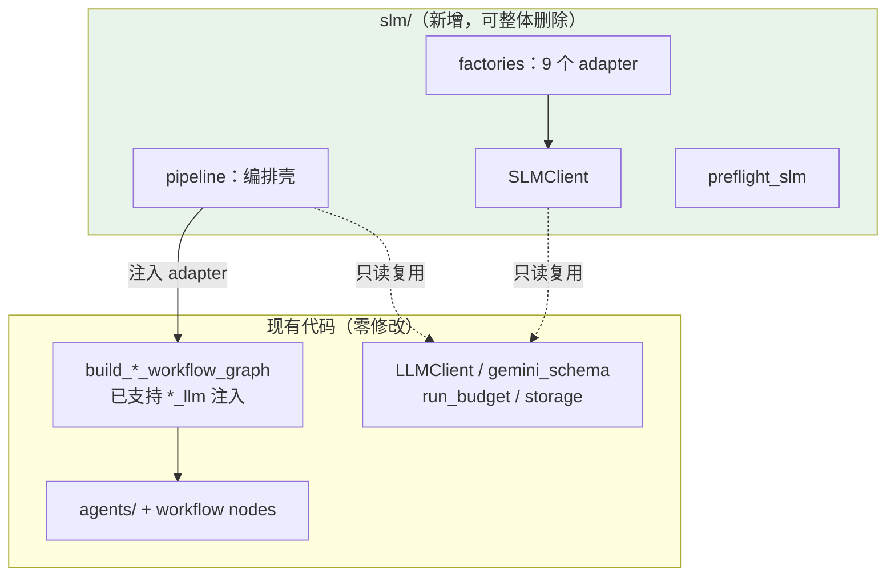

# Open Proposal Agent - Sprint Plan SLM (Qwen2.5-3B 对比实验)

> 用途：给 Cursor / Codex 逐步执行的极细粒度开发清单。
> 目标：在 **Phase 5 已完成** 的项目基础上，以 **完全隔离的新增模块** 方式接入 SLM - Qwen2.5-3B-Instruct，用于 LLM vs SLM 对比实验。
> **最高优先级约束（隔离原则）**：所有新代码只允许写在新建的 `slm/` 文件夹内。
> **`rm -rf slm/` 之后，项目必须与今天的状态逐字节等价，`pytest -q` 必须全绿。**
> 执行规则：每完成一个 checkbox，提交一次小 commit。

---

## 0. 隔离原则（本文件的第一约束，凡与后文冲突以本节为准）

### 0.1 三条硬规则

| 规则 | 内容 | 自动化保障 |
|---|---|---|
| **R1 单向依赖** | `slm/` 可以只读 import 项目现有模块；现有任何文件 **禁止** 出现 `import slm` / `from slm`。 | `slm/tests/test_isolation.py` 全仓扫描，发现即失败 |
| **R2 零修改** | 不新增、不删除、不修改 `slm/` 之外的任何文件——包括 `app.py`、`workflow/`、`agents/`、`prompts/`、`.env.example`、`requirements.txt`、`pytest.ini`、`tests/`。 | `git status` 检查：除 `slm/` 与本文档外无改动 |
| **R3 可删除** | 删除 `slm/` 后，`pytest -q` 全绿、Streamlit 正常、Gemini 全链路行为不变。 | Sprint S4.4 的删除演练 |

### 0.2 上一版方案的问题（为什么推倒重来）

上一版把 `create_default_llm_client()` 改成 provider 分发工厂、给 `preflight.py` 加分支、改 `app.py` 的 `MODEL_NAME`。这些改动都落在 Gemini 的关键路径上——重试计数、token 记账、校验闭环、preflight 语义——一旦出 bug，**污染的是对比实验的基线臂**，而基线臂出问题往往到跑完实验分析数据时才发现。本版全部废弃这种做法。

### 0.3 隔离为什么可行：注入接缝已经存在

代码审查确认，本项目的两个 graph builder **已经支持完整的 LLM 注入**，这是隔离方案成立的前提：

```python
# workflow/graph.py:40
build_proposal_workflow_graph(
    planner_llm=None, section_writer_llm=None, critic_llm=None, revision_llm=None, ...)

# workflow/multi_agent_graph.py:69
build_multi_agent_workflow_graph(
    supervisor_llm=None, research_llm=None, strategy_llm=None, finance_llm=None,
    writer_llm=None, critic_llm=None, revision_llm=None, web_search_tool=..., ...)
```

传 `None` 时各节点/Agent 调用自己的 `create_default_*_llm()`（Gemini）；**传入我们构造的 SLM adapter 时，Gemini 工厂根本不会被调用**。所以"换模型"这件事完全可以在调用方完成，不需要碰被调用方。

另外三处已验证的复用点：

- `app.py:210 generate_proposal(client, user_idea)` —— **接受 client 参数**，baseline 臂可直接传 SLM client，零复制。
- `app.py` 的 `if __name__ == "__main__":` 在 1063 行，`st.set_page_config` 在函数内（886 行）⇒ **`import app` 无 Streamlit 副作用**，可安全复用其 `_ensure_run_history_tables` / `_set_run_status` / `_get_step_statuses` / `_run_budget_settings` / `WorkflowPipelineResult` 等辅助件。
- `workflow/preflight.py:123 check_preflight(...)` **返回结果对象而不抛异常**（抛异常的是 `run_preflight_checks`）⇒ SLM 侧可以调用它、然后自行忽略 `gemini_api_key_missing` 这一条 issue，无需改它。

### 0.4 隔离的代价（如实列出，接受后再动手）

1. **编排逻辑复制约 100-140 行**：`app.py` 的 `run_workflow_pipeline` / `run_multi_agent_pipeline` 内联了 preflight、建 run record、run_budget、状态更新，且写死 Gemini 语义，无法直接复用整体，只能在 `slm/pipeline.py` 重写这层壳（内部仍复用其辅助函数与 graph builder）。
2. **9 个 adapter 工厂复制约 30 行**：镜像 `workflow/llm.py` 与 `agents/*.py` 的默认工厂，但绑定 SLM client。属配置性代码，无业务逻辑。
3. **漂移风险**：日后若 `app.py` 的 pipeline 演进，`slm/pipeline.py` 不会自动跟进。缓解：进入 Phase 7 评估期后代码本就冻结，漂移窗口很小；且 S4.4 的删除演练会暴露不一致。
4. **类型注解**：`StructuredJsonLLM.__init__` 的 client 参数标注为 `LLMClient`，运行时是鸭子类型（只调 `generate_structured` / `generate_structured_once`），传 `SLMClient` 可正常工作。若日后引入 mypy，只在 `slm/` 内加忽略，不改原文件。

这 4 项都是为"基线绝对安全"付的合理代价。

### 0.5 目标结构

```text
slm/                          # ← 删除此文件夹 = 完全回到今天的状态
├── __init__.py
├── README.md                 # 模块自述；首行写明"删除本文件夹即完整回滚"
├── client.py                 # SLMClient（OpenAI-compatible）
├── config.py                 # SLM_* 环境变量读取，含预算默认值
├── factories.py              # 9 个 adapter 工厂 + 可选的分批适配器
├── preflight_slm.py          # 端点探测 + 复用 check_preflight 并自行处理 gemini issue
├── pipeline.py               # baseline / workflow / multi-agent 三条 SLM 编排
├── cli.py                    # 命令行入口（评估 runner 调它）
├── app_slm.py                # 可选：独立 Streamlit 入口
├── .env.slm.example
├── requirements-slm.txt      # 仅 openai>=1.40.0
└── tests/
    ├── test_isolation.py     # R1/R2 的自动化守卫
    ├── test_slm_client.py
    ├── test_slm_factories.py
    └── test_slm_pipeline.py
```

`pytest.ini` 的 `testpaths = tests` 不包含 `slm/tests`，**不要改它**；SLM 测试用 `pytest slm/tests -q` 显式运行。这反而是好事：现有测试套件完全不受新模块影响。

### 0.6 架构图



依赖箭头**只从 slm/ 指向现有代码**，没有一条反向。

---

## 1. 技术选型与配置

### 1.1 Qwen2.5-3B 部署方式（三选一，S1 确定）

| 方案 | 入口 | 结构化输出 | 适用 |
|---|---|---|---|
| **Ollama（推荐，Windows 本机）** | `ollama pull qwen2.5:3b`；`http://localhost:11434/v1` | `response_format` 支持 json_schema | 本机、无 GPU、最快跑通 |
| vLLM（Linux/GPU） | `vllm serve Qwen/Qwen2.5-3B-Instruct`；`http://<host>:8000/v1` | json_schema / guided_json | 要测吞吐与延迟 |
| DashScope 云端 | `https://dashscope.aliyuncs.com/compatible-mode/v1`，model `qwen2.5-3b-instruct` | json_object（schema 进 prompt） | 本机跑不动 |

三者同为 OpenAI-compatible 协议，`SLMClient` 一套代码通吃，只换 `slm/.env.slm`。

### 1.2 SLM 专属配置（全部 `SLM_` 前缀，绝不复用现有变量名）

**关键约束**：Qwen2.5-3B 上下文 32K，远小于 Gemini 2.5 Flash。现有 `LLM_MAX_PROMPT_CHARS=120000` + `LLM_MAX_OUTPUT_TOKENS_PER_REQUEST=16384` 会撑爆窗口。**但不要去覆盖这两个现有变量**——那会同时影响 Gemini 臂。改为定义独立变量，只被 `slm/config.py` 读取：

| 变量（新增，仅 slm/ 读） | 默认值 | 说明 |
|---|---|---|
| `SLM_BASE_URL` | `http://localhost:11434/v1` | Ollama 默认 |
| `SLM_MODEL_NAME` | `qwen2.5:3b` | 也是写入 run record 的 model_name |
| `SLM_API_KEY` | `ollama` | 本地服务任意非空占位；DashScope 填真 key |
| `SLM_STRUCTURED_MODE` | `json_schema` | 失败降级 `json_object`（见 S2.4） |
| `SLM_MAX_PROMPT_CHARS` | `60000` | ≈15-20K tokens，给输出留窗口 |
| `SLM_MAX_OUTPUT_TOKENS` | `8192` | Qwen2.5 单次生成上限 |
| `SLM_RUN_MAX_REQUESTS` | `12` | 3B 校正更频繁 |
| `SLM_RUN_MAX_TOTAL_TOKENS` | `160000` | 同上 |
| `SLM_REQUEST_TIMEOUT` | `300` | 本地推理 + 冷启动 |

`slm/pipeline.py` 用后两个值调用现有 `run_budget(max_requests=, max_total_tokens=)`——这是**传参**，不是改配置，Gemini 臂完全不受影响。

---

## Sprint S1 - 服务部署与能力验证（零代码）

#### Goal

先确认 Qwen2.5-3B 能力边界，再写代码。**本 Sprint 不产生任何 Git 追踪的代码。**

#### Tasks

##### S1.1 部署

- [ ] 安装 Ollama for Windows；`ollama pull qwen2.5:3b`。
- [ ] `ollama run qwen2.5:3b "hello"` 确认可推理。
- [ ] `curl http://localhost:11434/v1/models` 确认 OpenAI 兼容端点存活。
- [ ] 记录本机 tokens/s（Phase 7 延迟指标要用）。

##### S1.2 结构化输出能力验证（脚本放 `tmp/`，不进 Git）

- [ ] 用 `openai` SDK 指向本地端点，跑通一次 `chat.completions.create`。
- [ ] 测试 1：`response_format={"type":"json_object"}` + prompt 内嵌小 schema → 返回合法 JSON？
- [ ] 测试 2：`response_format` 传 json_schema（3 字段小 schema）→ 约束生效？
- [ ] 测试 3：`from workflow.gemini_schema import relaxed_response_schema`，把真实 `CritiqueReport` 转换后传入 → 不报错、可被严格 Pydantic 校验？
- [ ] 测试 4：`ProposalDraft`（13 章节大 schema）同样跑一遍，记录成功与否 / 输出 tokens / 耗时。**此结果决定 S2.4 的默认模式。**
- [ ] 4 条结论写入 `slm/README.md` 的"验证记录"小节（S2.1 创建该文件时预留该小节）。

#### Definition of Done

- [ ] 端点存活、小 schema 通过、大 schema 行为已知（成功 或 已确认需降级）。
- [ ] `git status` 干净（除本文档外无改动）。

---

## Sprint S2 - SLMClient 与隔离守卫

#### Goal

在 `slm/` 内实现与 `LLMClient` 行为等价的 `SLMClient`，并建立自动化隔离守卫。

#### Tasks

##### S2.1 模块骨架与隔离守卫（守卫先行，后续每次提交都受保护）

- [ ] 创建 `slm/__init__.py`、`slm/README.md`（首行：**"删除本文件夹即可完整回滚 SLM 实验，无需任何其他操作。"**；并预留"验证记录"小节，承接 S1.2 / S4.1 / S4.4 的结果）。
- [ ] 创建 `slm/tests/test_isolation.py`：
  - 用例 A：扫描仓库中除 `slm/` 外的所有 `.py`，断言无 `import slm` / `from slm` —— 守卫 R1。
  - 用例 B：断言 `slm/` 内所有模块可被 import（防止半成品）。
  - 用例 C：断言 `slm/` 内未出现对 `os.environ` 中 `LLM_MAX_PROMPT_CHARS` / `LLM_RUN_MAX_*` 等**现有变量的写操作**（防止串味）。
- [ ] 创建 `slm/requirements-slm.txt`（仅 `openai>=1.40.0`）与 `slm/.env.slm.example`（1.2 表全部变量）。
- [ ] `pytest slm/tests -q` 通过；`pytest -q` 仍全绿。
- [ ] 提交 commit：`feat(slm): add isolated module skeleton and isolation guard`。

##### S2.2 配置读取 `slm/config.py`

- [ ] 实现 `load_slm_config() -> SLMConfig`（frozen dataclass），字段对应 1.2 表全部变量。
- [ ] 用 `dotenv.load_dotenv(slm/.env.slm)` 优先，回退到进程环境。
- [ ] 数值校验：正整数、非空 base_url，非法值抛带变量名的 `ValueError`。
- [ ] 单测覆盖默认值、覆盖值、非法值。
- [ ] 提交 commit：`feat(slm): add SLM configuration loader`。

##### S2.3 `SLMClient` 骨架

- [ ] 创建 `slm/client.py`，`class SLMClient`，内部持 `openai.OpenAI(base_url=, api_key=, timeout=)`。
- [ ] **只读 import 复用，禁止复制**（全部来自 `workflow.llm_client`）：`StructuredOutputValidationError`、`PromptBudgetExceededError`、`schema_cardinality_contract`、`capture_llm_usage` 所用的 tracker、`_provider_status_code`；以及 `workflow.gemini_schema.relaxed_response_schema`、`workflow.run_budget` 的三个记账函数。
- [ ] **usage tracker 接入**：`workflow/llm_client.py` 的 `_ACTIVE_USAGE_TRACKER` 是模块级私有 ContextVar。**不要为它去改原文件加公开访问器**——直接 `from workflow.llm_client import _ACTIVE_USAGE_TRACKER` 并在 `slm/README.md` 注明"依赖该私有名，若上游重命名此处需同步"，同时在 `slm/tests/test_slm_client.py` 加一条契约测试断言该名存在。这是隔离原则下的正确取舍：宁可承担一个有测试保护的私有依赖，也不改基线文件。
- [ ] 提交 commit：`feat(slm): add SLM client skeleton`。

##### S2.4 单次请求与结构化双模式

- [ ] `_check_prompt_budget()`：超 `SLM_MAX_PROMPT_CHARS` 抛复用的 `PromptBudgetExceededError`。
- [ ] 请求前 `reserve_run_request(estimated_tokens=len(prompt)//4 + max_output_tokens)`；tracker `request_count += 1`。
- [ ] 组装 `chat.completions.create`：system 消息放 `system_instruction`，user 消息放 prompt，`temperature`、`max_tokens`。
- [ ] `SLM_STRUCTURED_MODE=json_schema`：`response_format={"type":"json_schema","json_schema":{"name":schema.__name__,"schema":relaxed_response_schema(schema)}}`。
- [ ] `SLM_STRUCTURED_MODE=json_object`：`response_format={"type":"json_object"}`，并把 `json.dumps(relaxed_response_schema(schema))` 以 `# Output JSON Schema (must match exactly)` 段落追加进 prompt。
- [ ] 若 S1.2 测试 4 表明大 schema 下 json_schema 失败/超时，把 `slm/config.py` 默认改为 `json_object`，并在 `slm/README.md` 的"验证记录"小节写明原因。
- [ ] 瞬时错误短重试：`_provider_status_code(exc) in {429, 500, 502, 503}` 且首次尝试 → sleep 0.25s 重试一次；tracker `retry_count += 1` + `record_run_retry()`。
- [ ] 提交 commit：`feat(slm): implement request with structured output modes`。

##### S2.5 响应解析、记账、校验闭环

- [ ] 从 `response.choices[0].message.content` 取文本。
- [ ] `_extract_json_text(text)`：剥掉 ```json 代码围栏与首尾杂散文本（取第一个 `{` 到最后一个 `}`）。**这是 3B 模型与 Gemini 的最大行为差异，必须实现。**
- [ ] `_record_response_usage()`：读 `response.usage.prompt_tokens / completion_tokens / total_tokens`（注意与 Gemini 的 `prompt_token_count` / `candidates_token_count` 字段名不同），写入共享 tracker 与 `record_run_usage()`；本地推理成本记 0。
- [ ] 空响应 / `model_validate_json` 失败 / `output_validator` 抛 `ValueError` → 抛 `StructuredOutputValidationError`。
- [ ] `generate_structured()`：拼 `schema_cardinality_contract` → 首试 → 失败则 `record_run_retry()` + 追加校正段 → **恰好一次**修正请求。校正段文案与 `LLMClient` 保持一致（含 `# Structured Output Correction` 标记行），便于 Phase 7 用同一套识别逻辑统计校正率。
- [ ] `generate_structured_once()`：单次，无校正。
- [ ] 提交 commit：`feat(slm): add response parsing and validation loop`。

##### S2.6 单元测试

- [ ] `slm/tests/test_slm_client.py`，手法参考 `tests/test_llm_client.py`：构造后替换内部 openai client 为 Fake（返回 `SimpleNamespace(choices=[...], usage=SimpleNamespace(prompt_tokens=10, completion_tokens=5, total_tokens=15))`）。
- [ ] 用例：首试校验失败 → 恰好一次校正 → 成功。
- [ ] 用例：两次都失败 → 抛 `StructuredOutputValidationError`。
- [ ] 用例：超 prompt 预算 → 抛 `PromptBudgetExceededError` 且 **0 次** API 调用。
- [ ] 用例：503 → 短重试一次成功，`retry_count` 正确。
- [ ] 用例：```json 围栏响应能正确解析。
- [ ] 用例：`capture_llm_usage()` 聚合 tokens 正确、run_budget 扣减正确。
- [ ] 契约用例：`workflow.llm_client._ACTIVE_USAGE_TRACKER` 存在（守卫私有依赖）。
- [ ] `pytest slm/tests -q` 全绿；`pytest -q` 全绿。
- [ ] 提交 commit：`test(slm): add SLM client unit tests`。

#### Definition of Done

- [ ] `SLMClient` 与 `LLMClient` 公共接口逐一等价。
- [ ] 异常类、tracker、budget 全部为共享 import 而非复制。
- [ ] 隔离守卫通过；现有测试零改动零失败。

---

## Sprint S3 - Adapter 工厂、preflight 与编排壳

#### Goal

在 `slm/` 内组装出三条可运行的 SLM pipeline，全程不碰 `slm/` 外一个字符。

#### Tasks

##### S3.1 Adapter 工厂 `slm/factories.py`

- [ ] 实现 `build_slm_adapters(config) -> dict[str, StructuredJsonLLM]`，键覆盖 9 个注入点：`planner`、`section_writer`、`basic_critic`、`revision`、`research`、`strategy`、`finance`、`writer`、`critic`。
- [ ] 每个 adapter = `StructuredJsonLLM(slm_client, <对应 schema>, temperature=<与现有默认一致>)`。**temperature 必须逐一对齐现有工厂**（`workflow/llm.py`：planner 0.2 / section_writer 0.3 / critic 0.2 / revision 0.2；`agents/*.py` 均 0.2），否则对比实验多一个混淆变量。
- [ ] 复用现有 `StructuredJsonLLM`（运行时鸭子类型，见 0.4 第 4 条），不要在 slm/ 重写一个。
- [ ] 单测：断言 9 个键齐全、schema 与 temperature 与现有默认逐一相同（用参数化表格，硬编码期望值，防漂移）。
- [ ] 提交 commit：`feat(slm): add SLM adapter factories`。

##### S3.2 SLM preflight `slm/preflight_slm.py`

- [ ] 实现 `check_slm_preflight(...)`：调用现有 `check_preflight(require_knowledge_base=..., allow_tavily_degradation=True)` 拿结果对象，**过滤掉 `gemini_api_key_missing` 这条 issue**（SLM 臂不需要 Gemini key），保留知识库/输出目录/Tavily 判定。
- [ ] 追加自有检查：对 `SLM_BASE_URL + "/models"` 发 3 秒超时 GET（用已有的 `requests`），失败给出 issue `slm_endpoint_unreachable`，message 含"请确认 ollama serve 已启动"。
- [ ] 返回自有的 `SLMPreflightResult`（不复用也不修改原 `PreflightResult` 的字段语义）。
- [ ] 单测：mock requests，覆盖端点可达/不可达、Tavily 缺失降级、知识库缺失。
- [ ] 提交 commit：`feat(slm): add SLM preflight with endpoint probe`。

##### S3.3 编排壳 `slm/pipeline.py`

- [ ] `run_slm_baseline(user_brief_or_idea)`：复用 `app.generate_proposal(client, user_idea)`，client 传 `SLMClient`。**这条零复制。**
- [ ] `run_slm_workflow(user_brief)`：mirror `app.run_workflow_pipeline` 的编排，差异仅三处——preflight 换成 `check_slm_preflight`、`create_run(model_name=config.model_name)`、`build_proposal_workflow_graph(planner_llm=…, section_writer_llm=…, critic_llm=…, revision_llm=…)` 注入 4 个 SLM adapter。
- [ ] `run_slm_multi_agent(user_brief)`：同上，注入 7 个 adapter；保留 Tavily 不可用时的 `no_web_search` 降级闭包（从 `app.py` 复制该闭包，约 10 行）。
- [ ] 复用 `app.py` 的辅助件：`_ensure_run_history_tables`、`_set_run_status`、`_get_step_statuses`、`WorkflowPipelineResult`、`summarize_evidence_sources`、`summarize_web_sources`。在文件头注释里列出这份"对 app.py 私有辅助函数的依赖清单"，便于日后核对漂移。
- [ ] run_budget 用 `SLM_RUN_MAX_REQUESTS` / `SLM_RUN_MAX_TOTAL_TOKENS` 传参。
- [ ] 三个函数的返回类型与 `app.py` 对应函数一致（`WorkflowPipelineResult`），保证 Phase 7 runner 可统一处理两种臂。
- [ ] 单测（mock graph 与 session）：三条 pipeline 各自注入了正确数量的 adapter、run record 的 model_name 为 SLM 值、preflight 失败时不进入 LLM 调用。
- [ ] 提交 commit：`feat(slm): add SLM pipeline orchestration`。

##### S3.4 入口 `slm/cli.py`（+ 可选 `slm/app_slm.py`）

- [ ] CLI：`python -m slm.cli --mode {baseline,workflow,multi} --input examples/sample_input.json`，打印 run_id、输出路径、耗时、token 用量。
- [ ] 启动时先跑 `check_slm_preflight`，不通过则打印可操作的错误并以非 0 退出（评估 runner 依赖这个退出码）。
- [ ] （可选）`slm/app_slm.py`：独立 Streamlit 入口 `streamlit run slm/app_slm.py`，复用 `app.py` 的表单渲染函数（若其可复用）或写一个最简表单。**不要改 `app.py` 加 SLM 选项。**
- [ ] 提交 commit：`feat(slm): add SLM CLI entry point`。

#### Definition of Done

- [ ] `python -m slm.cli --mode multi` 可端到端跑通并落 run record。
- [ ] `git status` 显示改动仅限 `slm/` 与本文档。
- [ ] `pytest -q` 与 `pytest slm/tests -q` 均全绿。

---

## Sprint S4 - 真实验证、应急与删除演练

#### Goal

三条 SLM pipeline 跑通并量化失败率；证明隔离性成立。

#### Tasks

##### S4.1 逐管道验证

- [ ] `python -m slm.cli --mode baseline`，用 `examples/` 的 AI education 样例，记录成功/失败、耗时、校正次数。
- [ ] `--mode workflow` 同一输入（planner → section_writer → critic → revision 全链）。
- [ ] `--mode multi` 同一输入（5 agents + critic + revision，含 RAG；Tavily 未配置时确认降级路径正常）。
- [ ] 每种模式跑 3 次，统计各节点 `StructuredOutputValidationError` 触发率与最终失败率，登记到 `slm/README.md` 的"验证记录"小节。这是**冒烟性质的可用性验证**，不是对比实验数据——正式的四臂指标由 Phase 7 的 `evals/` 采集。

##### S4.2 问题分级与应急（按需，动手前先看数据）

- [ ] 失败集中在**大 schema 节点**（SectionDrafts / ProposalDraft / RevisedProposal）：在 `slm/config.py` 加 `SLM_FORCE_JSON_OBJECT_SCHEMAS` 集合，对这几个 schema 强制降级模式。**改动全在 slm/ 内。**
- [ ] 失败是**输出截断**（`finish_reason == "length"`）：确认 `SLM_MAX_OUTPUT_TOKENS` 生效；仍截断则记录该 case，不改 prompt。
- [ ] 失败是 **prompt 超 60K chars**：`slm/pipeline.py` 调 `build_multi_agent_workflow_graph(rag_top_k=…)` 时下调 top_k —— 这是 **graph builder 已暴露的参数**，仍是传参而非改代码。
- [ ] **应急预案 C（分批生成）**：隔离约束下有比改 `workflow/nodes.py` 更好的做法——在 `slm/factories.py` 实现 `ChunkedSectionAdapter`，它对外仍满足节点期望的 `generate_json(prompt) -> str` 契约，内部把 13 章节拆成 3 批分别请求再合并成完整 JSON。节点毫不知情，**零外部改动**。实施前先确认目标节点实际调用了哪几个方法（`generate_json` / `generate_json_validated` / `generate_json_once` / `generate_json_for_schema_once`），全部实现。
- [ ] 提交 commit（若触发）：`feat(slm): add chunked section adapter fallback`。

##### S4.3 现有套件回归

- [ ] `pytest -q` 全绿（应当与 S1 之前逐条相同）。
- [ ] 跑一次 Gemini 多 agent 全链（`streamlit run app.py`），与迁移前的一条 run record 对照，确认行为无差异。

##### S4.4 删除演练（R3 的验收，必做）

- [ ] `git stash` 或复制一份工作区，物理删除 `slm/` 文件夹。
- [ ] 运行 `pytest -q` → 必须全绿。
- [ ] 运行 `streamlit run app.py` 跑通一次 Gemini workflow → 必须成功。
- [ ] `git status` 确认除删除 `slm/` 外无任何其他差异。
- [ ] 恢复 `slm/`，在 `slm/README.md` 的"验证记录"小节记录演练结果。
- [ ] 提交 commit：`test(slm): verify module deletability`。

#### Definition of Done

- [ ] 三条 SLM pipeline 均产出通过 Pydantic 校验的完整 proposal。
- [ ] 失败率已量化。
- [ ] **删除演练通过**——这是本 Sprint 最重要的验收项。

---

## 2. 风险与预案

| 风险 | 概率 | 预案 |
|---|---|---|
| A. 3B 模型 json_schema 约束解码慢/挂 | 中 | S2.4 内置 json_object 降级 |
| B. 大 schema 单次 JSON 无效率高 | 高 | 先靠"一次校正"吸收；再按 S4.2 分级；最后上 ChunkedSectionAdapter |
| C. 32K 上下文放不下多 agent 证据 | 中 | 下调 `rag_top_k` 传参；`SLM_MAX_PROMPT_CHARS` 超限会抛 `PromptBudgetExceededError`，属预期保护 |
| D. Ollama 冷启动首请求超时 | 高 | `SLM_REQUEST_TIMEOUT=300`；preflight 已探测端点 |
| E. `_ACTIVE_USAGE_TRACKER` 私有名被上游重命名 | 低 | S2.6 契约测试会立刻失败并指明原因 |
| F. `app.py` 私有辅助函数变更导致 `slm/pipeline.py` 漂移 | 低 | 依赖清单写在文件头；评估期代码冻结 |
| G. 对比实验基线被污染 | **已消除** | 本方案对 Gemini 路径零修改 |

## 3. 明确不做什么

- 不修改 `slm/` 之外的任何文件——包括 `.env.example`、`requirements.txt`、`pytest.ini`、`app.py`、`workflow/`、`agents/`、`prompts/`、`tests/`。
- 不在现有代码中加 `LLM_PROVIDER` 之类的 provider 分发开关。
- 不复用/覆盖 `LLM_MAX_PROMPT_CHARS`、`LLM_RUN_MAX_*` 等现有变量（会同时影响 Gemini 臂）。
- 不引入 LangChain / LiteLLM 抽象层；`openai` SDK 足够。
- 不做微调、量化调优、多 SLM 接入。
- 不把真实 key 提交进 Git（`slm/.env.slm` 需确认已被 `.gitignore` 的 `.env*` 规则覆盖；若未覆盖，**在 `slm/` 内新建 `slm/.gitignore`**，不要改根 `.gitignore`）。

## 4. Cursor / Codex 执行模板

```text
You are working on Open Proposal Agent. Read sprint_plan_SLM.md section 0 first.
Implement only this task:

TASK: <paste one checkbox>

Hard constraints (violating any of these fails the task):
- Create/modify files ONLY inside slm/. Zero changes to app.py, workflow/,
  agents/, schemas/, rag/, storage/, tools/, prompts/, tests/, pytest.ini,
  .env.example, requirements.txt, or .gitignore.
- Never add `import slm` to any existing file. Dependency direction is
  slm/ -> existing code, never the reverse.
- Reuse by import (never copy): StructuredOutputValidationError,
  PromptBudgetExceededError, schema_cardinality_contract,
  relaxed_response_schema, run_budget helpers, StructuredJsonLLM.
- Inject SLM adapters through the existing *_llm parameters of
  build_proposal_workflow_graph / build_multi_agent_workflow_graph.
- After coding: run `pytest -q` AND `pytest slm/tests -q`; both must pass.
  Then run `git status` and confirm changes are confined to slm/.
```

## 5. Commit 规范

```text
feat(slm): add isolated module skeleton and isolation guard
feat(slm): add SLM configuration loader
feat(slm): add SLM client skeleton
feat(slm): implement request with structured output modes
feat(slm): add response parsing and validation loop
test(slm): add SLM client unit tests
feat(slm): add SLM adapter factories
feat(slm): add SLM preflight with endpoint probe
feat(slm): add SLM pipeline orchestration
feat(slm): add SLM CLI entry point
test(slm): verify module deletability
```

## 6. 与 Phase 7 的交接

本文件只负责"把 Qwen2.5-3B 接进来并跑通"。**四臂对比实验的指标定义、数据采集、
表格产出与报告，全部属于 `sprint_plan_phase7_eval.md`，本文件不重复。**

交接约定：

- 本文件各 Sprint 的验证结果（S1.2 能力验证、S4.1 失败率、S4.4 删除演练）记录在
  `slm/README.md` 的"验证记录"小节——随模块一起走，删除 `slm/` 时一并消失，符合隔离原则。
- Phase 7 的 runner 通过 `slm/pipeline.py` 的三个函数调用 SLM 臂，
  并用 guarded import 保证删除 `slm/` 后 Gemini 两臂仍可评估。
- Phase 7 的校正率统计依赖 S2.5 要求的"校正段文案与 `LLMClient` 一致（含
  `# Structured Output Correction` 标记行）"，实现时不要改这行文案。
